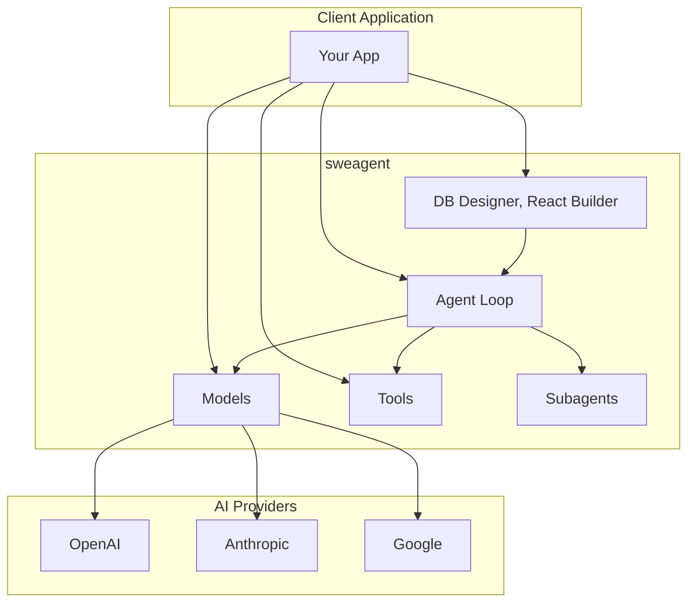
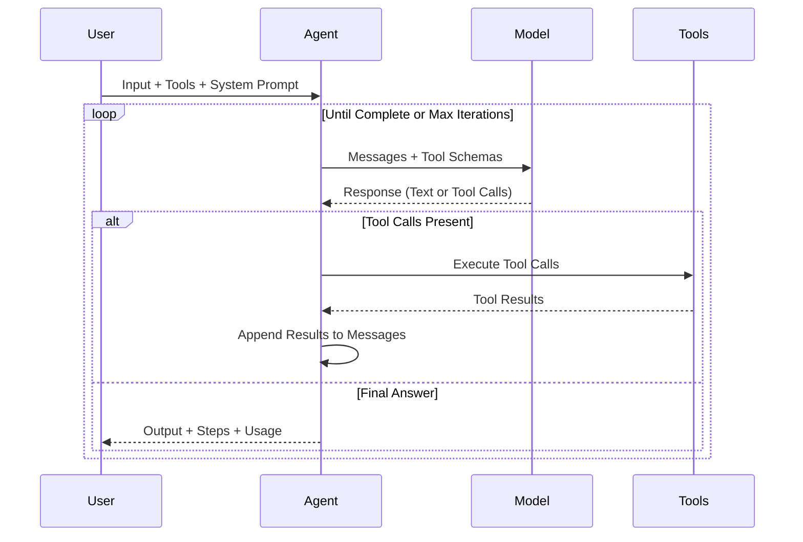
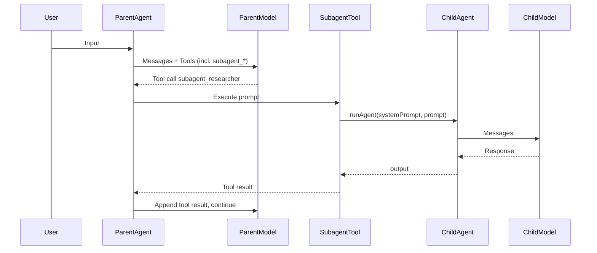
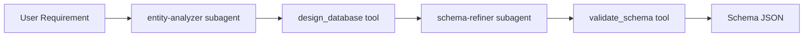

<p align="center">
  <h1 align="center">sweagent</h1>
  <p align="center">
    <strong>A multi-provider AI software engineering agent framework with tool calling.</strong>
  </p>
  <p align="center">
    Build intelligent agents that execute tools and integrate with OpenAI, Anthropic, and Google. TypeScript-first, type-safe tools, subagent orchestration, and MCP support.
  </p>
</p>

<p align="center">
  <a href="https://www.npmjs.com/package/sweagent"></a>
  <a href="https://www.typescriptlang.org/"></a>
  <a href="https://github.com/sijeeshmiziha/sweagent/blob/main/LICENSE"></a>
  <a href="https://github.com/sijeeshmiziha/sweagent/pulls"></a>
</p>

<p align="center">
  <a href="#what-is-sweagent">What is sweagent?</a> •
  <a href="#why-sweagent">Why sweagent?</a> •
  <a href="#installation">Installation</a> •
  <a href="#getting-started-tutorial">Tutorial</a> •
  <a href="#architecture">Architecture</a> •
  <a href="#api-reference">API Reference</a> •
  <a href="#production-modules">Modules</a> •
  <a href="#examples">Examples</a> •
  <a href="#contributing">Contributing</a>
</p>

---

## Table of Contents

- [What is sweagent?](#what-is-sweagent)
- [Why sweagent?](#why-sweagent)
- [Features](#features)
- [Installation](#installation)
- [Getting Started Tutorial](#getting-started-tutorial)
- [Architecture](#architecture)
- [Engineering Deep Dive](#engineering-deep-dive)
- [API Reference](#api-reference)
- [Production Modules](#production-modules)
- [Examples](#examples)
- [Configuration Reference](#configuration-reference)
- [FAQ](#faq)
- [Troubleshooting](#troubleshooting)
- [Contributing](#contributing)
- [License](#license)

---

## What is sweagent?

**sweagent** is a multi-provider AI software engineering agent framework for TypeScript and Node.js. It gives you a single, consistent API to build agents that call tools, delegate to subagents, and run across OpenAI, Anthropic, and Google—with no provider lock-in.

The framework is built around three pillars: **models** (unified provider abstraction), **tools** (Zod-validated, type-safe tool definitions), and **agents** (an iterative loop that invokes the model, executes tool calls, and feeds results back until the task is done). You can add **subagents** so a parent agent delegates subtasks to specialized child agents, and plug in **MCP** (Model Context Protocol) servers for external capabilities. Production-ready modules like **DB Designer** (MongoDB schema from natural language) and **React Builder** (frontend config from GraphQL) show how to orchestrate tools and subagents for real workflows.

Whether you are prototyping a coding assistant or shipping a multi-step AI pipeline, sweagent keeps the same mental model: create a model, define tools, run an agent. All provider SDKs are included; set your API keys and go.

```typescript
import { createModel, runAgent, defineTool } from 'sweagent';
import { z } from 'zod';

const model = createModel({ provider: 'openai', model: 'gpt-4o-mini' });
const greetTool = defineTool({
  name: 'greet',
  description: 'Greet someone',
  input: z.object({ name: z.string() }),
  handler: async ({ name }) => ({ message: `Hello, ${name}!` }),
});

const result = await runAgent({
  model,
  tools: [greetTool],
  systemPrompt: 'You are a helpful assistant.',
  input: 'Greet Alice',
});
console.log(result.output);
```

---

## Why sweagent?

Long-running AI agents face a core challenge: they work in discrete sessions, and each new session starts with no memory of the last. That leads to agents trying to do too much in one go (and leaving half-finished work), or declaring the job done too early. We designed sweagent so you can build **effective harnesses** for such agents.

The design follows a two-fold pattern. First, **initializer-style setup**: scaffold the environment with clear artifacts—feature lists, progress files, init scripts—so every run knows what “done” looks like and what’s left to do. Second, **incremental coding agents**: each session is prompted to make bounded progress, then leave the codebase in a clean, documented state (e.g. via commits and progress updates). That way the next session can read git history and progress files, get its bearings quickly, and continue without re-discovering the project.

sweagent’s architecture reflects this. **Modular tools** let you split capabilities into small, testable units. **Subagent delegation** lets a parent agent hand off analysis or refinement to specialized children. **Structured orchestration prompts** (as in the DB Designer and React Builder modules) spell out when to analyze, when to generate, and when to validate. **Typed schemas** (Zod everywhere) keep tool inputs and outputs predictable and safe. Under the hood, we use a **provider adapter** over the Vercel AI SDK so you can swap OpenAI, Anthropic, or Google without changing your agent code, and a **layered error hierarchy** so failures are easy to trace and handle.

---

## Features

| Feature                    | Description                                                                                                          |
| -------------------------- | -------------------------------------------------------------------------------------------------------------------- |
| **Multi-Provider**         | Unified API for OpenAI (GPT-4o), Anthropic (Claude), and Google (Gemini). One codebase, switch providers via config. |
| **Type-Safe Tools**        | Define tools with Zod schemas; full type inference and validation before execution.                                  |
| **Agent Framework**        | Iterative agent loop with tool calling, step callbacks, and configurable max iterations.                             |
| **Subagent Orchestration** | Parent agents delegate to child agents via tools; optional tool inheritance and isolated models.                     |
| **MCP Protocol**           | Connect to Model Context Protocol servers over HTTP or stdio. Lazy connection, typed tool invocation.                |
| **Production Modules**     | DB Designer (MongoDB schema from requirements), React Builder (frontend config from GraphQL).                        |
| **Vision**                 | Image inputs supported via `model.generateVision()` for vision-capable models.                                       |
| **Zero Extra Deps**        | All provider SDKs included; set API keys and run.                                                                    |

---

## Installation

### Step 1: Prerequisites

- **Node.js** >= 18.0.0
- **npm** >= 8.0.0 (or yarn, pnpm, bun)

### Step 2: Install the package

**Using the package in your project:**

```bash
npm install sweagent
```

Or with yarn, pnpm, or bun:

```bash
yarn add sweagent
pnpm add sweagent
bun add sweagent
```

All AI provider SDKs (OpenAI, Anthropic, Google) are included; no extra packages are required.

**Contributing from source:**

```bash
git clone https://github.com/sijeeshmiziha/sweagent.git
cd sweagent
npm install
```

### Step 3: Environment setup

Create a `.env` file in your project root (or export variables in your shell):

```bash
# At least one provider API key is required
OPENAI_API_KEY=sk-...
ANTHROPIC_API_KEY=sk-ant-...
GOOGLE_GENERATIVE_AI_API_KEY=...
```

### Step 4: Verify installation

Run the hello-world example to confirm everything works.

**If you installed the package:** create a file `test-agent.mjs` (or `test-agent.ts` with tsx):

```javascript
import { createModel, runAgent, helloWorldTool } from 'sweagent';
const model = createModel({ provider: 'openai', model: 'gpt-4o-mini' });
const result = await runAgent({
  model,
  tools: [helloWorldTool],
  systemPrompt: 'You are helpful.',
  input: 'Say hello',
});
console.log(result.output);
```

Run it with `node --env-file=.env test-agent.mjs` (or `npx tsx --env-file=.env test-agent.ts`).

**If you cloned the repo:**

```bash
npm run example -- examples/hello-world/01-hello-world.ts
```

---

## Getting Started Tutorial

Progress from a simple model call to a full agent with tools and subagents.

### Level 1: Model invocation

Create a model and get a completion:

```typescript
import { createModel } from 'sweagent';

const model = createModel({
  provider: 'openai',
  model: 'gpt-4o-mini',
  temperature: 0.7,
});

const response = await model.invoke([
  { role: 'user', content: 'Explain TypeScript in one sentence.' },
]);
console.log(response.text);
```

### Level 2: Custom tools

Define a type-safe tool with Zod:

```typescript
import { defineTool } from 'sweagent';
import { z } from 'zod';

const calculatorTool = defineTool({
  name: 'calculator',
  description: 'Perform math calculations',
  input: z.object({
    expression: z.string().describe('Math expression to evaluate'),
  }),
  handler: async ({ expression }) => {
    const result = eval(expression); // Use a safe math parser in production
    return { result };
  },
});
```

### Level 3: Agent loop

Run an agent that can call your tools:

```typescript
import { runAgent, createModel, defineTool, createToolSet } from 'sweagent';
import { z } from 'zod';

const calculatorTool = defineTool({
  name: 'calculator',
  description: 'Perform math calculations',
  input: z.object({ expression: z.string() }),
  handler: async ({ expression }) => ({ result: String(eval(expression)) }),
});

const result = await runAgent({
  model: createModel({ provider: 'openai', model: 'gpt-4o-mini' }),
  tools: createToolSet({ calculator: calculatorTool }),
  systemPrompt: 'You are a helpful assistant. Use the calculator when needed.',
  input: 'What is 25 multiplied by 4?',
  maxIterations: 10,
  onStep: step => console.log(`Step ${step.iteration}:`, step.toolCalls ?? step.content),
});
console.log(result.output);
```

### Level 4: Subagents

Define subagents and expose them as tools to a parent agent:

```typescript
import {
  defineSubagent,
  createSubagentToolSet,
  runAgent,
  createModel,
  createToolSet,
} from 'sweagent';

const researcher = defineSubagent({
  name: 'researcher',
  description: 'Research a topic and return a short summary',
  systemPrompt: 'You are a researcher. Answer concisely.',
});
const subagentTools = createSubagentToolSet([researcher], { parentModel: model });
const tools = createToolSet({ ...otherTools, ...subagentTools });

const result = await runAgent({
  model,
  tools,
  systemPrompt: 'You can delegate research to subagent_researcher.',
  input: 'Research the history of TypeScript and summarize in 2 sentences.',
  maxIterations: 10,
});
```

### Level 5: Production module (DB Designer)

Use the DB Designer orchestrator to generate a MongoDB schema from natural language:

```typescript
import { runDbDesignerAgent } from 'sweagent';

const result = await runDbDesignerAgent({
  input:
    'E-commerce: users, orders, products. Admins manage products. Users place orders and have a profile.',
  model: { provider: 'openai', model: 'gpt-4o-mini' },
  maxIterations: 15,
});
console.log(result.output);
```

### Level 6: MCP integration

Extend `BaseMcpClient` to call MCP tools (e.g. HTTP or stdio server):

```typescript
import { BaseMcpClient } from 'sweagent';

const config = BaseMcpClient.resolveConfig(
  { url: 'https://your-mcp-server.example.com' },
  { envPrefix: 'MCP' }
);
const client = new BaseMcpClient({ name: 'my-app', version: '1.0.0' }, config);
const result = await client.callTool('tool_name', { arg: 'value' });
```

---

## Architecture

### System overview



### Agent execution flow



### Subagent delegation



### Module orchestrator (DB Designer)



---

## Engineering Deep Dive

### Problem decomposition: long-running agents

Agents that work across many steps or sessions tend to fail in two ways: they either try to do too much in one shot (and leave partial, undocumented work), or they assume the project is done too early. To make progress across sessions, each run needs a way to **get up to speed** quickly and to **leave a clean state** for the next run. That implies structured artifacts: feature lists, progress files, and clear prompts that say “do one thing, then commit and document.”

### Incremental progress pattern

We structure agents so that each session does **bounded work**: one feature or one clear subtask. The agent is prompted to update a progress file and to commit (or at least document) what it did. The next session reads progress and git history, chooses the next unfinished item, and continues. That avoids “one-shotting” the whole project and reduces the chance of the agent declaring victory prematurely.

### Feature list approach

A structured list of requirements (e.g. in JSON) with a status per item gives the agent a clear definition of “done.” Agents are instructed to only mark items passing after verification. That keeps scope explicit and makes it easier to resume across context windows.

### Clean state principle

Every session should end with code that is buildable, documented, and easy to continue from. In practice that means: no half-implemented features left broken, no stray debug code, and clear commit messages or progress notes. The framework doesn’t enforce this by itself; the orchestration prompts (e.g. in DB Designer and React Builder) encode these expectations.

### Error hierarchy design

Errors are organized so you can handle them by type and preserve cause chains:

- **LibraryError** – base for all library errors
- **ModelError** – model invocation failures (provider, API key, etc.)
- **ToolError** – tool execution or “tool not found”
- **ValidationError** – schema validation failures
- **AgentError** – agent hit max iterations without finishing
- **SubagentError** – subagent configuration or execution failure

Each can wrap a `cause`. Use try/catch and `instanceof` to branch on the right level.

### Provider adapter pattern

Models are created via `createModel({ provider, model, ... })`. Under the hood, a shared **AI SDK adapter** (`createAIModel`) wraps the Vercel AI SDK’s `generateText` and normalizes messages, tool schemas, and responses. Each provider (OpenAI, Anthropic, Google) has a thin factory that passes the correct `LanguageModel` into this adapter. That keeps provider-specific logic in one place and keeps the rest of the stack provider-agnostic.

### Tool execution safety

Before any tool runs, inputs are validated with Zod. Invalid input produces a **ToolError** with the parse error; the handler is never called with bad data. Handler errors are caught and rethrown as **ToolError** with the original error as cause. The agent loop receives structured tool results (including error payloads) so the model can see failures and retry or adjust.

---

## API Reference

All public APIs are exported from the main package: `import { ... } from 'sweagent'`.

### Models

**createModel(config)** – Create a model instance for the given provider.

```typescript
import { createModel } from 'sweagent';

const model = createModel({
  provider: 'openai' | 'anthropic' | 'google',
  model: string,            // e.g. 'gpt-4o', 'gpt-4o-mini', 'claude-3-5-sonnet-20241022'
  apiKey?: string,          // Uses env var by default (OPENAI_API_KEY, etc.)
  temperature?: number,     // 0–2, default varies by provider
  maxOutputTokens?: number,
  baseUrl?: string,
});

const response = await model.invoke(messages, { tools });
// response: { text, toolCalls, usage, finishReason }
```

**Supported models (examples):**

| Provider  | Models                                                 |
| --------- | ------------------------------------------------------ |
| OpenAI    | `gpt-4o`, `gpt-4o-mini`, `gpt-4-turbo`                 |
| Anthropic | `claude-3-5-sonnet-20241022`, `claude-3-opus-20240229` |
| Google    | `gemini-1.5-pro`, `gemini-1.5-flash`                   |

**Vision:** `model.generateVision(prompt, images, options)` for image inputs.

---

### Tools

**defineTool(config)** – Define a type-safe tool with Zod schema and handler.

```typescript
import { defineTool } from 'sweagent';
import { z } from 'zod';

const tool = defineTool({
  name: 'my_tool',
  description: 'What the tool does',
  input: z.object({ key: z.string() }),
  handler: async (parsed, context) => ({ result: parsed.key }),
});
```

**createToolSet(tools)** – Build a record of tools for the agent (key = tool name).

**getTool(toolSet, name)** / **getTools(toolSet)** – Look up one or all tools.

**executeTool(tool, input, options)** – Run a single tool with input.

**executeToolByName(toolSet, name, input, options)** – Run by name; throws if tool missing.

**zodToJsonSchema(schema)** – Convert a Zod schema to JSON Schema (e.g. for MCP).

---

### Agents

**runAgent(config)** – Run the agent loop until the model returns no tool calls or max iterations is reached.

```typescript
import { runAgent } from 'sweagent';

const result = await runAgent({
  model,
  tools: createToolSet({ ... }),
  systemPrompt: string,
  input: string,
  maxIterations?: number,   // default 10
  onStep?: (step: AgentStep) => void,
});

// result: { output, steps, totalUsage, messages }
```

**AgentStep** – `{ iteration, content?, toolCalls?, toolResults?, usage? }`.

**AgentResult** – `{ output, steps, totalUsage?, messages }`.

---

### Subagents

**defineSubagent(config)** – Define a subagent (name must be kebab-case).

```typescript
import { defineSubagent } from 'sweagent';

const def = defineSubagent({
  name: 'my-subagent',
  description: 'What this subagent does',
  systemPrompt: '...',
  tools?: Record<string, Tool>,
  model?: ModelConfig,
  maxIterations?: number,
  disallowedTools?: string[],
  onStep?: (step) => void,
});
```

**runSubagent(definition, input, options)** – Run the subagent in isolation.

**createSubagentTool(definition, options)** – Expose one subagent as a tool (input: `{ prompt }`).

**createSubagentToolSet(definitions, options)** – Build a record of subagent tools (`subagent_<name>`).

---

### MCP

**BaseMcpClient** – Base class for MCP clients. Lazy connection, `callTool(name, args)` for invocation.

**BaseMcpClient.resolveConfig(options, resolveOpts)** – Build config from options and env (e.g. `MCP_URL`, `MCP_COMMAND`, `MCP_ARGS`).

**Transports** – HTTP and stdio transports are used internally; extend `BaseMcpClient` and pass config with `url` or `command` + `args`.

---

### Errors

| Class               | When                                             |
| ------------------- | ------------------------------------------------ |
| **LibraryError**    | Base; all others extend it.                      |
| **ModelError**      | Model creation or invoke failed.                 |
| **ToolError**       | Tool not found or tool execution failed.         |
| **ValidationError** | Zod validation failed.                           |
| **AgentError**      | Agent reached max iterations without completing. |
| **SubagentError**   | Subagent config or run failed.                   |

All accept an optional `cause` for chaining.

---

## Production Modules

### DB Designer

Generates MongoDB-style project schemas (modules, fields, relationships) from natural language requirements.

**Tools:** `design_database`, `design_database_pro`, `redesign_database`, `validate_schema`  
**Subagents:** `entity-analyzer` (structured analysis), `schema-refiner` (refinement/validation)

```typescript
import { runDbDesignerAgent } from 'sweagent';

const result = await runDbDesignerAgent({
  input: 'E-commerce: users, orders, products. Admins manage products.',
  model: { provider: 'openai', model: 'gpt-4o-mini' },
  maxIterations: 15,
  onStep: step => console.log(step),
});
console.log(result.output);
```

### React Builder

Generates frontend application config (app, modules, pages, fields, API hooks) from a GraphQL schema.

**Tools:** `generate_frontend`, `generate_feature_breakdown`, `validate_frontend_config`  
**Subagents:** `graphql-analyzer`, `config-validator`

```typescript
import { runReactBuilderAgent } from 'sweagent';

const result = await runReactBuilderAgent({
  input: 'GraphQL schema: type User { id: ID! name: String } ...',
  model: { provider: 'openai', model: 'gpt-4o-mini' },
  maxIterations: 15,
});
console.log(result.output);
```

---

## Examples

The [examples directory](./examples/README.md) contains runnable scripts. Use the interactive launcher or run a file directly:

```bash
# Interactive launcher (pick folder and example, then provide inputs)
npm run example:interactive

# Run a specific example (from repo root)
npm run example -- examples/core/01-basic-model.ts
npm run example -- examples/hello-world/01-hello-world.ts
npm run example -- examples/db-designer/01-db-designer-agent.ts
npm run example -- examples/react-builder/01-react-builder-agent.ts
```

| Group             | Examples                                                                             | Description                          |
| ----------------- | ------------------------------------------------------------------------------------ | ------------------------------------ |
| **Core**          | 01 Basic Model, 02 All Providers, 03 Tool Calling, 04 Multi-Tool Agent, 05 Subagents | Models, tools, agents, subagents     |
| **Hello World**   | 01 Hello World                                                                       | Minimal agent with greeting tool     |
| **DB Designer**   | 01 DB Designer Agent                                                                 | MongoDB schema from natural language |
| **React Builder** | 01 React Builder Agent                                                               | Frontend config from GraphQL         |

---

## Configuration Reference

### Environment variables

| Variable                               | Purpose                                 |
| -------------------------------------- | --------------------------------------- |
| `OPENAI_API_KEY`                       | OpenAI API key                          |
| `ANTHROPIC_API_KEY`                    | Anthropic API key                       |
| `GOOGLE_GENERATIVE_AI_API_KEY`         | Google AI API key                       |
| `MCP_URL` / `MCP_COMMAND` / `MCP_ARGS` | MCP client (when using `resolveConfig`) |

For examples: `PROVIDER`, `MODEL`, `AGENT_INPUT`, `REQUIREMENT`, `MAX_ITERATIONS` are used by example scripts.

### ModelConfig

`provider`, `model`, `apiKey?`, `temperature?`, `maxOutputTokens?`, `baseUrl?`

### AgentConfig

`model`, `tools`, `systemPrompt`, `input`, `maxIterations?`, `onStep?`

---

## FAQ

**Which AI provider should I use?**  
All work well. Choose by existing infra and pricing. The API is the same.

**How do I handle rate limits?**  
sweagent has no built-in rate limiting. Use a retry library (e.g. `p-retry`) around `model.invoke` or `runAgent` if needed.

**Can I use sweagent in the browser?**  
Target is Node.js. For browsers, proxy API calls through your backend and keep keys server-side.

**How do I add a new provider?**  
Implement a factory that returns a model conforming to the internal `Model` interface (e.g. via `createAIModel` and the provider’s AI SDK binding) and register it in `createModel`.

---

## Troubleshooting

### API key errors

**Invalid API key / Authentication failed**

- Ensure the key is set: `echo $OPENAI_API_KEY` (or the relevant env var).
- If using `.env`, load it: `tsx --env-file=.env your-script.ts` or `node --env-file=.env your-script.js`.

### Model not found

- Use the exact model id for the provider (e.g. `gpt-4o-mini`, `claude-3-5-sonnet-20241022`).
- Confirm your account has access to that model.

### Agent hits max iterations

- Increase `maxIterations` or simplify the task.
- Check that tools return clear, parseable results so the model can decide the next step.

### Tool not found

- Tools must be in the same object passed to `runAgent` under the name the model uses (e.g. `createToolSet({ calculator: calculatorTool })` → model calls `calculator`).

---

## Contributing

We welcome contributions. See [CONTRIBUTING.md](CONTRIBUTING.md) for code style, testing, and PR process.

**Quick start for contributors:**

```bash
git clone https://github.com/sijeeshmiziha/sweagent.git
cd sweagent
npm install
cp .env.example .env
# Add API keys to .env
npm test
npm run lint
npm run build
```

| Command                             | Description       |
| ----------------------------------- | ----------------- |
| `npm run dev`                       | Watch build       |
| `npm test`                          | Unit tests        |
| `npm run test:integration`          | Integration tests |
| `npm run test:all`                  | All tests         |
| `npm run lint` / `npm run lint:fix` | ESLint            |
| `npm run typecheck`                 | TypeScript        |
| `npm run build`                     | Production build  |

**Support**

- [GitHub Issues](https://github.com/sijeeshmiziha/sweagent/issues) – Bugs and features
- [GitHub Discussions](https://github.com/sijeeshmiziha/sweagent/discussions) – Questions

---

## License

MIT License – see [LICENSE](LICENSE) for details.

---

<p align="center">
  Made with ❤️ by the CompilersLab team!
</p>
