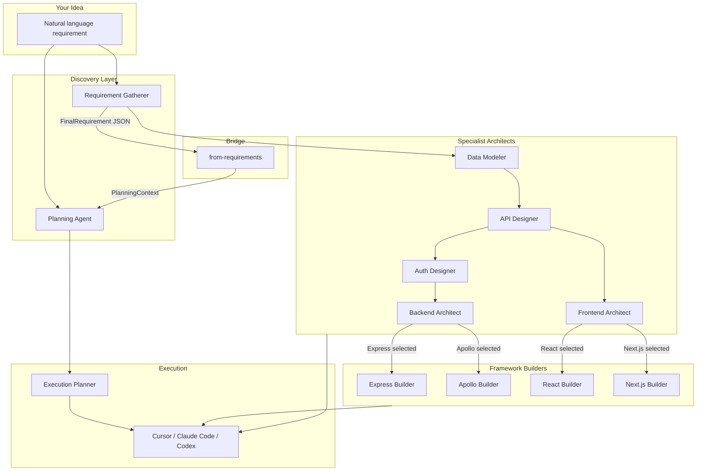
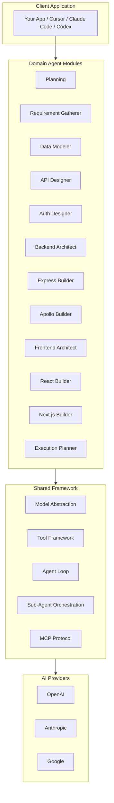
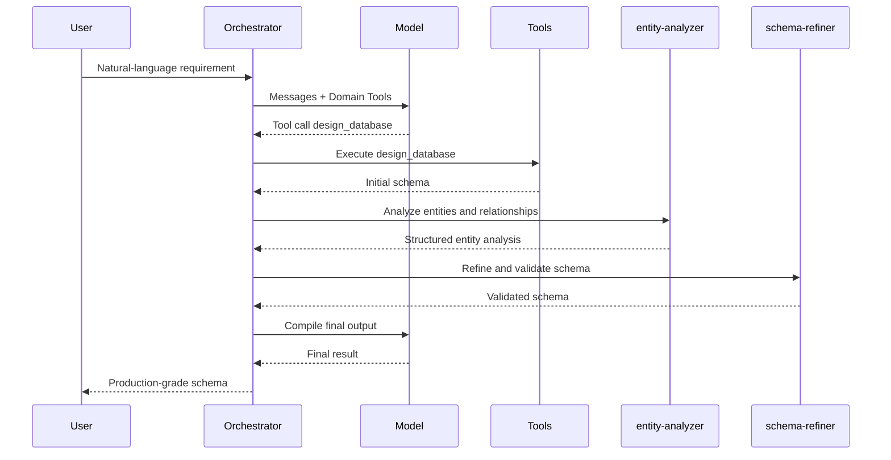
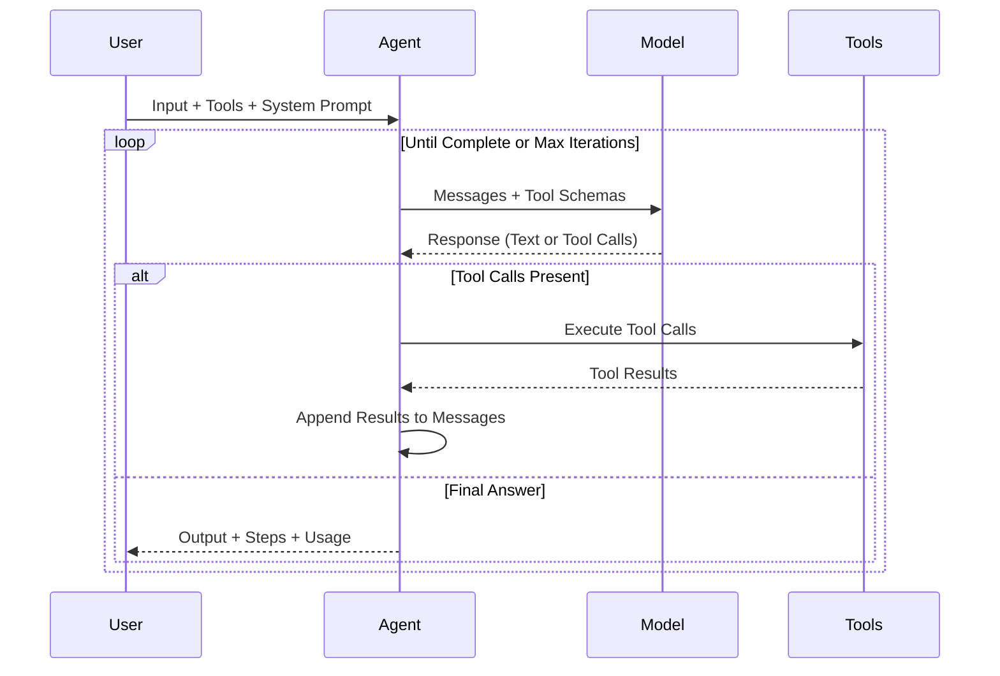

<p align="center">
  <h1 align="center">sweagent</h1>
  <p align="center">
    <strong>The planning layer that makes Cursor, Claude Code, and Codex 10x more effective.</strong>
  </p>
  <p align="center">
    14 domain-specialized AI agent pipelines -- Planning, Requirements, Data Modeling, API Design, Auth, Backend, Frontend, and more -- each with dedicated orchestrators, sub-agents, and structured outputs. Generate implementation-ready blueprints, then hand them to your coding agent.
  </p>
</p>

<p align="center">
  <a href="https://www.npmjs.com/package/sweagent"></a>
  <a href="https://www.typescriptlang.org/"></a>
  <a href="https://github.com/sijeeshmiziha/sweagent/blob/main/LICENSE"></a>
  <a href="https://github.com/sijeeshmiziha/sweagent/pulls"></a>
</p>

<p align="center">
  <a href="#the-problem">The Problem</a> •
  <a href="#how-it-works">How It Works</a> •
  <a href="#practical-usage">Practical Usage</a> •
  <a href="#domain-agent-modules">Modules</a> •
  <a href="#getting-started">Getting Started</a> •
  <a href="#installation">Installation</a> •
  <a href="#architecture">Architecture</a> •
  <a href="#api-reference">API Reference</a> •
  <a href="#reference">Reference</a>
</p>

---

## The Problem

AI coding agents -- Cursor, Claude Code, Codex -- are powerful executors, but they fail at planning. Hand one a vague requirement and it guesses a tech stack, skips data modeling, forgets auth, and produces half-finished code.

**Without sweagent**, a coding agent receives `"build a task manager"` and immediately starts writing code:

- Picks a random framework (maybe Express, maybe Fastify, who knows)
- Invents a database schema on the fly, misses relationships
- Forgets authentication entirely
- Skips error handling and edge cases
- Produces something that sort-of runs but needs a rewrite

**With sweagent**, the coding agent receives a structured blueprint before writing a single line:

- 11-section markdown plan with tech stack, data models, API routes, auth flow, implementation order, edge cases, and testing checklist
- Structured JSON requirements with actors, user flows, stories, and module breakdowns
- Database schemas with exact field types, relationships, indexes, and validation rules
- API contracts with endpoints, methods, request/response shapes, and auth requirements
- Frontend architecture with pages, components, routing, and state management

Each pipeline walks through structured stages -- discovery, analysis, design, synthesis -- not a single LLM call. The result is a professional-grade artifact that a coding agent can execute step-by-step, or that a human architect can review and approve.

```typescript
import { runPlanningWithResult } from 'sweagent';

const { planning, plan } = await runPlanningWithResult({
  input: 'Task manager app with user auth, task CRUD, assignments, and a dashboard',
  model: { provider: 'openai', model: 'gpt-4o-mini' },
});

if (planning) {
  console.log('Plan is implementation-ready. Hand it to your coding agent.');
  console.log(plan); // Full markdown blueprint
}
```

TypeScript-first, built on the Vercel AI SDK, ships with all provider SDKs (OpenAI, Anthropic, Google). Set your API keys and go.

---

## How It Works

sweagent is not a single agent. It is a system of 14 domain-specialized agent pipelines organized across the full software planning lifecycle. Each module can run independently, or you can chain them into a full-stack specification pipeline.



### Three usage modes

**1. Quick plan** -- Planning Agent standalone. One call, one markdown plan. Best for getting a coding agent started fast.

**2. Structured requirements** -- Requirement Gatherer produces typed JSON (actors, flows, stories, modules, database, API). Feed the JSON to specialist modules (Data Modeler, API Designer, etc.) for detailed specs per layer. Use `runPlanningFromRequirements` to bridge requirement-gatherer output into the planning pipeline, skipping redundant discovery stages.

**3. Full pipeline** -- Chain all agents together. Each agent's output feeds the next: requirements -> data model -> API design -> auth -> backend architecture -> frontend architecture. Save all specs and hand the directory to your coding agent.

---

## Practical Usage

### Workflow 1: Generate a plan for Cursor / Claude Code

Generate a plan, save it to a file, and reference it in your coding agent:

```typescript
import { runPlanningWithResult } from 'sweagent';
import { writeFileSync } from 'fs';

const { planning, plan } = await runPlanningWithResult({
  input: 'E-commerce with users, products, cart, checkout, admin dashboard',
  model: { provider: 'openai', model: 'gpt-4o-mini' },
});

writeFileSync('plan.md', plan);
```

**Cursor** -- Open `plan.md` and say: _"Implement this plan step by step"_. Or copy it to `.cursor/rules/` so every agent session uses it as context.

**Claude Code** -- Save as `CLAUDE.md` for automatic context, or save as `plan.md` and tell Claude Code: _"Read plan.md and implement phase 1"_.

**Codex** -- Use the Requirement Gatherer for structured JSON output and feed `requirements.json` as context for implementation.

### Workflow 2: Full-stack spec generation

Chain multiple agents to go from a vague idea to implementation-ready specs for every layer:

```typescript
import {
  runRequirementGathererAgent,
  runDataModelerAgent,
  runApiDesignerAgent,
  runAuthDesignerAgent,
  runBackendArchitectAgent,
  runFrontendArchitectAgent,
} from 'sweagent';
import { writeFileSync } from 'fs';

const model = { provider: 'openai', model: 'gpt-4o-mini' } as const;

// Step 1: Gather structured requirements
const requirements = await runRequirementGathererAgent({
  input: 'Project management SaaS with teams, Kanban boards, time tracking, and billing',
  model,
  maxIterations: 15,
});

// Step 2: Design the data model from requirements
const dataModel = await runDataModelerAgent({
  input: `Design a data model based on these requirements:\n${requirements.output}`,
  model,
  maxIterations: 15,
});

// Step 3: Design the API from the data model
const apiDesign = await runApiDesignerAgent({
  input: `Design REST API for this data model:\n${dataModel.output}`,
  model,
  maxIterations: 15,
});

// Step 4: Design auth from the requirements and API
const authDesign = await runAuthDesignerAgent({
  input: `Design auth for this project:\nRequirements: ${requirements.output}\nAPI: ${apiDesign.output}`,
  model,
  maxIterations: 15,
});

// Step 5: Plan backend architecture
const backendDesign = await runBackendArchitectAgent({
  input: `Design backend:\nData model: ${dataModel.output}\nAPI: ${apiDesign.output}\nAuth: ${authDesign.output}`,
  model,
  maxIterations: 15,
});

// Step 6: Plan frontend architecture
const frontendDesign = await runFrontendArchitectAgent({
  input: `Design frontend:\nAPI: ${apiDesign.output}\nRequirements: ${requirements.output}`,
  model,
  maxIterations: 15,
});

// Save all specs for your coding agent
writeFileSync('specs/requirements.json', requirements.output);
writeFileSync('specs/data-model.json', dataModel.output);
writeFileSync('specs/api-design.json', apiDesign.output);
writeFileSync('specs/auth-design.json', authDesign.output);
writeFileSync('specs/backend-design.json', backendDesign.output);
writeFileSync('specs/frontend-design.json', frontendDesign.output);

// Hand the specs/ directory to Cursor, Claude Code, or Codex
// "Implement the backend using specs/backend-design.json and specs/data-model.json"
```

### Workflow 3: Requirements to plan (the bridge)

The Requirement Gatherer produces structured JSON. The `runPlanningFromRequirements` function converts that JSON into a `PlanningContext` at the design stage, skipping the redundant discovery and requirements stages that the requirement-gatherer already handled:

```typescript
import { runRequirementGathererAgent, runPlanningFromRequirements } from 'sweagent';

const model = { provider: 'openai', model: 'gpt-4o-mini' } as const;

// Step 1: Gather structured requirements (actors, flows, stories, modules, DB)
const reqResult = await runRequirementGathererAgent({
  input: 'Task manager with teams, Kanban boards, and time tracking',
  model,
  maxIterations: 15,
});

// Step 2: Convert requirements into a planning context and generate the plan
// Skips discovery + requirements stages; begins at design
const planResult = await runPlanningFromRequirements({
  requirement: JSON.parse(reqResult.output),
  model,
});

console.log(planResult.output); // Full implementation plan as markdown
```

### Interactive chat mode

For iterative refinement, use `processPlanningChat` in a multi-turn conversation:

```typescript
import { processPlanningChat } from 'sweagent';
import type { PlanningContext } from 'sweagent';

let context: PlanningContext | null = null;

// Turn 1: describe the project
const turn1 = await processPlanningChat('Build a task manager with teams', context, {
  model: { provider: 'openai', model: 'gpt-4o-mini' },
});
context = turn1.context;
console.log(turn1.message); // Assistant asks clarifying questions

// Turn 2: answer and advance
const turn2 = await processPlanningChat('Use NextAuth with GitHub OAuth', context, {
  model: { provider: 'openai', model: 'gpt-4o-mini' },
});
context = turn2.context;

// Continue until turn.planMarkdown is set (plan complete)
```

---

## Domain Agent Modules

| Module                   | Function                      | Sub-Agents                                                 | Output                                            | Key Tools                                                     |
| ------------------------ | ----------------------------- | ---------------------------------------------------------- | ------------------------------------------------- | ------------------------------------------------------------- |
| **Planning**             | `runPlanningAgent`            | --                                                         | Markdown plan (11 sections)                       | pipeline stages                                               |
| **Requirement Gatherer** | `runRequirementGathererAgent` | --                                                         | Structured JSON (actors, flows, stories, modules) | stage tools                                                   |
| **Data Modeler**         | `runDataModelerAgent`         | `entity-analyzer`, `relationship-mapper`, `schema-refiner` | Data model JSON (MongoDB/PostgreSQL)              | `design_schema`, `refine_schema`, `validate_data_model`       |
| **API Designer**         | `runApiDesignerAgent`         | `endpoint-analyzer`, `contract-designer`                   | API design JSON (REST/GraphQL)                    | `design_api`, `validate_api`                                  |
| **Auth Designer**        | `runAuthDesignerAgent`        | `security-analyzer`, `flow-designer`                       | Auth design JSON (strategy, flows, RBAC)          | `design_auth`, `validate_auth`                                |
| **Backend Architect**    | `runBackendArchitectAgent`    | `framework-selector`, `service-planner`                    | Backend design JSON                               | `design_backend`, `validate_backend`                          |
| **Express Builder**      | `runExpressBuilderAgent`      | `route-generator`, `middleware-configurator`               | Express config JSON                               | `generate_express`, `scaffold_express`, `validate_express`    |
| **Apollo Builder**       | `runApolloBuilderAgent`       | `schema-generator`, `resolver-planner`                     | Apollo subgraph config JSON                       | `generate_subgraph`, `scaffold_subgraph`, `validate_subgraph` |
| **Frontend Architect**   | `runFrontendArchitectAgent`   | `page-planner`, `component-analyzer`, `framework-selector` | Frontend design JSON                              | --                                                            |
| **React Builder**        | `runReactBuilderAgent`        | `graphql-analyzer`, `config-validator`                     | React app config JSON                             | `generate_frontend`, `validate_frontend_config`               |
| **Next.js Builder**      | `runNextjsBuilderAgent`       | `route-planner`, `api-route-generator`                     | Next.js App Router config JSON                    | `generate_nextjs`, `validate_nextjs`                          |
| **Execution Planner**    | `runExecutionPlannerAgent`    | `edge-case-analyzer`, `testing-strategist`                 | Execution plan JSON                               | `create_execution_plan`, `validate_execution_plan`            |
| **Hello World**          | `runAgent` + `helloWorldTool` | --                                                         | Greeting (template module)                        | `hello_world`                                                 |

### Architects delegate to builders

The **Backend Architect** analyzes requirements and selects a framework (Express, Apollo, or both). Based on its `framework` field, the downstream **Express Builder** or **Apollo Builder** generates the concrete configuration with routes, middleware, and scaffolding.

The **Frontend Architect** works the same way: it plans pages, components, routing, and state management, then delegates to the **React Builder** (for React + Vite) or the **Next.js Builder** (for Next.js App Router) based on framework selection.

### Planning pipeline stages

The Planning Agent is the centerpiece for AI coding agents. It progresses through four structured stages with 8+ sequential LLM calls:

| Stage            | What it produces                                   | Sections                                                            |
| ---------------- | -------------------------------------------------- | ------------------------------------------------------------------- |
| **Discovery**    | Understands the project, asks clarifying questions | Project overview                                                    |
| **Requirements** | 4 sequential LLM calls to flesh out the spec       | Tech stack, feature decisions, data models, pages/routes, auth flow |
| **Design**       | 2 sequential LLM calls for technical design        | API routes, implementation details                                  |
| **Synthesis**    | Assembles the final plan                           | Implementation order, edge cases, testing checklist                 |

The output plan contains 11 sections: Overview, Tech Stack, Feature Decisions, Data Models, Pages and Routes, Authentication Flow, API Routes, Implementation Details, Execution Plan, Edge Cases, and Testing Checklist.

### The from-requirements bridge

When you already have structured requirements from the Requirement Gatherer, `runPlanningFromRequirements` converts the `FinalRequirement` JSON into a `PlanningContext` pre-filled at the design stage. It skips the discovery and requirements stages (which the requirement-gatherer already handled) and jumps straight to generating API routes, implementation details, execution plan, edge cases, and the testing checklist.

---

## Getting Started

### Level 1: Model invocation

```typescript
import { createModel } from 'sweagent';

const model = createModel({
  provider: 'openai', // 'openai' | 'anthropic' | 'google'
  model: 'gpt-4o-mini',
  temperature: 0.7,
});

const response = await model.invoke([
  { role: 'user', content: 'Explain TypeScript in one sentence.' },
]);
console.log(response.text);
```

### Level 2: Define tools

```typescript
import { defineTool } from 'sweagent';
import { z } from 'zod';

const calculatorTool = defineTool({
  name: 'calculator',
  description: 'Perform math calculations',
  input: z.object({
    expression: z.string().describe('Math expression to evaluate'),
  }),
  handler: async ({ expression }) => {
    const result = eval(expression); // Use a safe math parser in production
    return { result };
  },
});
```

### Level 3: Agent loop

```typescript
import { runAgent, createModel, defineTool, createToolSet } from 'sweagent';
import { z } from 'zod';

const calculatorTool = defineTool({
  name: 'calculator',
  description: 'Perform math calculations',
  input: z.object({ expression: z.string() }),
  handler: async ({ expression }) => ({ result: String(eval(expression)) }),
});

const result = await runAgent({
  model: createModel({ provider: 'openai', model: 'gpt-4o-mini' }),
  tools: createToolSet({ calculator: calculatorTool }),
  systemPrompt: 'You are a helpful assistant. Use the calculator when needed.',
  input: 'What is 25 multiplied by 4?',
  maxIterations: 10,
  onStep: step => console.log(`Step ${step.iteration}:`, step.toolCalls ?? step.content),
});
console.log(result.output);
```

### Level 4: Subagents

```typescript
import {
  defineSubagent,
  createSubagentToolSet,
  runAgent,
  createModel,
  createToolSet,
} from 'sweagent';

const model = createModel({ provider: 'openai', model: 'gpt-4o-mini' });

const researcher = defineSubagent({
  name: 'researcher',
  description: 'Research a topic and return a short summary',
  systemPrompt: 'You are a researcher. Answer concisely.',
});
const subagentTools = createSubagentToolSet([researcher], { parentModel: model });
const tools = createToolSet({ ...subagentTools });

const result = await runAgent({
  model,
  tools,
  systemPrompt: 'You can delegate research to subagent_researcher.',
  input: 'Research the history of TypeScript and summarize in 2 sentences.',
  maxIterations: 10,
});
```

### Level 5: Planning pipeline

```typescript
import { runPlanningWithResult } from 'sweagent';

const { planning, plan } = await runPlanningWithResult({
  input: 'E-commerce site: users, products, cart, checkout, admin dashboard',
  model: { provider: 'openai', model: 'gpt-4o-mini' },
});

console.log('Ready for coding agent:', planning);
console.log(plan);
```

### Level 6: MCP integration

```typescript
import { BaseMcpClient } from 'sweagent';

const config = BaseMcpClient.resolveConfig(
  { url: 'https://your-mcp-server.example.com' },
  { envPrefix: 'MCP' }
);
const client = new BaseMcpClient({ name: 'my-app', version: '1.0.0' }, config);
const result = await client.callTool('tool_name', { arg: 'value' });
```

---

## Installation

### Prerequisites

- **Node.js** >= 18.0.0
- **npm** >= 8.0.0 (or yarn, pnpm, bun)

### Install

```bash
npm install sweagent
```

Or with yarn, pnpm, or bun:

```bash
yarn add sweagent
pnpm add sweagent
bun add sweagent
```

All AI provider SDKs (OpenAI, Anthropic, Google) are included; no extra packages needed.

### From source

```bash
git clone https://github.com/sijeeshmiziha/sweagent.git
cd sweagent
npm install
```

### Environment setup

Create a `.env` file in your project root:

```bash
# At least one provider API key is required
OPENAI_API_KEY=sk-...
ANTHROPIC_API_KEY=sk-ant-...
GOOGLE_GENERATIVE_AI_API_KEY=...
```

### Verify

```bash
# If installed as a package
echo 'import { createModel, runAgent, helloWorldTool } from "sweagent";
const model = createModel({ provider: "openai", model: "gpt-4o-mini" });
const result = await runAgent({ model, tools: [helloWorldTool], systemPrompt: "You are helpful.", input: "Say hello" });
console.log(result.output);' > test.mjs
node --env-file=.env test.mjs

# If cloned from source
npm run example -- examples/hello-world/01-hello-world.ts
```

---

## Architecture

### System overview



### Orchestrator with sub-agents

Domain agents like Data Modeler and React Builder delegate to specialized sub-agents:



### Agent execution loop



### Multi-stage pipeline pattern

Each domain agent progresses through structured stages -- discovery, requirements, design, synthesis -- with dedicated LLM calls at each step. The Planning pipeline makes 8+ sequential LLM calls across 4 stages. No single-shot prompt engineering; each stage builds on the last and produces traceable intermediate results.

### Provider adapter pattern

Models are created via `createModel({ provider, model, ... })`. A shared AI SDK adapter wraps the Vercel AI SDK's `generateText` and normalizes messages, tool schemas, and responses. Each provider has a thin factory that passes the correct `LanguageModel` into this adapter. Provider-specific logic stays in one place; everything else is provider-agnostic.

### Tool execution safety

Inputs are validated with Zod before any tool runs. Invalid input produces a `ToolError` with the parse error; the handler is never called with bad data. Handler errors are caught and rethrown as `ToolError` with the original error as cause. The agent loop receives structured tool results (including error payloads) so the model can see failures and retry or adjust.

### Error hierarchy

| Class               | When                                             |
| ------------------- | ------------------------------------------------ |
| **LibraryError**    | Base; all others extend it.                      |
| **ModelError**      | Model creation or invoke failed.                 |
| **ToolError**       | Tool not found or tool execution failed.         |
| **ValidationError** | Zod validation failed.                           |
| **AgentError**      | Agent reached max iterations without completing. |
| **SubagentError**   | Subagent config or run failed.                   |

All accept an optional `cause` for chaining.

---

## API Reference

All public APIs are exported from the main package: `import { ... } from 'sweagent'`.

### Models

**createModel(config)** -- Create a model instance.

```typescript
import { createModel } from 'sweagent';

const model = createModel({
  provider: 'openai' | 'anthropic' | 'google',
  model: string,            // e.g. 'gpt-4o', 'claude-sonnet-4-20250514'
  apiKey?: string,          // Uses env var by default
  temperature?: number,
  maxOutputTokens?: number,
  baseUrl?: string,
});

const response = await model.invoke(messages, { tools });
// response: { text, toolCalls, usage, finishReason }
```

**Supported models (examples):**

| Provider  | Models                                               |
| --------- | ---------------------------------------------------- |
| OpenAI    | `gpt-4o`, `gpt-4o-mini`, `gpt-4-turbo`               |
| Anthropic | `claude-sonnet-4-20250514`, `claude-3-opus-20240229` |
| Google    | `gemini-1.5-pro`, `gemini-1.5-flash`                 |

**Vision:** `model.generateVision(prompt, images, options)` for image inputs.

---

### Tools

**defineTool(config)** -- Define a type-safe tool with Zod schema and handler.

```typescript
import { defineTool } from 'sweagent';
import { z } from 'zod';

const tool = defineTool({
  name: 'my_tool',
  description: 'What the tool does',
  input: z.object({ key: z.string() }),
  handler: async (parsed, context) => ({ result: parsed.key }),
});
```

**createToolSet(tools)** -- Build a record of tools for the agent (key = tool name).

**getTool(toolSet, name)** / **getTools(toolSet)** -- Look up one or all tools.

**executeTool(tool, input, options)** -- Run a single tool with input.

**executeToolByName(toolSet, name, input, options)** -- Run by name; throws if tool missing.

**zodToJsonSchema(schema)** -- Convert a Zod schema to JSON Schema (e.g. for MCP).

---

### Agents

**runAgent(config)** -- Run the agent loop until the model returns no tool calls or max iterations is reached.

```typescript
import { runAgent } from 'sweagent';

const result = await runAgent({
  model,
  tools: createToolSet({ ... }),
  systemPrompt: string,
  input: string,
  maxIterations?: number,   // default 10
  onStep?: (step: AgentStep) => void,
});

// result: { output, steps, totalUsage, messages }
```

---

### Subagents

**defineSubagent(config)** -- Define a subagent (name must be kebab-case).

```typescript
import { defineSubagent } from 'sweagent';

const def = defineSubagent({
  name: 'my-subagent',
  description: 'What this subagent does',
  systemPrompt: '...',
  tools?: Record<string, Tool>,
  model?: ModelConfig,
  maxIterations?: number,
  disallowedTools?: string[],
  onStep?: (step) => void,
});
```

**runSubagent(definition, input, options)** -- Run the subagent in isolation.

**createSubagentTool(definition, options)** -- Expose one subagent as a tool.

**createSubagentToolSet(definitions, options)** -- Build a record of subagent tools (`subagent_<name>`).

---

### Planning

**runPlanningAgent(config)** -- One-shot mode: single input, auto-advances through all stages, returns plan markdown.

```typescript
import { runPlanningAgent } from 'sweagent';

const result = await runPlanningAgent({
  input: string,
  model?: ModelConfig,
  maxIterations?: number,
  onStep?: (step: AgentStep) => void,
  logger?: Logger,
});
// result: AgentResult { output, steps, totalUsage, messages }
```

**runPlanningWithResult(config)** -- Runs the planning agent then validates the output with an LLM judge.

```typescript
import { runPlanningWithResult } from 'sweagent';

const result = await runPlanningWithResult({
  input: string,
  model?: ModelConfig,
  logger?: Logger,
});
// result: { planning: boolean, plan: string }
```

**processPlanningChat(userMessage, context, config)** -- Multi-turn chat mode. Pass `null` context on the first turn.

```typescript
import { processPlanningChat } from 'sweagent';

const result = await processPlanningChat(userMessage, context, {
  model?: ModelConfig,
  maxIterations?: number,
  onStep?: (step: AgentStep) => void,
  logger?: Logger,
});
// result: PlanChatTurnResult { message, context, pendingQuestions, planMarkdown }
```

**runPlanningFromRequirements(config)** -- Convert requirement-gatherer output to a plan, skipping redundant stages.

```typescript
import { runPlanningFromRequirements } from 'sweagent';

const result = await runPlanningFromRequirements({
  requirement: FinalRequirement,  // JSON from requirement-gatherer
  model?: ModelConfig,
  onStep?: (step: AgentStep) => void,
  logger?: Logger,
});
// result: AgentResult { output (plan markdown), steps, totalUsage, messages }
```

**validatePlanForCodingAgent(planMarkdown, model, logger)** -- LLM-based validation. Returns `{ valid: boolean, feedback?: string }`.

**assemblePlan(projectName, sections)** -- Assemble `PlanSections` into a single markdown string.

**writePlanToFile(markdown, outputPath)** -- Write plan markdown to a file.

**PlanningContextBuilder** -- Fluent builder for `PlanningContext`:

```typescript
import { createPlanningContextBuilder } from 'sweagent';

const context = createPlanningContextBuilder()
  .withStage('requirements')
  .withProjectDescription('Task manager app')
  .withSections({ overview: '## Overview\n...' })
  .build();
```

---

### MCP

**BaseMcpClient** -- Base class for MCP clients. Lazy connection, `callTool(name, args)` for invocation.

**BaseMcpClient.resolveConfig(options, resolveOpts)** -- Build config from options and env (e.g. `MCP_URL`, `MCP_COMMAND`, `MCP_ARGS`).

---

### Errors

| Class               | When                                             |
| ------------------- | ------------------------------------------------ |
| **LibraryError**    | Base; all others extend it.                      |
| **ModelError**      | Model creation or invoke failed.                 |
| **ToolError**       | Tool not found or tool execution failed.         |
| **ValidationError** | Zod validation failed.                           |
| **AgentError**      | Agent reached max iterations without completing. |
| **SubagentError**   | Subagent config or run failed.                   |

All accept an optional `cause` for chaining.

---

## Reference

### Environment variables

| Variable                               | Purpose                                                        |
| -------------------------------------- | -------------------------------------------------------------- |
| `OPENAI_API_KEY`                       | OpenAI API key                                                 |
| `ANTHROPIC_API_KEY`                    | Anthropic API key                                              |
| `GOOGLE_GENERATIVE_AI_API_KEY`         | Google AI API key                                              |
| `MCP_URL` / `MCP_COMMAND` / `MCP_ARGS` | MCP client (when using `resolveConfig`)                        |
| `PROVIDER`                             | Default provider for examples                                  |
| `MODEL`                                | Default model for examples                                     |
| `REQUIREMENT`                          | Project requirement for planning/requirement-gatherer examples |
| `MAX_ITERATIONS`                       | Max agent iterations for examples                              |

### Config types

- **ModelConfig** -- `provider`, `model`, `apiKey?`, `temperature?`, `maxOutputTokens?`, `baseUrl?`
- **AgentConfig** -- `model`, `tools`, `systemPrompt`, `input`, `maxIterations?`, `onStep?`
- **PlanningAgentConfig** -- `input`, `model?`, `maxIterations?`, `onStep?`, `logger?`
- **PlanFromRequirementsConfig** -- `requirement`, `model?`, `onStep?`, `logger?`

### FAQ

**Which AI provider should I use?**
All work well. Choose by existing infrastructure and pricing. The API is the same regardless of provider.

**Can I use this with Claude Code / Codex / Cursor?**
Yes -- this is the primary use case. See [Practical Usage](#practical-usage) for integration guides with code examples.

**How do I handle rate limits?**
sweagent has no built-in rate limiting. Use a retry library (e.g. `p-retry`) around `model.invoke` or `runAgent` if needed.

**Can I use sweagent in the browser?**
Target is Node.js. For browsers, proxy API calls through your backend and keep keys server-side.

**How do I add a new provider?**
Implement a factory that returns a model conforming to the internal `Model` interface (e.g. via `createAIModel` and the provider's AI SDK binding) and register it in `createModel`.

### Troubleshooting

**API key errors** -- Ensure the key is set: `echo $OPENAI_API_KEY`. If using `.env`, load it: `tsx --env-file=.env your-script.ts`.

**Model not found** -- Use the exact model id for the provider (e.g. `gpt-4o-mini`, `claude-sonnet-4-20250514`). Confirm your account has access.

**Agent hits max iterations** -- Increase `maxIterations` or simplify the task. Check that tools return clear, parseable results.

**Tool not found** -- Tools must be in the same object passed to `runAgent` under the name the model uses.

**Planning module returns `planning: false`** -- The LLM validator found missing sections. Try a more capable model or provide a more detailed project description.

---

## Examples

The [examples directory](./examples/) contains runnable scripts organized by domain agent:

```bash
# Interactive launcher -- pick a domain agent, then an example
npm run example:interactive

# Run a specific example
npm run example -- examples/planning/01-planning-agent.ts
npm run example -- examples/data-modeler/01-data-modeler-agent.ts
npm run example -- examples/react-builder/01-react-builder-agent.ts
```

| Domain Agent         | Example                                               | Output                                          |
| -------------------- | ----------------------------------------------------- | ----------------------------------------------- |
| Core Framework       | 01-05: Model, Providers, Tools, Multi-Tool, Subagents | Models, tools, agent loop, sub-agent delegation |
| Hello World          | 01: Hello World                                       | Minimal agent with greeting tool (template)     |
| Planning             | 01: Planning Agent                                    | Markdown plan through 4-stage pipeline          |
| Requirement Gatherer | 01: Requirement Gatherer                              | JSON requirements (actors, flows, stories)      |
| Data Modeler         | 01: Data Modeler                                      | MongoDB/PostgreSQL data model                   |
| API Designer         | 01: API Designer                                      | REST/GraphQL API design                         |
| Auth Designer        | 01: Auth Designer                                     | Auth strategy and RBAC                          |
| Backend Architect    | 01: Backend Architect                                 | Backend architecture and services               |
| Express Builder      | 01: Express Builder                                   | Express.js config with routes and middleware    |
| Apollo Builder       | 01: Apollo Builder                                    | Apollo GraphQL subgraph config                  |
| Frontend Architect   | 01: Frontend Architect                                | Frontend architecture with pages and components |
| React Builder        | 01: React Builder                                     | React app config from GraphQL schema            |
| Next.js Builder      | 01: Next.js Builder                                   | Next.js App Router config                       |
| Execution Planner    | 01: Execution Planner                                 | Phased plan with edge cases and testing         |

---

## Contributing

We welcome contributions. See [CONTRIBUTING.md](CONTRIBUTING.md) for code style, testing, and PR process.

```bash
git clone https://github.com/sijeeshmiziha/sweagent.git
cd sweagent
npm install
cp .env.example .env
# Add API keys to .env
npm test
npm run lint
npm run build
```

| Command                             | Description       |
| ----------------------------------- | ----------------- |
| `npm run dev`                       | Watch build       |
| `npm test`                          | Unit tests        |
| `npm run test:integration`          | Integration tests |
| `npm run lint` / `npm run lint:fix` | ESLint            |
| `npm run typecheck`                 | TypeScript        |
| `npm run build`                     | Production build  |

**Support:** [GitHub Issues](https://github.com/sijeeshmiziha/sweagent/issues) (bugs and features) | [GitHub Discussions](https://github.com/sijeeshmiziha/sweagent/discussions) (questions)

---

## License

MIT License -- see [LICENSE](LICENSE) for details.
