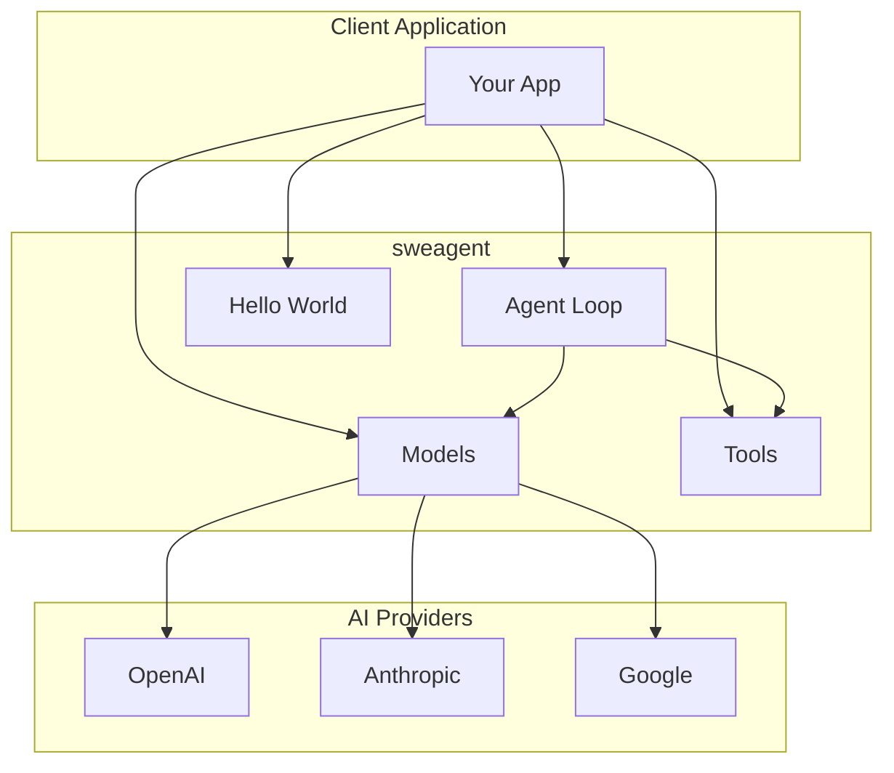
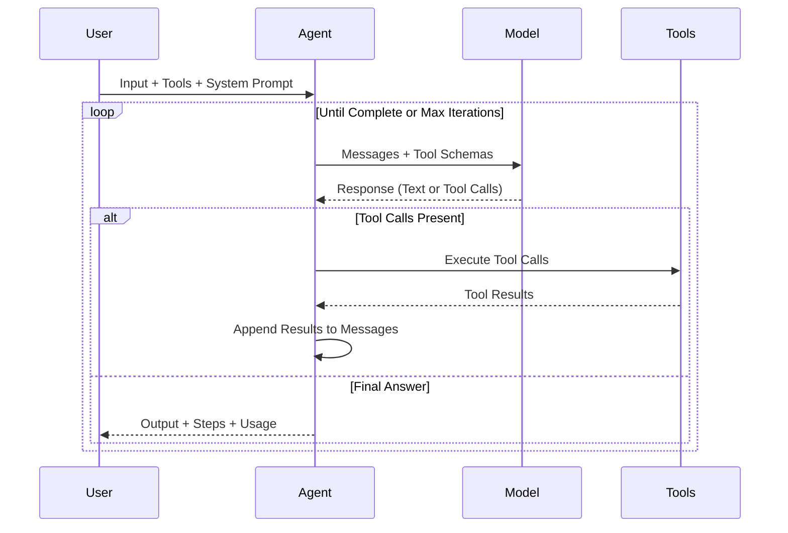

<p align="center">
  <h1 align="center">sweagent</h1>
  <p align="center">
    <strong>A multi-provider AI software engineering agent framework with tool calling.</strong>
  </p>
  <p align="center">
    Build intelligent agents that execute tools and integrate seamlessly with OpenAI, Anthropic, and Google.
  </p>
</p>

<p align="center">
  <a href="https://www.npmjs.com/package/sweagent"></a>
  <a href="https://www.typescriptlang.org/"></a>
  <a href="https://github.com/sijeeshmiziha/sweagent/blob/main/LICENSE"></a>
  <a href="https://github.com/sijeeshmiziha/sweagent/pulls"></a>
</p>

<p align="center">
  <a href="#installation">Installation</a> •
  <a href="#quick-start">Quick Start</a> •
  <a href="#api-reference">API Reference</a> •
  <a href="#examples">Examples</a> •
  <a href="#contributing">Contributing</a>
</p>

---

## Table of Contents

- [Why sweagent?](#why-sweagent)
- [Features](#features)
- [Installation](#installation)
- [Quick Start](#quick-start)
- [Architecture](#architecture)
- [API Reference](#api-reference)
  - [Models](#models)
  - [Tools](#tools)
  - [Agents](#agents)
- [Module Exports](#module-exports)
- [Examples](#examples)
- [FAQ](#faq)
- [Troubleshooting](#troubleshooting)
- [Contributing](#contributing)
- [License](#license)

---

## Why sweagent?

sweagent is a multi-provider AI software engineering agent framework. It provides:

- **Multi-Provider**: Unified API across OpenAI, Anthropic, and Google
- **Agent-First**: Tool calling, agents, and iteration control out of the box
- **Type-Safe**: Full TypeScript support with Zod schema validation
- **Zero Extra Deps**: AI provider SDKs included; set API keys and go

```typescript
// Run an agent with tools in a few lines
import { createModel, runAgent, defineTool } from 'sweagent';
import { z } from 'zod';

const model = createModel({ provider: 'openai', model: 'gpt-4o-mini' });
const greetTool = defineTool({
  name: 'greet',
  description: 'Greet someone',
  input: z.object({ name: z.string() }),
  handler: async ({ name }) => ({ message: `Hello, ${name}!` }),
});

const result = await runAgent({
  model,
  tools: [greetTool],
  systemPrompt: 'You are a helpful assistant.',
  input: 'Greet Alice',
});
console.log(result.output);
```

---

## Features

| Feature             | Description                                                                 |
| ------------------- | --------------------------------------------------------------------------- |
| **Multi-Provider**  | Support for OpenAI (GPT-4o), Anthropic (Claude), and Google (Gemini)      |
| **Tool System**     | Define custom tools with Zod schema validation and type inference          |
| **Agent Framework** | Build autonomous agents with tool calling, reasoning, and iteration control |
| **Type-Safe**       | Full TypeScript support with comprehensive type definitions                 |
| **Zero Config**     | Works out of the box with environment variables                             |

---

## Installation

### Using npm

```bash
npm install sweagent
```

### Using yarn

```bash
yarn add sweagent
```

### Using pnpm

```bash
pnpm add sweagent
```

### Using bun

```bash
bun add sweagent
```

All AI provider SDKs (OpenAI, Anthropic, Google) are included as dependencies; no extra packages are required.

### Environment Setup

Create a `.env` file in your project root:

```bash
# Required: At least one AI provider API key
OPENAI_API_KEY=sk-...
ANTHROPIC_API_KEY=sk-ant-...
GOOGLE_GENERATIVE_AI_API_KEY=...
```

---

## Quick Start

### 1. Create a Model and Invoke

```typescript
import { createModel } from 'sweagent';

const model = createModel({
  provider: 'openai',
  model: 'gpt-4o-mini',
  temperature: 0.7,
});

const response = await model.invoke([
  { role: 'user', content: 'Explain TypeScript in one sentence.' },
]);
console.log(response.content);
```

### 2. Define Custom Tools

Create type-safe tools with Zod validation:

```typescript
import { defineTool } from 'sweagent';
import { z } from 'zod';

const calculatorTool = defineTool({
  name: 'calculator',
  description: 'Perform math calculations',
  input: z.object({
    expression: z.string().describe('Math expression to evaluate'),
  }),
  handler: async ({ expression }) => {
    const result = eval(expression); // Use a safe math parser in production
    return { result };
  },
});
```

### 3. Run an Agent

Build autonomous agents that use tools:

```typescript
import { runAgent, createModel, defineTool } from 'sweagent';
import { z } from 'zod';

const calculatorTool = defineTool({
  name: 'calculator',
  description: 'Perform math calculations',
  input: z.object({ expression: z.string() }),
  handler: async ({ expression }) => ({ result: String(eval(expression)) }),
});

const result = await runAgent({
  model: createModel({ provider: 'openai', model: 'gpt-4o-mini' }),
  tools: [calculatorTool],
  systemPrompt: 'You are a helpful assistant. Use the calculator when needed.',
  input: 'What is 25 multiplied by 4?',
  maxIterations: 10,
  onStep: step => console.log(`Step ${step.iteration}:`, step.action),
});

console.log(result.output);
```

---

## Architecture



### Agent Execution Flow



---

## API Reference

### Models

Create and configure AI models. All imports are from the main package:

```typescript
import { createModel } from 'sweagent';

const model = createModel({
  provider: 'openai' | 'anthropic' | 'google',
  model: string,           // e.g., 'gpt-4o', 'gpt-4o-mini', 'claude-3-5-sonnet-20241022'
  apiKey?: string,         // Uses env var by default (OPENAI_API_KEY, etc.)
  temperature?: number,    // 0-2, default varies by provider
  maxTokens?: number,      // Max tokens in response
});

// Invoke with messages (and optional tools for agent use)
const response = await model.invoke(messages, { tools });
```

#### Supported Models

| Provider  | Models                                                 |
| --------- | ------------------------------------------------------ |
| OpenAI    | `gpt-4o`, `gpt-4o-mini`, `gpt-4-turbo`                 |
| Anthropic | `claude-3-5-sonnet-20241022`, `claude-3-opus-20240229` |
| Google    | `gemini-1.5-pro`, `gemini-1.5-flash`                   |

### Tools

Define type-safe tools with Zod; the agent uses them via `createToolSet`:

```typescript
import { defineTool, createToolSet, getTool } from 'sweagent';
import { z } from 'zod';

const calculatorTool = defineTool({
  name: 'calculator',
  description: 'Perform mathematical calculations',
  input: z.object({
    expression: z.string().describe('Math expression to evaluate'),
  }),
  handler: async ({ expression }) => {
    const result = eval(expression); // Use a safe math parser in production
    return { result };
  },
});

// Create a tool set for the agent
const tools = createToolSet({ calculator: calculatorTool, search: searchTool });

// Retrieve a specific tool by name
const tool = getTool(tools, 'calculator');
```

### Agents

Run autonomous agents with tool calling:

```typescript
import { runAgent } from 'sweagent';

const result = await runAgent({
  model,                    // Created with createModel()
  tools,                    // Array of tools or ToolSet
  systemPrompt: string,     // Instructions for the agent
  input: string,            // User's request
  maxIterations?: number,   // Default: 10
  onStep?: (step) => void,  // Callback for each step
});

// Result structure
interface AgentResult {
  output: string;           // Final answer from the agent
  steps: AgentStep[];       // Array of steps with tool calls
  messages: Message[];      // Full conversation history
  totalUsage: TokenUsage;   // Total tokens used
}
```

---

## Module Exports

sweagent uses a single entry point. Import everything from `sweagent`:

```typescript
import {
  createModel,
  runAgent,
  defineTool,
  createToolSet,
  runHelloWorldAgent,
  helloWorldTool,
} from 'sweagent';
```

---

## Examples

See the [examples directory](./examples/README.md) for runnable examples. Use the interactive launcher or run a specific file:

```bash
# Interactive launcher (pick example and provide inputs)
npm run example:interactive

# Run a specific example
npm run example -- examples/core/01-basic-model.ts
npm run example -- examples/hello-world/01-hello-world.ts
```

| Group           | Examples                                               | Description           |
| --------------- | ------------------------------------------------------ | --------------------- |
| **Core**        | 01 Basic Model, 02 All Providers, 03 Tool Calling, 04 Multi-Tool Agent | Models, agents, tools |
| **Hello World** | 01 Hello World                                         | Minimal agent with greeting tool |

---

## FAQ

### Which AI provider should I use?

All providers work well for general agents. Choose based on your existing infrastructure and pricing preferences.

### How do I handle rate limits?

sweagent doesn't include built-in rate limiting. Use a retry library (e.g. `p-retry`) around model or agent calls if your provider rate-limits requests.

### Can I use sweagent in the browser?

sweagent is designed for Node.js environments. For browser usage, you'll need to proxy API calls through your backend for security.

---

## Troubleshooting

### API Key Issues

**Error**: `Invalid API key` or `Authentication failed`

```bash
# Verify your API key is set
echo $OPENAI_API_KEY

# Check .env file is being loaded (use --env-file with tsx/node)
node -e "require('dotenv').config(); console.log(process.env.OPENAI_API_KEY)"
```

### Model Not Available

**Error**: `Model not found` or `Invalid model`

```typescript
// Verify model name matches provider's naming
const validModels = {
  openai: ['gpt-4o', 'gpt-4o-mini', 'gpt-4-turbo'],
  anthropic: ['claude-3-5-sonnet-20241022', 'claude-3-opus-20240229'],
  google: ['gemini-1.5-pro', 'gemini-1.5-flash'],
};
```

---

## Contributing

We welcome contributions! Please see our [Contributing Guide](CONTRIBUTING.md) for details.

### Quick Start for Contributors

```bash
# Clone the repository
git clone https://github.com/sijeeshmiziha/sweagent.git
cd sweagent

# Install dependencies
npm install

# Run tests
npm test

# Run linting
npm run lint

# Build the project
npm run build
```

### Development Commands

| Command                    | Description                |
| -------------------------- | -------------------------- |
| `npm run dev`              | Watch mode for development |
| `npm test`                 | Run unit tests             |
| `npm run test:integration` | Run integration tests      |
| `npm run lint`             | Check code style           |
| `npm run lint:fix`         | Auto-fix code style        |
| `npm run typecheck`        | TypeScript type checking   |
| `npm run build`            | Production build           |

---

## Support

- [GitHub Issues](https://github.com/sijeeshmiziha/sweagent/issues) - Bug reports and feature requests
- [GitHub Discussions](https://github.com/sijeeshmiziha/sweagent/discussions) - Questions and community help

---

## License

MIT License - see [LICENSE](LICENSE) for details.
