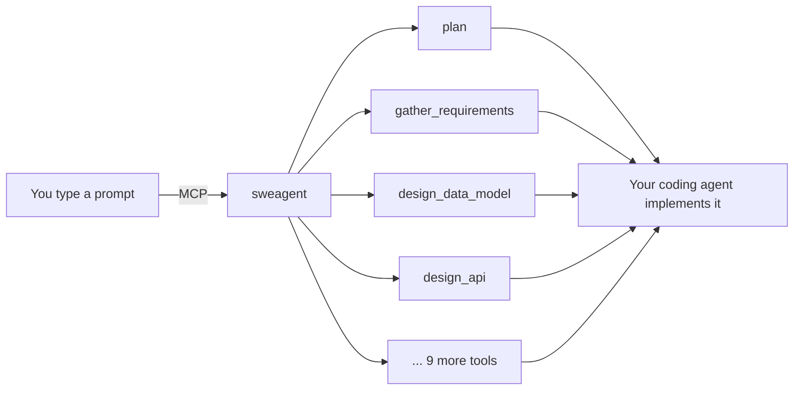
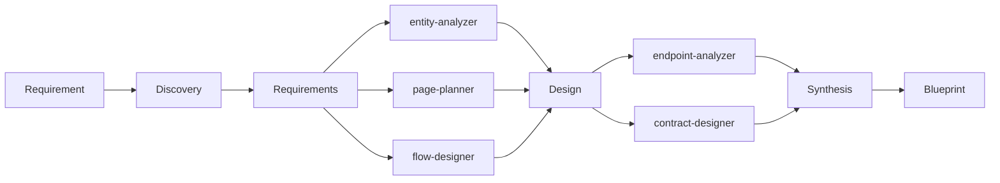
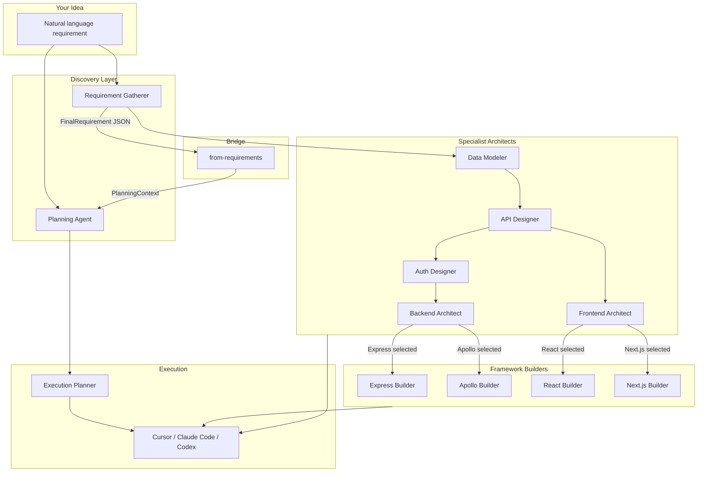
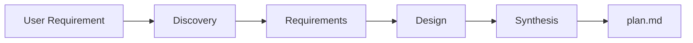
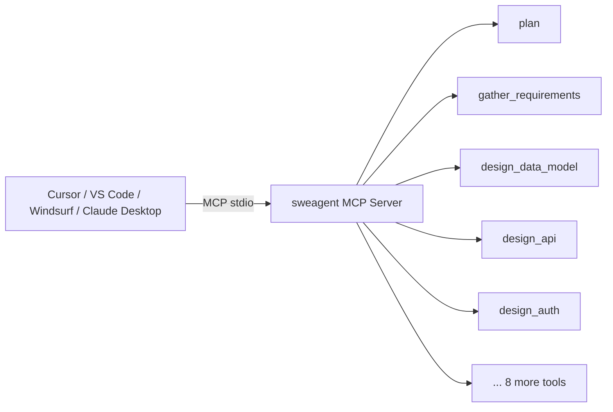
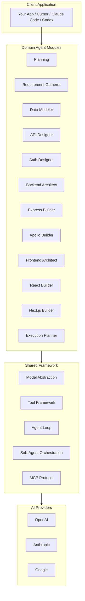
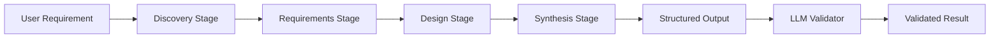
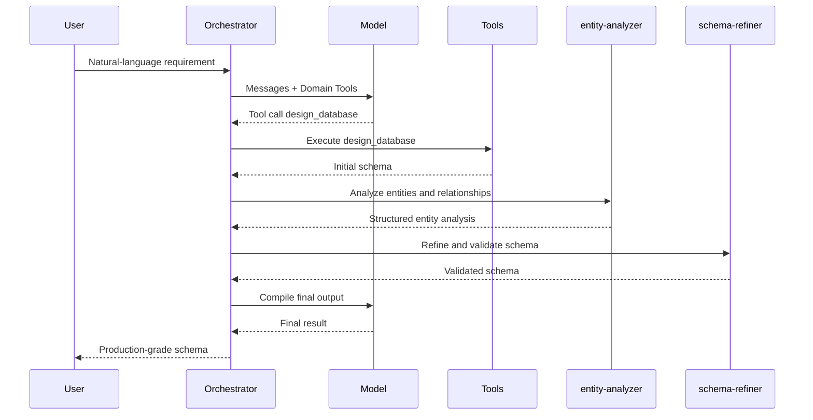
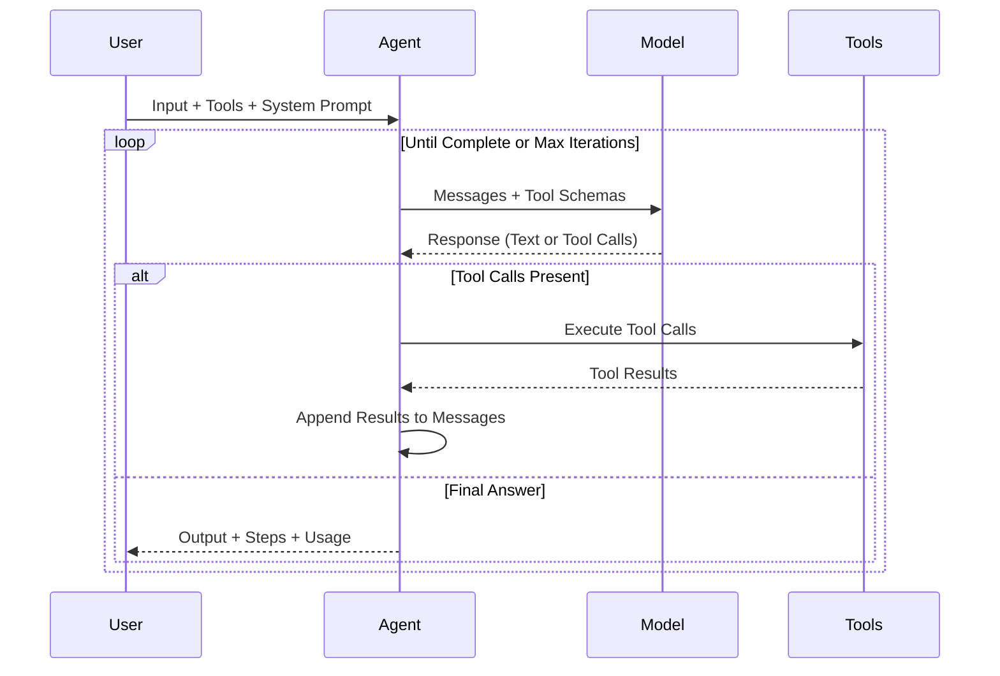

<p align="center">
  <h1 align="center">sweagent</h1>
  <p align="center">
    <strong>The Deep Thinking layer that makes Cursor, Claude Code, and Codex 10x more effective.</strong>
  </p>
  <p align="center">
    Deep, multi-stage reasoning before a single line of code is written. Domain-specialized agent pipelines generate structured blueprints -- requirements, data models, API contracts, auth flows, and architecture specs -- through iterative LLM calls and sub-agent decomposition. Hand the result to your coding agent.
  </p>
</p>

<p align="center">
  <a href="https://www.npmjs.com/package/sweagent"></a>
  <a href="https://www.typescriptlang.org/"></a>
  <a href="https://github.com/sijeeshmiziha/sweagent/blob/main/LICENSE"></a>
  <a href="https://github.com/sijeeshmiziha/sweagent/pulls"></a>
</p>

<p align="center">
  <a href="#the-problem">The Problem</a> •
  <a href="#use-with-cursor-claude-code-and-codex">Use with Coding Agents</a> •
  <a href="#why-sweagent">Why sweagent?</a> •
  <a href="#deep-reasoning-philosophy">Deep Reasoning</a> •
  <a href="#how-it-works">How It Works</a> •
  <a href="#features">Features</a> •
  <a href="#planning-pipeline">Planning Pipeline</a> •
  <a href="#full-pipeline">Full Pipeline</a> •
  <a href="#domain-agent-modules">Modules</a> •
  <a href="#getting-started">Getting Started</a> •
  <a href="#installation">Installation</a> •
  <a href="#mcp-server">MCP Server</a> •
  <a href="#architecture">Architecture</a> •
  <a href="#api-reference">API Reference</a> •
  <a href="#reference">Reference</a> •
  <a href="#examples">Examples</a> •
  <a href="#contributing">Contributing</a>
</p>

---

## Table of Contents

- [The Problem](#the-problem)
- [Use with Cursor, Claude Code, and Codex](#use-with-cursor-claude-code-and-codex)
- [Why sweagent?](#why-sweagent)
- [Deep Reasoning Philosophy](#deep-reasoning-philosophy)
- [How It Works](#how-it-works)
- [Features](#features)
- [Planning Pipeline](#planning-pipeline)
- [Full Pipeline](#full-pipeline)
- [Domain Agent Modules](#domain-agent-modules)
- [Getting Started](#getting-started)
- [Installation](#installation)
- [MCP Server](#mcp-server)
- [Architecture](#architecture)
- [API Reference](#api-reference)
- [Reference](#reference)
- [Examples](#examples)
- [Contributing](#contributing)
- [License](#license)

---

## The Problem

AI coding agents -- Cursor, Claude Code, Codex -- are powerful executors, but they fail at planning. Hand one a vague requirement and it guesses a tech stack, skips data modeling, forgets auth, and produces half-finished code. Enterprise teams need the same rigor from AI that they expect from senior engineers: structured discovery, explicit requirements, deliberate design, and traceable decisions.

**Without sweagent**, a coding agent receives `"build a task manager"` and immediately starts writing code:

- Picks a random framework (maybe Express, maybe Fastify, who knows)
- Invents a database schema on the fly, misses relationships
- Forgets authentication entirely
- Skips error handling and edge cases
- Produces something that sort-of runs but needs a rewrite

**With sweagent**, the coding agent receives a structured blueprint before writing a single line:

- **11-section markdown plan** with tech stack, data models, API routes, auth flow, implementation order, edge cases, and testing checklist
- **Structured JSON requirements** with actors, user flows, stories, and module breakdowns
- **Database schemas** with exact field types, relationships, indexes, and validation rules
- **API contracts** with endpoints, methods, request/response shapes, and auth requirements
- **Frontend architecture** with pages, components, routing, and state management

Each pipeline walks through structured stages -- discovery, analysis, design, synthesis -- not a single LLM call. The result is a professional-grade artifact that a coding agent can execute step-by-step, or that a human architect can review and approve.

```typescript
import { runPlanningAgent } from 'sweagent';

const result = await runPlanningAgent({
  input: 'Task manager app with user auth, task CRUD, assignments, and a dashboard',
  model: { provider: 'openai', model: 'gpt-4o-mini' },
});

console.log('Plan is implementation-ready. Hand it to your coding agent.');
console.log(result.output); // Full markdown blueprint
```

TypeScript-first, built on the Vercel AI SDK, ships with all provider SDKs (OpenAI, Anthropic, Google). Set your API keys and go.

---

## Use with Cursor, Claude Code, and Codex

sweagent is an MCP server. Install it once, add one config to your IDE, and all 13 domain agents are available directly in your chat -- planning, requirements, data modeling, API design, auth, architecture, and more. No scripts, no code, no file juggling.



### 1. Install

```bash
npm install -g sweagent
```

### 2. Add the config for your IDE

**Cursor** -- create `.cursor/mcp.json` in your project root:

```json
{
  "mcpServers": {
    "sweagent": {
      "command": "sweagent",
      "env": { "OPENAI_API_KEY": "your-openai-api-key" }
    }
  }
}
```

**VS Code (Copilot)** -- create `.vscode/mcp.json` in your project root:

```json
{
  "servers": {
    "sweagent": {
      "command": "sweagent",
      "env": { "OPENAI_API_KEY": "your-openai-api-key" }
    }
  }
}
```

**Windsurf** -- edit `~/.codeium/windsurf/mcp_config.json`:

```json
{
  "mcpServers": {
    "sweagent": {
      "command": "sweagent",
      "env": { "OPENAI_API_KEY": "your-openai-api-key" }
    }
  }
}
```

**Claude Desktop** -- edit `~/Library/Application Support/Claude/claude_desktop_config.json` (macOS) or `%APPDATA%\Claude\claude_desktop_config.json` (Windows):

```json
{
  "mcpServers": {
    "sweagent": {
      "command": "sweagent",
      "env": { "OPENAI_API_KEY": "your-openai-api-key" }
    }
  }
}
```

> **Don't want a global install?** Replace `"command": "sweagent"` with `"command": "npx"` and add `"args": ["-y", "sweagent"]`. See [MCP Server](#mcp-server) for all options including from-source setup.

### 3. Restart your IDE and start prompting

Open the chat and try:

- _"Use the plan tool to plan a task manager app with teams, Kanban boards, and time tracking."_
- _"Use the gather_requirements tool to extract structured requirements for an e-commerce platform."_
- _"Use the design_data_model tool to design a PostgreSQL schema for a SaaS billing system."_

The agent calls sweagent, gets back a structured blueprint, and can immediately start implementing it.

### Full reference

- [MCP Server](#mcp-server) -- all 13 tools, input parameters, multi-provider setup, troubleshooting
- [Getting Started](#getting-started) and [Full Pipeline](#full-pipeline) -- programmatic API for scripted pipelines, CI, or chaining multiple agents in code

---

## Why sweagent?

### 1. Domain-specialized agents, not generic wrappers

Each module is a self-contained agent pipeline purpose-built for its domain. The Data Modeler doesn't reuse the Planning Agent's prompts -- it has its own `entity-analyzer` and `schema-refiner` sub-agents, its own tools (`design_schema`, `validate_data_model`), and its own output schema. The React Builder has a `graphql-analyzer` and `config-validator`. Every domain gets the specialized treatment it deserves.

### 2. Multi-stage pipelines with structured outputs

Every domain agent progresses through deliberate stages -- discovery, requirements, design, synthesis -- with dedicated LLM calls at each step. The Planning pipeline makes 8+ sequential LLM calls across 4 stages. The Requirement Gatherer produces structured JSON with actors, user flows, stories, and module breakdowns. No single-shot prompt engineering; each stage builds on the last and produces traceable, reviewable intermediate results.

### 3. Sub-agent orchestration for complex domains

When a domain is too complex for a single agent, sweagent delegates to specialized sub-agents. The Data Modeler orchestrator spawns an `entity-analyzer` to extract entities and relationships, then a `schema-refiner` to normalize and validate the schema. The React Builder uses a `graphql-analyzer` to parse the schema and a `config-validator` to verify the output. Sub-agents run in isolation with their own context, tools, and models -- then return condensed results to the orchestrator.

### 4. Enterprise-quality output, not bullet points

Plans include tech stack decisions, data models with field-level detail, API routes with request/response shapes, phased implementation order, edge cases, and testing checklists. Requirement documents include actors with permissions, user flows with steps, user stories with acceptance criteria, and module breakdowns with CRUD operations. DB schemas include field types, relationships, indexes, and validation rules. These are blueprints, not summaries.

### 5. Provider-agnostic model layer

Your agent code stays the same whether you're using GPT-4o, Claude, or Gemini. One `createModel()` call, one interface, zero provider lock-in. Switch models in config, not in code.

### 6. Incremental progress across sessions

Long-running agents fail when they lose context. sweagent encodes patterns for structured progress tracking: feature lists with pass/fail status, progress files, and clean-state principles so each session picks up exactly where the last one left off.

---

## Deep Reasoning Philosophy

Coding agents generate code fast. But speed without depth produces fragile, incomplete software. sweagent applies deep reasoning -- structured, multi-stage, decomposed -- so your coding agent receives a blueprint that has been thoroughly worked through before implementation begins.

### Multi-Stage Reasoning

sweagent never produces one-shot answers. The Planning Agent progresses through four deliberate stages -- discovery, requirements, design, synthesis -- with dedicated LLM calls at each step. Each stage consumes the output of the previous one, building context incrementally rather than cramming everything into a single prompt. Requirements inform design decisions, design decisions shape API contracts, and API contracts feed the implementation order.



### Sub-Agent Decomposition

When a domain is too complex for a single agent, sweagent delegates to specialized sub-agents that run in isolation with their own context, tools, and models. The Data Modeler spawns an `entity-analyzer` to extract entities, a `relationship-mapper` for cardinality, and a `schema-refiner` to normalize the result. The React Builder uses a `graphql-analyzer` to parse schema structure and a `config-validator` to check the output. Each sub-agent returns condensed results to its orchestrator, keeping context windows focused and reasoning sharp.

### Inference-Time Depth

Unlike single-prompt planning tools, sweagent deliberately spends more inference-time compute for higher-quality output. The Planning Agent alone makes 12+ LLM calls across 4 stages and 7 sub-agents. The Data Modeler adds 3 more sub-agent calls. The full pipeline chains 7+ domain agents end-to-end, each with its own multi-call pipeline. This is not a design accident -- more structured reasoning steps produce measurably better blueprints than a single large prompt, the same way a senior engineer produces better architecture by working through each layer separately rather than designing everything at once.

---

## How It Works

sweagent is not a single agent. It is a system of domain-specialized agent pipelines organized across the full software planning lifecycle. Each module can run independently, or you can chain them into a full-stack specification pipeline.



### Three usage modes

**1. Quick plan** -- Planning Agent standalone. One call, one markdown plan. Best for getting a coding agent started fast.

**2. Structured requirements** -- Requirement Gatherer produces typed JSON (actors, flows, stories, modules, database, API). Feed the JSON to specialist modules (Data Modeler, API Designer, etc.) for detailed specs per layer. Use `runPlanningFromRequirements` to bridge requirement-gatherer output into the planning pipeline, skipping redundant discovery stages.

**3. Full pipeline** -- Chain all agents together. Each agent's output feeds the next: requirements -> data model -> API design -> auth -> backend architecture -> frontend architecture. Save all specs and hand the directory to your coding agent.

---

## Features

| Feature                     | Description                                                                                                                                                                                                                                                       |
| --------------------------- | ----------------------------------------------------------------------------------------------------------------------------------------------------------------------------------------------------------------------------------------------------------------- |
| **Domain Agent Modules**    | Planning, Requirement Gatherer, Data Modeler, API Designer, Auth Designer, Backend Architect, Express Builder, Apollo Builder, Frontend Architect, React Builder, Next.js Builder, Execution Planner, and Hello World template -- each a self-contained pipeline. |
| **Multi-Stage Pipelines**   | Every domain agent progresses through structured stages (discovery, requirements, design, synthesis) with dedicated LLM calls at each step. No single-shot prompts.                                                                                               |
| **Sub-Agent Orchestration** | Complex domains delegate to specialized sub-agents (`entity-analyzer`, `schema-refiner`, `graphql-analyzer`, `config-validator`) that run in isolation and return condensed results.                                                                              |
| **Structured Outputs**      | Requirements as typed JSON (actors, flows, stories, modules). DB schemas with field-level detail. Frontend configs with pages, hooks, and branding. Plans with 11 sections.                                                                                       |
| **Multi-Provider Models**   | Unified API for OpenAI, Anthropic, and Google. One `createModel()` call, zero provider lock-in.                                                                                                                                                                   |
| **Type-Safe Tools**         | Define tools with Zod schemas; full type inference and validation before execution. Minimal, workflow-oriented tool sets.                                                                                                                                         |
| **Agent Framework**         | Iterative agent loop with tool calling, step callbacks, and configurable max iterations.                                                                                                                                                                          |
| **MCP Protocol**            | Connect to Model Context Protocol servers over HTTP or stdio. Lazy connection, typed tool invocation.                                                                                                                                                             |
| **Vision**                  | Image inputs via `model.generateVision()` for vision-capable models.                                                                                                                                                                                              |
| **Zero Extra Deps**         | All provider SDKs (OpenAI, Anthropic, Google) included. Set API keys and run.                                                                                                                                                                                     |

---

## Planning Pipeline

The planning module is the centerpiece for AI coding agents. It turns a natural-language project description into a structured, implementation-ready markdown plan through four stages.

### How it works



### Stages

| Stage            | What it produces                                   | Sections                                                            |
| ---------------- | -------------------------------------------------- | ------------------------------------------------------------------- |
| **Discovery**    | Understands the project, asks clarifying questions | Project overview                                                    |
| **Requirements** | 4 sequential LLM calls to flesh out the spec       | Tech stack, feature decisions, data models, pages/routes, auth flow |
| **Design**       | 2 sequential LLM calls for technical design        | API routes, implementation details                                  |
| **Synthesis**    | Assembles the final plan                           | Implementation order, edge cases, testing checklist                 |

### Output

The plan is a markdown document with these sections:

- **Overview** -- project scope and goals
- **Tech Stack** -- languages, frameworks, database, auth approach
- **Feature Decisions** -- what to build and what to defer
- **Data Models** -- schemas, relationships, fields
- **Pages and Routes** -- frontend structure
- **Authentication Flow** -- auth strategy and implementation
- **API Routes** -- endpoints, methods, request/response shapes
- **Implementation Details** -- architecture decisions, file structure
- **Execution Plan** -- phased implementation order
- **Edge Cases** -- error handling, boundary conditions
- **Testing Checklist** -- what to verify at each phase

### Two modes

**One-shot mode** -- pass a requirement, get a plan:

```typescript
import { runPlanningAgent } from 'sweagent';

const result = await runPlanningAgent({
  input: 'Fitness app with workouts, nutrition tracking, and social features',
  model: { provider: 'anthropic', model: 'claude-sonnet-4-20250514' },
});
console.log(result.output); // Full plan markdown
```

**Interactive chat mode** -- multi-turn conversation where you refine the plan:

```typescript
import { processPlanningChat } from 'sweagent';
import type { PlanningContext } from 'sweagent';

let context: PlanningContext | null = null;

// Turn 1: describe the project
const turn1 = await processPlanningChat('Build a task manager with teams', context, {
  model: { provider: 'openai', model: 'gpt-4o-mini' },
});
context = turn1.context;
console.log(turn1.message); // Assistant asks clarifying questions
console.log(turn1.pendingQuestions); // ["What auth provider?", ...]

// Turn 2: answer and advance
const turn2 = await processPlanningChat('Use NextAuth with GitHub OAuth', context, {
  model: { provider: 'openai', model: 'gpt-4o-mini' },
});
context = turn2.context;

// Continue until turn.planMarkdown is set (plan complete)
```

### Requirements to plan (the bridge)

When you already have structured requirements from the Requirement Gatherer, `runPlanningFromRequirements` converts the `FinalRequirement` JSON into a `PlanningContext` pre-filled at the design stage, skipping the redundant discovery and requirements stages:

```typescript
import { runRequirementGathererAgent, runPlanningFromRequirements } from 'sweagent';

const model = { provider: 'openai', model: 'gpt-4o-mini' } as const;

// Step 1: Gather structured requirements (actors, flows, stories, modules, DB)
const reqResult = await runRequirementGathererAgent({
  input: 'Task manager with teams, Kanban boards, and time tracking',
  model,
  maxIterations: 15,
});

// Step 2: Convert requirements into a planning context and generate the plan
// Skips discovery + requirements stages; begins at design
const planResult = await runPlanningFromRequirements({
  requirement: JSON.parse(reqResult.output),
  model,
});

console.log(planResult.output); // Full implementation plan as markdown
```

---

## Full Pipeline

Chain multiple agents together to go from a vague idea to implementation-ready specs for every layer of your stack. Each agent's output feeds the next.

```typescript
import {
  runRequirementGathererAgent,
  runDataModelerAgent,
  runApiDesignerAgent,
  runAuthDesignerAgent,
  runBackendArchitectAgent,
  runFrontendArchitectAgent,
  runExecutionPlannerAgent,
} from 'sweagent';
import { writeFileSync } from 'fs';

const model = { provider: 'openai', model: 'gpt-4o-mini' } as const;

// Step 1: Gather structured requirements
const requirements = await runRequirementGathererAgent({
  input: 'Project management SaaS with teams, Kanban boards, time tracking, and billing',
  model,
  maxIterations: 15,
});

// Step 2: Design the data model from requirements
const dataModel = await runDataModelerAgent({
  input: `Design a data model based on these requirements:\n${requirements.output}`,
  model,
  maxIterations: 15,
});

// Step 3: Design the API from the data model
const apiDesign = await runApiDesignerAgent({
  input: `Design REST API for this data model:\n${dataModel.output}`,
  model,
  maxIterations: 15,
});

// Step 4: Design auth from the requirements and API
const authDesign = await runAuthDesignerAgent({
  input: `Design auth for this project:\nRequirements: ${requirements.output}\nAPI: ${apiDesign.output}`,
  model,
  maxIterations: 15,
});

// Step 5: Plan backend architecture
const backendDesign = await runBackendArchitectAgent({
  input: `Design backend:\nData model: ${dataModel.output}\nAPI: ${apiDesign.output}\nAuth: ${authDesign.output}`,
  model,
  maxIterations: 15,
});

// Step 6: Plan frontend architecture
const frontendDesign = await runFrontendArchitectAgent({
  input: `Design frontend:\nAPI: ${apiDesign.output}\nRequirements: ${requirements.output}`,
  model,
  maxIterations: 15,
});

// Save all specs for your coding agent
writeFileSync('specs/requirements.json', requirements.output);
writeFileSync('specs/data-model.json', dataModel.output);
writeFileSync('specs/api-design.json', apiDesign.output);
writeFileSync('specs/auth-design.json', authDesign.output);
writeFileSync('specs/backend-design.json', backendDesign.output);
writeFileSync('specs/frontend-design.json', frontendDesign.output);

// Now hand the specs/ directory to Cursor, Claude Code, or Codex
// "Implement the backend using specs/backend-design.json and specs/data-model.json"
```

You can also run individual agents standalone -- each works independently with natural-language input. The pipeline approach gives you maximum control over each design decision.

---

## Domain Agent Modules

Each module is a self-contained domain agent with its own orchestrator, pipeline stages, tools, sub-agents, and output format. All are exported from the main package.

| Stage               | Agent                         | Sub-Agents                                                 | Output                                            |
| ------------------- | ----------------------------- | ---------------------------------------------------------- | ------------------------------------------------- |
| **Planning**        | `runPlanningAgent`            | --                                                         | Implementation-ready markdown plan (11 sections)  |
| **Requirements**    | `runRequirementGathererAgent` | --                                                         | Structured JSON (actors, flows, stories, modules) |
| **Data Modeling**   | `runDataModelerAgent`         | `entity-analyzer`, `relationship-mapper`, `schema-refiner` | MongoDB/PostgreSQL schemas                        |
| **API Design**      | `runApiDesignerAgent`         | `endpoint-analyzer`, `contract-designer`                   | REST and/or GraphQL API design                    |
| **Auth Design**     | `runAuthDesignerAgent`        | `security-analyzer`, `flow-designer`                       | Auth strategy, flows, middleware, RBAC            |
| **Backend Arch.**   | `runBackendArchitectAgent`    | `framework-selector`, `service-planner`                    | Backend architecture (Express/Apollo)             |
| **Express Builder** | `runExpressBuilderAgent`      | `route-generator`, `middleware-configurator`               | Express.js REST API config                        |
| **Apollo Builder**  | `runApolloBuilderAgent`       | `schema-generator`, `resolver-planner`                     | Apollo GraphQL subgraph config                    |
| **Frontend Arch.**  | `runFrontendArchitectAgent`   | `page-planner`, `component-analyzer`, `framework-selector` | Frontend architecture (React/Next.js)             |
| **React Builder**   | `runReactBuilderAgent`        | `graphql-analyzer`, `config-validator`                     | React + Vite app config from GraphQL              |
| **Next.js Builder** | `runNextjsBuilderAgent`       | `route-planner`, `api-route-generator`                     | Next.js App Router config                         |
| **Execution Plan**  | `runExecutionPlannerAgent`    | `edge-case-analyzer`, `testing-strategist`                 | Phased implementation plan                        |
| **Hello World**     | `runAgent` + `helloWorldTool` | --                                                         | Template module for custom agents                 |

---

### Planning Agent

Turns a natural-language project description into an implementation-ready markdown plan through 4 stages and 12+ LLM calls. Covers tech stack, data models, API routes, implementation order, edge cases, and testing checklists.

| Attribute         | Detail                                                                  |
| ----------------- | ----------------------------------------------------------------------- |
| **Stages**        | Discovery, Requirements (4 LLM calls), Design (2 LLM calls), Synthesis  |
| **Sub-Agents**    | --                                                                      |
| **Tools**         | -- (pipeline stages, not tool-based)                                    |
| **Output Format** | Markdown plan (11 sections)                                             |
| **Modes**         | One-shot (`runPlanningAgent`), interactive chat (`processPlanningChat`) |

```typescript
import { runPlanningAgent } from 'sweagent';

const result = await runPlanningAgent({
  input: 'E-commerce: users, orders, products. Admins manage products.',
  model: { provider: 'openai', model: 'gpt-4o-mini' },
});
console.log(result.output); // Full markdown blueprint
```

See [Planning Pipeline](#planning-pipeline) for stage-by-stage details.

---

### Requirement Gatherer Agent

Produces structured JSON requirements -- not prose. Unlike the Planning module (markdown output), the Requirement Gatherer extracts typed data that downstream systems can consume programmatically.

| Attribute         | Detail                                                                                |
| ----------------- | ------------------------------------------------------------------------------------- |
| **Stages**        | Discovery, Requirements, Design, Synthesis                                            |
| **Sub-Agents**    | --                                                                                    |
| **Tools**         | Stage-specific tools                                                                  |
| **Output Format** | Structured JSON                                                                       |
| **Schemas**       | Actors, User Flows, User Stories, Modules, Database Design, API Design                |
| **Modes**         | One-shot (`runRequirementGathererAgent`), interactive chat (`processRequirementChat`) |

**Output structure:** Actors (with permissions), User Flows (step-by-step sequences), User Stories (with acceptance criteria), Modules (with CRUD operations), Database Design (schemas, relationships), API Design (REST/GraphQL endpoints).

```typescript
import { runRequirementGathererAgent } from 'sweagent';

const result = await runRequirementGathererAgent({
  input: 'Project management tool with teams and Kanban boards',
  model: { provider: 'openai', model: 'gpt-4o-mini' },
  maxIterations: 15,
});
// result.output: structured JSON with actors, flows, stories, modules
```

---

### Data Modeler Agent

Designs data models for MongoDB or PostgreSQL with entities, fields, indexes, and relationships. Uses three sub-agents for entity analysis, relationship mapping, and schema refinement.

| Attribute         | Detail                                                                       |
| ----------------- | ---------------------------------------------------------------------------- |
| **Pattern**       | Orchestrator with sub-agents                                                 |
| **Sub-Agents**    | `entity-analyzer`, `relationship-mapper`, `schema-refiner`                   |
| **Tools**         | `design_schema`, `design_schema_pro`, `refine_schema`, `validate_data_model` |
| **Output Format** | Data model JSON (entities, fields, indexes, relationships)                   |
| **Databases**     | MongoDB, PostgreSQL                                                          |

```typescript
import { runDataModelerAgent } from 'sweagent';

const result = await runDataModelerAgent({
  input: 'SaaS platform with organizations, users, projects, and billing',
  model: { provider: 'openai', model: 'gpt-4o-mini' },
  maxIterations: 15,
});
// result.output: DataModelDesign JSON with entities, fields, indexes, relationships
```

---

### API Designer Agent

Designs REST and/or GraphQL APIs from data models, producing endpoint definitions with request/response contracts, auth requirements, and operation details.

| Attribute         | Detail                                                                                                  |
| ----------------- | ------------------------------------------------------------------------------------------------------- |
| **Pattern**       | Orchestrator with sub-agents                                                                            |
| **Sub-Agents**    | `endpoint-analyzer` (derives endpoints from data model), `contract-designer` (designs request/response) |
| **Tools**         | `design_api`, `design_api_pro`, `validate_api`                                                          |
| **Output Format** | API design JSON (REST endpoints and/or GraphQL operations)                                              |

```typescript
import { runApiDesignerAgent } from 'sweagent';

const result = await runApiDesignerAgent({
  input: 'Design REST API for a task manager with users, projects, and tasks',
  model: { provider: 'openai', model: 'gpt-4o-mini' },
  maxIterations: 15,
});
// result.output: ApiDesign JSON with REST endpoints and/or GraphQL operations
```

---

### Auth Designer Agent

Designs authentication and authorization systems with strategies, flows, middleware, roles, and security policies.

| Attribute         | Detail                                                                                     |
| ----------------- | ------------------------------------------------------------------------------------------ |
| **Pattern**       | Orchestrator with sub-agents                                                               |
| **Sub-Agents**    | `security-analyzer` (analyzes security requirements), `flow-designer` (designs auth flows) |
| **Tools**         | `design_auth`, `validate_auth`                                                             |
| **Output Format** | Auth design JSON (strategy, flows, middleware, roles, policies)                            |

```typescript
import { runAuthDesignerAgent } from 'sweagent';

const result = await runAuthDesignerAgent({
  input: 'JWT auth with email/password, Google OAuth, role-based access (admin, member)',
  model: { provider: 'openai', model: 'gpt-4o-mini' },
  maxIterations: 15,
});
// result.output: AuthDesign JSON with strategy, flows, middleware, roles, policies
```

---

### Backend Architect Agent

Plans backend architecture including framework selection, services, middleware, routes, and folder structure. Routes to Express Builder or Apollo Builder based on framework choice.

| Attribute         | Detail                                                                          |
| ----------------- | ------------------------------------------------------------------------------- |
| **Pattern**       | Orchestrator with sub-agents                                                    |
| **Sub-Agents**    | `framework-selector`, `service-planner`                                         |
| **Tools**         | `design_backend`, `validate_backend`                                            |
| **Output Format** | Backend design JSON (framework, services, middleware, routes, folder structure) |
| **Frameworks**    | Express, Apollo, or both                                                        |

```typescript
import { runBackendArchitectAgent } from 'sweagent';

const result = await runBackendArchitectAgent({
  input: 'REST API backend with user auth, CRUD operations, and file uploads',
  model: { provider: 'openai', model: 'gpt-4o-mini' },
  maxIterations: 15,
});
// result.output: BackendDesign JSON with framework, services, middleware, routes
```

---

### Express Builder Agent

Generates Express.js REST API configuration with routers, models, middleware, and environment variables.

| Attribute         | Detail                                                      |
| ----------------- | ----------------------------------------------------------- |
| **Pattern**       | Orchestrator with sub-agents                                |
| **Sub-Agents**    | `route-generator`, `middleware-configurator`                |
| **Tools**         | `generate_express`, `scaffold_express`, `validate_express`  |
| **Output Format** | Express config JSON (routers, models, middleware, env vars) |

```typescript
import { runExpressBuilderAgent } from 'sweagent';

const result = await runExpressBuilderAgent({
  input: 'Express API for e-commerce with products, orders, and user auth',
  model: { provider: 'openai', model: 'gpt-4o-mini' },
  maxIterations: 15,
});
// result.output: ExpressConfig JSON with routers, models, middleware, env vars
```

---

### Apollo Builder Agent

Generates Apollo GraphQL subgraph configuration with modules, types, resolvers, datasources, and Federation v2 support.

| Attribute         | Detail                                                                |
| ----------------- | --------------------------------------------------------------------- |
| **Pattern**       | Orchestrator with sub-agents                                          |
| **Sub-Agents**    | `schema-generator`, `resolver-planner`                                |
| **Tools**         | `generate_subgraph`, `scaffold_subgraph`, `validate_subgraph`         |
| **Output Format** | Apollo subgraph config JSON (modules, types, operations, datasources) |

```typescript
import { runApolloBuilderAgent } from 'sweagent';

const result = await runApolloBuilderAgent({
  input: 'Apollo subgraph for a task manager with users, projects, and tasks',
  model: { provider: 'openai', model: 'gpt-4o-mini' },
  maxIterations: 15,
});
// result.output: SubgraphConfig JSON with modules, types, operations, datasources
```

---

### Frontend Architect Agent

Plans frontend architecture including pages, components, routing, and state management. Routes to React Builder or Next.js Builder based on framework selection.

| Attribute         | Detail                                                              |
| ----------------- | ------------------------------------------------------------------- |
| **Pattern**       | Orchestrator with sub-agents                                        |
| **Sub-Agents**    | `page-planner`, `component-analyzer`, `framework-selector`          |
| **Output Format** | Frontend design JSON (pages, components, state management, routing) |
| **Frameworks**    | React + Vite, Next.js                                               |

```typescript
import { runFrontendArchitectAgent } from 'sweagent';

const result = await runFrontendArchitectAgent({
  input: 'Dashboard app with analytics, settings, and user management pages',
  model: { provider: 'openai', model: 'gpt-4o-mini' },
  maxIterations: 15,
});
// result.output: FrontendDesign JSON with pages, components, state management, routing
```

---

### React Builder Agent

Generates complete frontend application configuration from a GraphQL schema. A `graphql-analyzer` sub-agent parses the schema structure, and a `config-validator` sub-agent verifies the output. Produces app config, modules, pages, fields, and API hooks.

| Attribute         | Detail                                                                                                      |
| ----------------- | ----------------------------------------------------------------------------------------------------------- |
| **Pattern**       | Orchestrator with sub-agents                                                                                |
| **Sub-Agents**    | `graphql-analyzer` (parses GraphQL schema structure), `config-validator` (validates frontend config output) |
| **Tools**         | `generate_frontend`, `generate_feature_breakdown`, `validate_frontend_config`                               |
| **Output Format** | React app config JSON (app, modules, pages, fields, API hooks, branding)                                    |
| **Schemas**       | App config, User config, Page config, Field config, Branding                                                |

```typescript
import { runReactBuilderAgent } from 'sweagent';

const result = await runReactBuilderAgent({
  input: 'GraphQL schema: type User { id: ID! name: String! } type Task { ... }',
  model: { provider: 'openai', model: 'gpt-4o-mini' },
  maxIterations: 15,
});
// result.output: frontend config JSON with pages, fields, hooks, branding
```

---

### Next.js Builder Agent

Generates Next.js App Router configuration with pages, layouts, API routes, server actions, and middleware.

| Attribute         | Detail                                                                       |
| ----------------- | ---------------------------------------------------------------------------- |
| **Pattern**       | Orchestrator with sub-agents                                                 |
| **Sub-Agents**    | `route-planner`, `api-route-generator`                                       |
| **Tools**         | `generate_nextjs`, `validate_nextjs`                                         |
| **Output Format** | Next.js config JSON (pages, layouts, API routes, server actions, middleware) |

```typescript
import { runNextjsBuilderAgent } from 'sweagent';

const result = await runNextjsBuilderAgent({
  input: 'Next.js app for project management with teams, tasks, and dashboards',
  model: { provider: 'openai', model: 'gpt-4o-mini' },
  maxIterations: 15,
});
// result.output: NextjsConfig JSON with pages, layouts, API routes, server actions
```

---

### Execution Planner Agent

Creates phased implementation execution plans from plan sections, with edge case analysis and testing checklists.

| Attribute         | Detail                                                                                  |
| ----------------- | --------------------------------------------------------------------------------------- |
| **Pattern**       | Orchestrator with sub-agents                                                            |
| **Sub-Agents**    | `edge-case-analyzer`, `testing-strategist`                                              |
| **Tools**         | `create_execution_plan`, `validate_execution_plan`                                      |
| **Output Format** | Execution plan JSON (phases, edge cases, testing checklist, security/performance notes) |

```typescript
import { runExecutionPlannerAgent } from 'sweagent';

const result = await runExecutionPlannerAgent({
  input: 'Create execution plan for the task manager project',
  model: { provider: 'openai', model: 'gpt-4o-mini' },
  maxIterations: 15,
});
// result.output: ExecutionPlan JSON with phases, edge cases, testing checklist
```

---

### Hello World (Template)

Minimal example module with a single greeting tool. Use as a starting point when building your own domain agent module.

```typescript
import { createModel, runAgent, helloWorldTool } from 'sweagent';

const result = await runAgent({
  model: createModel({ provider: 'openai', model: 'gpt-4o-mini' }),
  tools: [helloWorldTool],
  systemPrompt: 'You are helpful.',
  input: 'Say hello',
});
```

---

## Getting Started

### Level 1: Model invocation

```typescript
import { createModel } from 'sweagent';

const model = createModel({
  provider: 'openai', // 'openai' | 'anthropic' | 'google'
  model: 'gpt-4o-mini',
  temperature: 0.7,
});

const response = await model.invoke([
  { role: 'user', content: 'Explain TypeScript in one sentence.' },
]);
console.log(response.text);
```

### Level 2: Define tools

```typescript
import { defineTool } from 'sweagent';
import { z } from 'zod';

const calculatorTool = defineTool({
  name: 'calculator',
  description: 'Perform math calculations',
  input: z.object({
    expression: z.string().describe('Math expression to evaluate'),
  }),
  handler: async ({ expression }) => {
    const result = eval(expression); // Use a safe math parser in production
    return { result };
  },
});
```

### Level 3: Agent loop

```typescript
import { runAgent, createModel, defineTool, createToolSet } from 'sweagent';
import { z } from 'zod';

const calculatorTool = defineTool({
  name: 'calculator',
  description: 'Perform math calculations',
  input: z.object({ expression: z.string() }),
  handler: async ({ expression }) => ({ result: String(eval(expression)) }),
});

const result = await runAgent({
  model: createModel({ provider: 'openai', model: 'gpt-4o-mini' }),
  tools: createToolSet({ calculator: calculatorTool }),
  systemPrompt: 'You are a helpful assistant. Use the calculator when needed.',
  input: 'What is 25 multiplied by 4?',
  maxIterations: 10,
  onStep: step => console.log(`Step ${step.iteration}:`, step.toolCalls ?? step.content),
});
console.log(result.output);
```

### Level 4: Subagents

```typescript
import {
  defineSubagent,
  createSubagentToolSet,
  runAgent,
  createModel,
  createToolSet,
} from 'sweagent';

const model = createModel({ provider: 'openai', model: 'gpt-4o-mini' });

const researcher = defineSubagent({
  name: 'researcher',
  description: 'Research a topic and return a short summary',
  systemPrompt: 'You are a researcher. Answer concisely.',
});
const subagentTools = createSubagentToolSet([researcher], { parentModel: model });
const tools = createToolSet({ ...subagentTools });

const result = await runAgent({
  model,
  tools,
  systemPrompt: 'You can delegate research to subagent_researcher.',
  input: 'Research the history of TypeScript and summarize in 2 sentences.',
  maxIterations: 10,
});
```

### Level 5: Planning pipeline

Generate an implementation plan for a coding agent:

```typescript
import { runPlanningAgent } from 'sweagent';

const result = await runPlanningAgent({
  input: 'E-commerce site: users, products, cart, checkout, admin dashboard',
  model: { provider: 'openai', model: 'gpt-4o-mini' },
});

console.log(result.output); // Full markdown blueprint
```

### Level 6: MCP integration

```typescript
import { BaseMcpClient } from 'sweagent';

const config = BaseMcpClient.resolveConfig(
  { url: 'https://your-mcp-server.example.com' },
  { envPrefix: 'MCP' }
);
const client = new BaseMcpClient({ name: 'my-app', version: '1.0.0' }, config);
const result = await client.callTool('tool_name', { arg: 'value' });
```

---

## Installation

### Prerequisites

- **Node.js** >= 18.0.0
- **npm** >= 8.0.0 (or yarn, pnpm, bun)

### Install

```bash
npm install sweagent
```

Or with yarn, pnpm, or bun:

```bash
yarn add sweagent
pnpm add sweagent
bun add sweagent
```

All AI provider SDKs (OpenAI, Anthropic, Google) are included; no extra packages needed.

### From source

```bash
git clone https://github.com/sijeeshmiziha/sweagent.git
cd sweagent
npm install
```

### Environment setup

Create a `.env` file in your project root:

```bash
# At least one provider API key is required
OPENAI_API_KEY=sk-...
ANTHROPIC_API_KEY=sk-ant-...
GOOGLE_GENERATIVE_AI_API_KEY=...
```

### Verify

```bash
# If installed as a package
echo 'import { createModel, runAgent, helloWorldTool } from "sweagent";
const model = createModel({ provider: "openai", model: "gpt-4o-mini" });
const result = await runAgent({ model, tools: [helloWorldTool], systemPrompt: "You are helpful.", input: "Say hello" });
console.log(result.output);' > test.mjs
node --env-file=.env test.mjs

# If cloned from source
npm run example -- examples/hello-world/01-hello-world.ts
```

---

## MCP Server

sweagent is also a **Model Context Protocol (MCP) server**. Install it once and every MCP-compatible IDE or tool -- Cursor, VS Code, Windsurf, Claude Desktop, and more -- can call any of the 13 domain agents directly from the chat interface. No wrapper scripts, no code to write.



### Quick Start

**1. Install sweagent from npm:**

```bash
npm install -g sweagent
```

This installs the `sweagent` command globally on your machine. Requires Node.js >= 18.

**2. Set your API key:**

You need at least one AI provider API key. Export it in your shell or pass it via the IDE config (shown below):

```bash
export OPENAI_API_KEY=sk-...
# or ANTHROPIC_API_KEY, or GOOGLE_GENERATIVE_AI_API_KEY
```

**3. Add the config to your IDE** (pick your IDE below) **and restart.**

**4. Verify** -- ask the chat agent: _"Use the hello_world tool to test the sweagent server."_

> **No global install?** You can skip step 1 and use `npx -y sweagent` instead. The IDE configs below show both options.

### How it runs

The MCP server communicates over **stdio**. Your IDE starts it automatically -- you do not run these commands yourself. Under the hood, the IDE runs one of:

```bash
# If you installed globally (npm install -g sweagent)
sweagent

# If you prefer npx (no install needed, downloads on first use)
npx -y sweagent

# If you cloned the repo and built from source
node --env-file=.env dist/stdio.js
```

### Setup with Cursor

Create `.cursor/mcp.json` in your project root:

**Option A -- Global install (recommended):**

```json
{
  "mcpServers": {
    "sweagent": {
      "command": "sweagent",
      "env": {
        "OPENAI_API_KEY": "your-openai-api-key"
      }
    }
  }
}
```

**Option B -- npx (no install needed):**

```json
{
  "mcpServers": {
    "sweagent": {
      "command": "npx",
      "args": ["-y", "sweagent"],
      "env": {
        "OPENAI_API_KEY": "your-openai-api-key"
      }
    }
  }
}
```

**Option C -- From source (local clone):**

```json
{
  "mcpServers": {
    "sweagent": {
      "command": "node",
      "args": ["--env-file=.env", "dist/stdio.js"]
    }
  }
}
```

Cursor auto-discovers `.cursor/mcp.json`. After saving, restart Cursor or reload the window. The sweagent tools appear in the Cursor chat tool list.

### Setup with VS Code (GitHub Copilot)

Create `.vscode/mcp.json` in your project root:

**Option A -- Global install:**

```json
{
  "servers": {
    "sweagent": {
      "command": "sweagent",
      "env": {
        "OPENAI_API_KEY": "your-openai-api-key"
      }
    }
  }
}
```

**Option B -- npx:**

```json
{
  "servers": {
    "sweagent": {
      "command": "npx",
      "args": ["-y", "sweagent"],
      "env": {
        "OPENAI_API_KEY": "your-openai-api-key"
      }
    }
  }
}
```

VS Code discovers MCP servers from `.vscode/mcp.json` automatically. You can also configure servers globally via **MCP: Open User Configuration** in the Command Palette. After saving, open the Copilot chat panel -- the sweagent tools are available to the agent.

### Setup with Windsurf

Edit (or create) the Windsurf MCP config file at `~/.codeium/windsurf/mcp_config.json`:

**Option A -- Global install:**

```json
{
  "mcpServers": {
    "sweagent": {
      "command": "sweagent",
      "env": {
        "OPENAI_API_KEY": "your-openai-api-key"
      }
    }
  }
}
```

**Option B -- npx:**

```json
{
  "mcpServers": {
    "sweagent": {
      "command": "npx",
      "args": ["-y", "sweagent"],
      "env": {
        "OPENAI_API_KEY": "your-openai-api-key"
      }
    }
  }
}
```

Restart Windsurf after saving. The sweagent tools appear in the Cascade chat.

### Setup with Claude Desktop

Edit the Claude Desktop config file:

- **macOS:** `~/Library/Application Support/Claude/claude_desktop_config.json`
- **Windows:** `%APPDATA%\Claude\claude_desktop_config.json`

**Option A -- Global install:**

```json
{
  "mcpServers": {
    "sweagent": {
      "command": "sweagent",
      "env": {
        "OPENAI_API_KEY": "your-openai-api-key"
      }
    }
  }
}
```

**Option B -- npx:**

```json
{
  "mcpServers": {
    "sweagent": {
      "command": "npx",
      "args": ["-y", "sweagent"],
      "env": {
        "OPENAI_API_KEY": "your-openai-api-key"
      }
    }
  }
}
```

Restart Claude Desktop after saving. The sweagent tools appear in the tool list (hammer icon) in a new conversation.

### Available Tools

All 13 domain agents are exposed as MCP tools:

| Tool                  | Description                                                                                           |
| --------------------- | ----------------------------------------------------------------------------------------------------- |
| `plan`                | Generate a full software plan (discovery, requirements, design, synthesis) from a project description |
| `gather_requirements` | Extract structured requirements (actors, flows, stories, modules) from a project description          |
| `design_data_model`   | Design a database schema (MongoDB or PostgreSQL) with entities, relations, and indexes                |
| `design_api`          | Design REST or GraphQL API contracts (endpoints, request/response schemas) from requirements          |
| `design_auth`         | Design authentication and authorization strategy (providers, roles, permissions, flows)               |
| `architect_backend`   | Design backend architecture (folder structure, services, middleware, deployment)                      |
| `architect_frontend`  | Design frontend architecture (components, state management, routing, styling)                         |
| `build_express`       | Generate Express.js REST API configuration and boilerplate from an API design                         |
| `build_apollo`        | Generate Apollo GraphQL subgraph configuration and resolvers from an API design                       |
| `build_react`         | Generate React + Vite application configuration and components from a GraphQL schema                  |
| `build_nextjs`        | Generate Next.js App Router configuration and pages from requirements                                 |
| `plan_execution`      | Create a phased execution plan with edge-case analysis and testing strategy                           |
| `hello_world`         | Test agent that greets users -- use to verify the MCP server is working                               |

### Tool Input Parameters

Every tool accepts the same input shape:

| Parameter     | Type                                  | Required | Description                                                                            |
| ------------- | ------------------------------------- | -------- | -------------------------------------------------------------------------------------- |
| `input`       | `string`                              | Yes      | Natural language description of what to build or design                                |
| `provider`    | `"openai" \| "anthropic" \| "google"` | No       | LLM provider (defaults to `openai`)                                                    |
| `model`       | `string`                              | No       | Model name, e.g. `gpt-4o-mini`, `claude-sonnet-4-20250514` (defaults to `gpt-4o-mini`) |
| `temperature` | `number` (0--1)                       | No       | Sampling temperature                                                                   |

### Verify the Server

After configuring your IDE, verify the connection by asking the chat agent:

> Use the hello_world tool to verify the sweagent MCP server is working.

If the server is running correctly, the agent will call the `hello_world` tool and return a greeting.

### Using Multiple Providers

Pass `provider` and `model` to any tool call to override the default (OpenAI gpt-4o-mini). Make sure the corresponding API key is set in the `env` block of your MCP config:

```json
{
  "mcpServers": {
    "sweagent": {
      "command": "npx",
      "args": ["-y", "sweagent"],
      "env": {
        "OPENAI_API_KEY": "your-openai-api-key",
        "ANTHROPIC_API_KEY": "your-anthropic-api-key",
        "GOOGLE_GENERATIVE_AI_API_KEY": "your-google-api-key"
      }
    }
  }
}
```

Then tell the agent which provider to use:

> Use the plan tool with provider "anthropic" and model "claude-sonnet-4-20250514" to plan a task manager app with teams, Kanban boards, and time tracking.

### Troubleshooting MCP

**Server not appearing in tool list** -- Restart your IDE after saving the config file. Check that the config file is in the correct location for your IDE.

**API key errors** -- Make sure the API key is set in the `env` block of your MCP config, not just in a `.env` file (unless you are using the `--env-file` flag with the node command).

**npx timeout or failure** -- Run `npx sweagent` manually in a terminal to check for errors. Make sure Node.js >= 18 is installed.

**Tool returns an error** -- The MCP server catches errors and returns them as text. Check that the `input` parameter contains a meaningful project description, not an empty string.

---

## Architecture

### System overview



### Domain agent pipeline flow

Each domain agent follows a structured pipeline. The Planning Agent is representative:



### Orchestrator with sub-agents

Domain agents like Data Modeler and React Builder delegate to specialized sub-agents:



### Agent execution loop



### Engineering Deep Dive

#### The problem: long-running coding agents

Coding agents that work across many steps or sessions fail in two ways: they try to do too much in one shot (leaving partial, undocumented work), or they declare the job done too early. Each new session starts with no memory of the last. To make progress across sessions, each run needs a way to get up to speed quickly and leave a clean state for the next run.

#### Incremental progress pattern

Each session does bounded work: one feature or one clear subtask. The agent updates a progress file and commits what it did. The next session reads progress and git history, chooses the next unfinished item, and continues. This avoids one-shotting the whole project and reduces premature completion.

#### Feature list approach

A structured list of requirements (e.g. in JSON) with a status per item gives the agent a clear definition of "done." Agents only mark items passing after verification, keeping scope explicit and making it easy to resume across context windows.

#### Clean state principle

Every session should end with code that is buildable, documented, and easy to continue from. No half-implemented features, no stray debug code, clear commit messages or progress notes. The orchestration prompts in production modules encode these expectations.

### Provider adapter pattern

Models are created via `createModel({ provider, model, ... })`. A shared AI SDK adapter wraps the Vercel AI SDK's `generateText` and normalizes messages, tool schemas, and responses. Each provider has a thin factory that passes the correct `LanguageModel` into this adapter. Provider-specific logic stays in one place; everything else is provider-agnostic.

### Tool execution safety

Inputs are validated with Zod before any tool runs. Invalid input produces a **ToolError** with the parse error; the handler is never called with bad data. Handler errors are caught and rethrown as **ToolError** with the original error as cause. The agent loop receives structured tool results (including error payloads) so the model can see failures and retry or adjust.

### Error hierarchy

| Class               | When                                             |
| ------------------- | ------------------------------------------------ |
| **LibraryError**    | Base; all others extend it.                      |
| **ModelError**      | Model creation or invoke failed.                 |
| **ToolError**       | Tool not found or tool execution failed.         |
| **ValidationError** | Zod validation failed.                           |
| **AgentError**      | Agent reached max iterations without completing. |
| **SubagentError**   | Subagent config or run failed.                   |

All accept an optional `cause` for chaining.

---

## API Reference

All public APIs are exported from the main package: `import { ... } from 'sweagent'`.

### Models

**createModel(config)** -- Create a model instance.

```typescript
import { createModel } from 'sweagent';

const model = createModel({
  provider: 'openai' | 'anthropic' | 'google',
  model: string,            // e.g. 'gpt-4o', 'claude-sonnet-4-20250514'
  apiKey?: string,          // Uses env var by default
  temperature?: number,
  maxOutputTokens?: number,
  baseUrl?: string,
});

const response = await model.invoke(messages, { tools });
// response: { text, toolCalls, usage, finishReason }
```

**Supported models (examples):**

| Provider  | Models                                               |
| --------- | ---------------------------------------------------- |
| OpenAI    | `gpt-4o`, `gpt-4o-mini`, `gpt-4-turbo`               |
| Anthropic | `claude-sonnet-4-20250514`, `claude-3-opus-20240229` |
| Google    | `gemini-1.5-pro`, `gemini-1.5-flash`                 |

**Vision:** `model.generateVision(prompt, images, options)` for image inputs.

---

### Tools

**defineTool(config)** -- Define a type-safe tool with Zod schema and handler.

```typescript
import { defineTool } from 'sweagent';
import { z } from 'zod';

const tool = defineTool({
  name: 'my_tool',
  description: 'What the tool does',
  input: z.object({ key: z.string() }),
  handler: async (parsed, context) => ({ result: parsed.key }),
});
```

**createToolSet(tools)** -- Build a record of tools for the agent (key = tool name).

**getTool(toolSet, name)** / **getTools(toolSet)** -- Look up one or all tools.

**executeTool(tool, input, options)** -- Run a single tool with input.

**executeToolByName(toolSet, name, input, options)** -- Run by name; throws if tool missing.

**zodToJsonSchema(schema)** -- Convert a Zod schema to JSON Schema (e.g. for MCP).

---

### Agents

**runAgent(config)** -- Run the agent loop until the model returns no tool calls or max iterations is reached.

```typescript
import { runAgent } from 'sweagent';

const result = await runAgent({
  model,
  tools: createToolSet({ ... }),
  systemPrompt: string,
  input: string,
  maxIterations?: number,   // default 10
  onStep?: (step: AgentStep) => void,
});

// result: { output, steps, totalUsage, messages }
```

---

### Subagents

**defineSubagent(config)** -- Define a subagent (name must be kebab-case).

```typescript
import { defineSubagent } from 'sweagent';

const def = defineSubagent({
  name: 'my-subagent',
  description: 'What this subagent does',
  systemPrompt: '...',
  tools?: Record<string, Tool>,
  model?: ModelConfig,
  maxIterations?: number,
  disallowedTools?: string[],
  onStep?: (step) => void,
});
```

**runSubagent(definition, input, options)** -- Run the subagent in isolation.

**createSubagentTool(definition, options)** -- Expose one subagent as a tool.

**createSubagentToolSet(definitions, options)** -- Build a record of subagent tools (`subagent_<name>`).

---

### Planning

**runPlanningAgent(config)** -- One-shot mode: single input, auto-advances through all stages, returns plan markdown.

```typescript
import { runPlanningAgent } from 'sweagent';

const result = await runPlanningAgent({
  input: string,
  model?: ModelConfig,
  maxIterations?: number,
  onStep?: (step: AgentStep) => void,
  logger?: Logger,
});
// result: AgentResult { output, steps, totalUsage, messages }
```

**processPlanningChat(userMessage, context, config)** -- Multi-turn chat mode. Pass `null` context on the first turn.

```typescript
import { processPlanningChat } from 'sweagent';

const result = await processPlanningChat(userMessage, context, {
  model?: ModelConfig,
  maxIterations?: number,
  onStep?: (step: AgentStep) => void,
  logger?: Logger,
});
// result: PlanChatTurnResult { message, context, pendingQuestions, planMarkdown }
```

**runPlanningFromRequirements(config)** -- Convert requirement-gatherer output to a plan, skipping redundant stages.

```typescript
import { runPlanningFromRequirements } from 'sweagent';

const result = await runPlanningFromRequirements({
  requirement: FinalRequirement,  // JSON from requirement-gatherer
  model?: ModelConfig,
  onStep?: (step: AgentStep) => void,
  logger?: Logger,
});
// result: AgentResult { output (plan markdown), steps, totalUsage, messages }
```

**assemblePlan(projectName, sections)** -- Assemble `PlanSections` into a single markdown string.

**writePlanToFile(markdown, outputPath)** -- Write plan markdown to a file.

**PlanningContextBuilder** -- Fluent builder for `PlanningContext`:

```typescript
import { createPlanningContextBuilder } from 'sweagent';

const context = createPlanningContextBuilder()
  .withStage('requirements')
  .withProjectDescription('Task manager app')
  .withSections({ overview: '## Overview\n...' })
  .build();
```

---

### MCP

sweagent ships as a standalone **MCP server** that exposes all 13 domain agents as tools. See [MCP Server](#mcp-server) for IDE setup and tool reference.

**BaseMcpClient** -- Base class for MCP clients. Lazy connection, `callTool(name, args)` for invocation.

**BaseMcpClient.resolveConfig(options, resolveOpts)** -- Build config from options and env (e.g. `MCP_URL`, `MCP_COMMAND`, `MCP_ARGS`).

---

### Errors

| Class               | When                                             |
| ------------------- | ------------------------------------------------ |
| **LibraryError**    | Base; all others extend it.                      |
| **ModelError**      | Model creation or invoke failed.                 |
| **ToolError**       | Tool not found or tool execution failed.         |
| **ValidationError** | Zod validation failed.                           |
| **AgentError**      | Agent reached max iterations without completing. |
| **SubagentError**   | Subagent config or run failed.                   |

All accept an optional `cause` for chaining.

---

## Reference

### Environment variables

| Variable                               | Purpose                                                        |
| -------------------------------------- | -------------------------------------------------------------- |
| `OPENAI_API_KEY`                       | OpenAI API key                                                 |
| `ANTHROPIC_API_KEY`                    | Anthropic API key                                              |
| `GOOGLE_GENERATIVE_AI_API_KEY`         | Google AI API key                                              |
| `MCP_URL` / `MCP_COMMAND` / `MCP_ARGS` | MCP client (when using `resolveConfig`)                        |
| `PROVIDER`                             | Default provider for examples                                  |
| `MODEL`                                | Default model for examples                                     |
| `REQUIREMENT`                          | Project requirement for planning/requirement-gatherer examples |
| `MAX_ITERATIONS`                       | Max agent iterations for examples                              |

### Config types

- **ModelConfig** -- `provider`, `model`, `apiKey?`, `temperature?`, `maxOutputTokens?`, `baseUrl?`
- **AgentConfig** -- `model`, `tools`, `systemPrompt`, `input`, `maxIterations?`, `onStep?`
- **PlanningAgentConfig** -- `input`, `model?`, `maxIterations?`, `onStep?`, `logger?`
- **PlanFromRequirementsConfig** -- `requirement`, `model?`, `onStep?`, `logger?`

### FAQ

**Which AI provider should I use?**
All work well. Choose by existing infrastructure and pricing. The API is the same regardless of provider.

**Can I use this with Claude Code / Codex / Cursor?**
Yes -- this is the primary use case. See [Use with Cursor, Claude Code, and Codex](#use-with-cursor-claude-code-and-codex) for detailed integration guides with code examples. In short: generate a plan or structured spec with sweagent, save it to a file, and reference it in your coding agent. For Cursor, save to `.cursor/rules/` or paste into chat. For Claude Code, save as `CLAUDE.md` or reference with `@plan.md`. For Codex, feed the structured JSON as context.

**How do I handle rate limits?**
sweagent has no built-in rate limiting. Use a retry library (e.g. `p-retry`) around `model.invoke` or `runAgent` if needed.

**Can I use sweagent in the browser?**
Target is Node.js. For browsers, proxy API calls through your backend and keep keys server-side.

**How do I add a new provider?**
Implement a factory that returns a model conforming to the internal `Model` interface (e.g. via `createAIModel` and the provider's AI SDK binding) and register it in `createModel`.

### Troubleshooting

**API key errors** -- Ensure the key is set: `echo $OPENAI_API_KEY` (or the relevant env var). If using `.env`, load it: `tsx --env-file=.env your-script.ts` or `node --env-file=.env your-script.js`.

**Model not found** -- Use the exact model id for the provider (e.g. `gpt-4o-mini`, `claude-sonnet-4-20250514`). Confirm your account has access to that model.

**Agent hits max iterations** -- Increase `maxIterations` or simplify the task. Check that tools return clear, parseable results so the model can decide the next step.

**Tool not found** -- Tools must be in the same object passed to `runAgent` under the name the model uses (e.g. `createToolSet({ calculator: calculatorTool })` means the model calls `calculator`).

---

## Examples

The [examples directory](./examples/) contains runnable scripts organized by domain agent. Use the interactive launcher or run a file directly:

```bash
# Interactive launcher -- pick a domain agent, then an example
npm run example:interactive

# Run a specific domain agent example
npm run example -- examples/planning/01-planning-agent.ts
npm run example -- examples/data-modeler/01-data-modeler-agent.ts
npm run example -- examples/react-builder/01-react-builder-agent.ts
```

| Domain Agent             | Examples                                              | What it produces                                                         |
| ------------------------ | ----------------------------------------------------- | ------------------------------------------------------------------------ |
| **Planning**             | 01 Planning Agent                                     | Implementation-ready markdown plan through 4-stage pipeline              |
| **Requirement Gatherer** | 01 Requirement Gatherer Agent                         | Structured JSON requirements (actors, flows, stories, modules)           |
| **Data Modeler**         | 01 Data Modeler Agent                                 | MongoDB/PostgreSQL data model with entities, fields, indexes             |
| **API Designer**         | 01 API Designer Agent                                 | REST/GraphQL API design with endpoints and contracts                     |
| **Auth Designer**        | 01 Auth Designer Agent                                | Auth strategy, flows, middleware, roles, and policies                    |
| **Backend Architect**    | 01 Backend Architect Agent                            | Backend architecture with framework selection and services               |
| **Express Builder**      | 01 Express Builder Agent                              | Express.js config with routers, models, and middleware                   |
| **Apollo Builder**       | 01 Apollo Builder Agent                               | Apollo GraphQL subgraph config with types and resolvers                  |
| **Frontend Architect**   | 01 Frontend Architect Agent                           | Frontend architecture with pages, components, and routing                |
| **React Builder**        | 01 React Builder Agent                                | Frontend config via `graphql-analyzer` and `config-validator` sub-agents |
| **Next.js Builder**      | 01 Next.js Builder Agent                              | Next.js App Router config with pages, layouts, and API routes            |
| **Execution Planner**    | 01 Execution Planner Agent                            | Phased implementation plan with edge cases and testing checklist         |
| **Core Framework**       | 01-05: Model, Providers, Tools, Multi-Tool, Subagents | Models, tools, agent loop, sub-agent delegation                          |
| **Hello World**          | 01 Hello World                                        | Minimal agent with greeting tool (module template)                       |

---

## Contributing

We welcome contributions. See [CONTRIBUTING.md](CONTRIBUTING.md) for code style, testing, and PR process.

**Quick start for contributors:**

```bash
git clone https://github.com/sijeeshmiziha/sweagent.git
cd sweagent
npm install
cp .env.example .env
# Add API keys to .env
npm test
npm run lint
npm run build
```

| Command                             | Description       |
| ----------------------------------- | ----------------- |
| `npm run dev`                       | Watch build       |
| `npm test`                          | Unit tests        |
| `npm run test:integration`          | Integration tests |
| `npm run test:all`                  | All tests         |
| `npm run lint` / `npm run lint:fix` | ESLint            |
| `npm run typecheck`                 | TypeScript        |
| `npm run build`                     | Production build  |

**Support**

- [GitHub Issues](https://github.com/sijeeshmiziha/sweagent/issues) -- Bugs and features
- [GitHub Discussions](https://github.com/sijeeshmiziha/sweagent/discussions) -- Questions

---

## License

MIT License -- see [LICENSE](LICENSE) for details.
