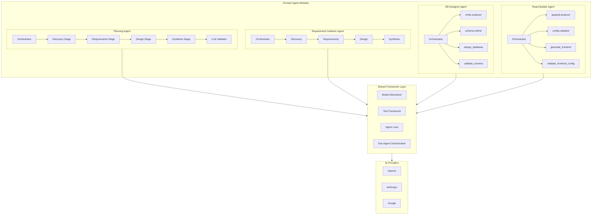
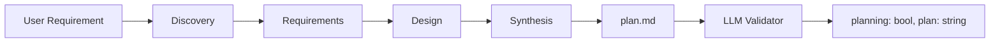
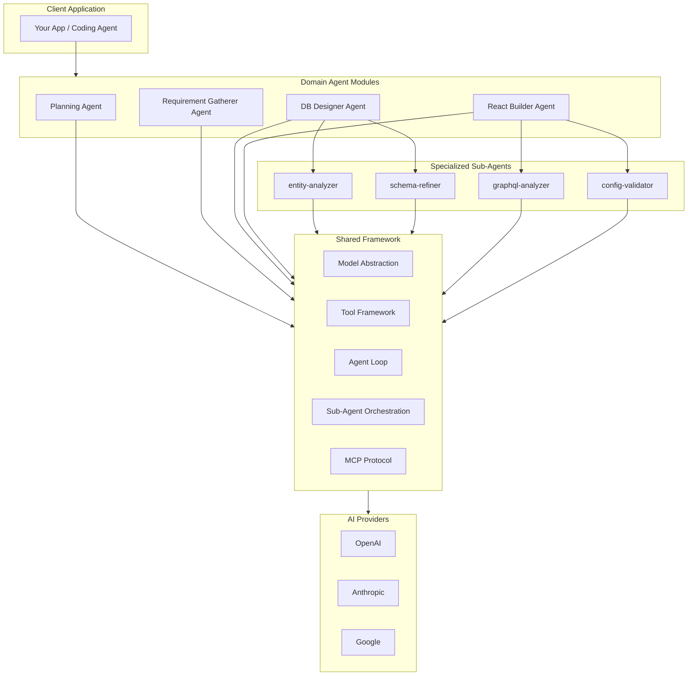
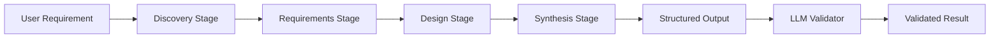
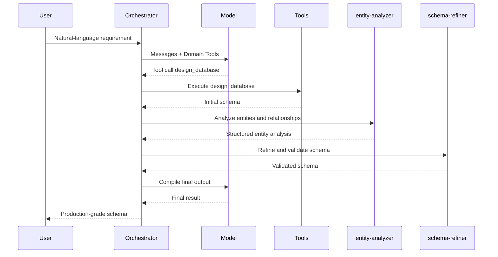
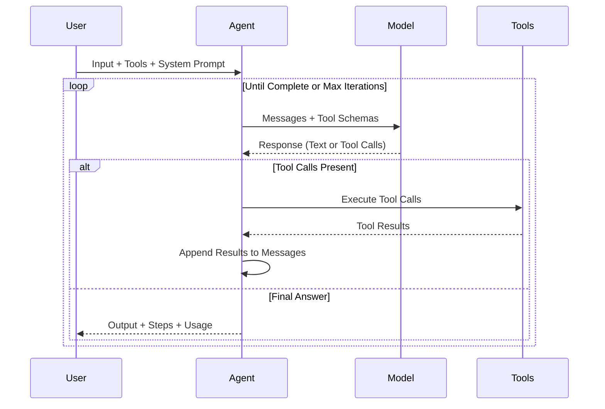

<p align="center">
  <h1 align="center">sweagent</h1>
  <p align="center">
    <strong>Enterprise-grade AI agents for every stage of software planning.</strong>
  </p>
  <p align="center">
    Domain-specialized agent pipelines — Planning, Requirements, DB Design, Frontend — each with dedicated orchestrators, sub-agents, and structured outputs. From discovery to implementation-ready blueprints, in TypeScript.
  </p>
</p>

<p align="center">
  <a href="https://www.npmjs.com/package/sweagent"></a>
  <a href="https://www.typescriptlang.org/"></a>
  <a href="https://github.com/sijeeshmiziha/sweagent/blob/main/LICENSE"></a>
  <a href="https://github.com/sijeeshmiziha/sweagent/pulls"></a>
</p>

<p align="center">
  <a href="#what-is-sweagent">What is sweagent?</a> •
  <a href="#why-sweagent">Why sweagent?</a> •
  <a href="#domain-agents">Domain Agents</a> •
  <a href="#planning-pipeline">Planning Pipeline</a> •
  <a href="#installation">Installation</a> •
  <a href="#getting-started">Getting Started</a> •
  <a href="#architecture">Architecture</a> •
  <a href="#api-reference">API Reference</a> •
  <a href="#domain-agent-modules">Modules</a> •
  <a href="#examples">Examples</a> •
  <a href="#contributing">Contributing</a>
</p>

---

## Table of Contents

- [What is sweagent?](#what-is-sweagent)
- [Why sweagent?](#why-sweagent)
- [Domain Agents](#domain-agents)
- [Planning Pipeline](#planning-pipeline)
- [Features](#features)
- [Installation](#installation)
- [Getting Started](#getting-started)
- [Architecture](#architecture)
- [API Reference](#api-reference)
- [Domain Agent Modules](#domain-agent-modules)
- [Examples](#examples)
- [Configuration Reference](#configuration-reference)
- [FAQ](#faq)
- [Troubleshooting](#troubleshooting)
- [Contributing](#contributing)
- [License](#license)

---

## What is sweagent?

AI coding agents -- Claude Code, Codex, Cursor -- are powerful executors, but they fail at planning. Hand one a vague requirement and it guesses a tech stack, skips data modeling, forgets auth, and produces half-finished code. Enterprise teams need the same rigor from AI that they expect from senior engineers: structured discovery, explicit requirements, deliberate design, and traceable decisions.

**sweagent** is a library of **domain-specialized AI agent pipelines** that handle every stage of software planning at professional quality. Each domain -- planning, requirements, database design, frontend configuration -- gets its own **orchestrator agent** with dedicated **sub-agents**, **tools**, and **multi-stage pipelines** that produce structured, reviewable outputs.

| Domain           | Orchestrator Agent            | Sub-Agents                             | Output                                            |
| ---------------- | ----------------------------- | -------------------------------------- | ------------------------------------------------- |
| **Planning**     | `runPlanningAgent`            | --                                     | Implementation-ready markdown plan                |
| **Requirements** | `runRequirementGathererAgent` | --                                     | Structured JSON (actors, flows, stories, modules) |
| **DB Design**    | `runDbDesignerAgent`          | `entity-analyzer`, `schema-refiner`    | MongoDB schemas with relationships                |
| **Frontend**     | `runReactBuilderAgent`        | `graphql-analyzer`, `config-validator` | React app config from GraphQL                     |

Each pipeline walks through structured stages -- discovery, analysis, design, synthesis -- not a single LLM call. The result is a professional-grade artifact that a coding agent can execute step-by-step, or that a human architect can review and approve.

```typescript
import { runPlanningWithResult } from 'sweagent';

// Generate an implementation-ready plan -- validated by an LLM judge
const { planning, plan } = await runPlanningWithResult({
  input: 'Task manager app with user auth, task CRUD, assignments, and a dashboard',
  model: { provider: 'openai', model: 'gpt-4o-mini' },
});

if (planning) {
  console.log('Plan is implementation-ready. Hand it to your coding agent.');
  console.log(plan); // Full markdown blueprint
}
```

TypeScript-first, built on the Vercel AI SDK, ships with all provider SDKs (OpenAI, Anthropic, Google). Set your API keys and go.

---

## Why sweagent?

### 1. Domain-specialized agents, not generic wrappers

Each module is a self-contained agent pipeline purpose-built for its domain. The DB Designer doesn't reuse the Planning Agent's prompts -- it has its own `entity-analyzer` and `schema-refiner` sub-agents, its own tools (`design_database`, `validate_schema`), and its own output schema. The React Builder has a `graphql-analyzer` and `config-validator`. Every domain gets the specialized treatment it deserves.

### 2. Multi-stage pipelines with structured outputs

Every domain agent progresses through deliberate stages -- discovery, requirements, design, synthesis -- with dedicated LLM calls at each step. The Planning pipeline makes 8+ sequential LLM calls across 4 stages. The Requirement Gatherer produces structured JSON with actors, user flows, stories, and module breakdowns. No single-shot prompt engineering; each stage builds on the last and produces traceable, reviewable intermediate results.

### 3. Sub-agent orchestration for complex domains

When a domain is too complex for a single agent, sweagent delegates to specialized sub-agents. The DB Designer orchestrator spawns an `entity-analyzer` to extract entities and relationships, then a `schema-refiner` to normalize and validate the schema. The React Builder uses a `graphql-analyzer` to parse the schema and a `config-validator` to verify the output. Sub-agents run in isolation with their own context, tools, and models -- then return condensed results to the orchestrator.

### 4. Enterprise-quality output, not bullet points

Plans include tech stack decisions, data models with field-level detail, API routes with request/response shapes, phased implementation order, edge cases, and testing checklists. Requirement documents include actors with permissions, user flows with steps, user stories with acceptance criteria, and module breakdowns with CRUD operations. DB schemas include field types, relationships, indexes, and validation rules. These are blueprints, not summaries.

### 5. Provider-agnostic model layer

Your agent code stays the same whether you're using GPT-4o, Claude, or Gemini. One `createModel()` call, one interface, zero provider lock-in. Switch models in config, not in code.

### 6. Incremental progress across sessions

Long-running agents fail when they lose context. sweagent encodes patterns for structured progress tracking: feature lists with pass/fail status, progress files, and clean-state principles so each session picks up exactly where the last one left off.

---

## Domain Agents

sweagent ships with four production domain agents and a template module. Each is a complete pipeline with its own orchestrator, tools, sub-agents, and output format.



### Planning Agent

Turns a natural-language project description into an implementation-ready markdown plan through 4 stages and 8+ LLM calls. Covers tech stack, data models, API routes, implementation order, edge cases, and testing checklists. Optional LLM validation judges completeness.

```typescript
import { runPlanningWithResult } from 'sweagent';

const { planning, plan } = await runPlanningWithResult({
  input: 'E-commerce: users, products, cart, checkout, admin dashboard',
  model: { provider: 'openai', model: 'gpt-4o-mini' },
});
// planning === true means the plan passed all validation criteria
// plan is the full markdown blueprint
```

**Stages:** Discovery, Requirements (4 LLM calls), Design (2 LLM calls), Synthesis | **Output:** Markdown | **Modes:** One-shot, validated, interactive chat

---

### Requirement Gatherer Agent

Produces structured JSON requirements -- not prose. Extracts actors with permissions, user flows with step-by-step sequences, user stories with acceptance criteria, and module breakdowns with CRUD operations, database schemas, and API designs.

```typescript
import { runRequirementGathererAgent } from 'sweagent';

const result = await runRequirementGathererAgent({
  input: 'Project management tool with teams, Kanban boards, and time tracking',
  model: { provider: 'openai', model: 'gpt-4o-mini' },
  maxIterations: 15,
});
// result.output contains structured JSON: actors, flows, stories, modules
```

**Stages:** Discovery, Requirements, Design, Synthesis | **Output:** Structured JSON | **Schemas:** Actors, Flows, Stories, Modules, Database, API

---

### DB Designer Agent

An orchestrator agent that delegates to specialized sub-agents for entity analysis and schema refinement. Produces MongoDB-style schemas with modules, fields, relationships, indexes, and validation rules.

```typescript
import { runDbDesignerAgent } from 'sweagent';

const result = await runDbDesignerAgent({
  input: 'E-commerce: users, orders, products. Admins manage products.',
  model: { provider: 'openai', model: 'gpt-4o-mini' },
  maxIterations: 15,
});
// result.output contains the full database schema
```

**Sub-agents:** `entity-analyzer` (extracts entities and relationships), `schema-refiner` (normalizes and validates) | **Tools:** `design_database`, `design_database_pro`, `redesign_database`, `validate_schema` | **Output:** MongoDB schema JSON

---

### React Builder Agent

Generates complete frontend application configuration from a GraphQL schema. A `graphql-analyzer` sub-agent parses the schema structure, and a `config-validator` sub-agent verifies the output. Produces app config, modules, pages, fields, and API hooks.

```typescript
import { runReactBuilderAgent } from 'sweagent';

const result = await runReactBuilderAgent({
  input: 'GraphQL schema: type User { id: ID! name: String! } type Task { ... }',
  model: { provider: 'openai', model: 'gpt-4o-mini' },
  maxIterations: 15,
});
// result.output contains frontend config JSON
```

**Sub-agents:** `graphql-analyzer` (schema parsing), `config-validator` (output verification) | **Tools:** `generate_frontend`, `generate_feature_breakdown`, `validate_frontend_config` | **Output:** React app config JSON

---

### Hello World (Template)

Minimal example module with a single greeting tool. Use as a starting point when building your own domain agent module.

```typescript
import { createModel, runAgent, helloWorldTool } from 'sweagent';

const result = await runAgent({
  model: createModel({ provider: 'openai', model: 'gpt-4o-mini' }),
  tools: [helloWorldTool],
  systemPrompt: 'You are helpful.',
  input: 'Say hello',
});
```

---

## Planning Pipeline

The planning module is the centerpiece for AI coding agents. It turns a natural-language project description into a structured, implementation-ready markdown plan through four stages.

### How it works



### Stages

| Stage            | What it produces                                   | Sections                                                            |
| ---------------- | -------------------------------------------------- | ------------------------------------------------------------------- |
| **Discovery**    | Understands the project, asks clarifying questions | Project overview                                                    |
| **Requirements** | 4 sequential LLM calls to flesh out the spec       | Tech stack, feature decisions, data models, pages/routes, auth flow |
| **Design**       | 2 sequential LLM calls for technical design        | API routes, implementation details                                  |
| **Synthesis**    | Assembles the final plan                           | Implementation order, edge cases, testing checklist                 |

### Output

The plan is a markdown document with these sections:

- **Overview** — project scope and goals
- **Tech Stack** — languages, frameworks, database, auth approach
- **Feature Decisions** — what to build and what to defer
- **Data Models** — schemas, relationships, fields
- **Pages and Routes** — frontend structure
- **Authentication Flow** — auth strategy and implementation
- **API Routes** — endpoints, methods, request/response shapes
- **Implementation Details** — architecture decisions, file structure
- **Execution Plan** — phased implementation order
- **Edge Cases** — error handling, boundary conditions
- **Testing Checklist** — what to verify at each phase

### Two modes

**One-shot mode** — pass a requirement, get a plan:

```typescript
import { runPlanningAgent } from 'sweagent';

const result = await runPlanningAgent({
  input: 'Fitness app with workouts, nutrition tracking, and social features',
  model: { provider: 'anthropic', model: 'claude-sonnet-4-20250514' },
});
console.log(result.output); // Full plan markdown
```

**With validation** — run the plan through an LLM judge that checks completeness:

```typescript
import { runPlanningWithResult } from 'sweagent';

const { planning, plan } = await runPlanningWithResult({
  input: 'Fitness app with workouts, nutrition tracking, and social features',
  model: { provider: 'openai', model: 'gpt-4o-mini' },
});
// planning === true means the plan passed all validation criteria
```

**Interactive chat mode** — multi-turn conversation where you refine the plan:

```typescript
import { processPlanningChat } from 'sweagent';
import type { PlanningContext } from 'sweagent';

let context: PlanningContext | null = null;

// Turn 1: describe the project
const turn1 = await processPlanningChat('Build a task manager with teams', context, {
  model: { provider: 'openai', model: 'gpt-4o-mini' },
});
context = turn1.context;
console.log(turn1.message); // Assistant asks clarifying questions
console.log(turn1.pendingQuestions); // ["What auth provider?", ...]

// Turn 2: answer and advance
const turn2 = await processPlanningChat('Use NextAuth with GitHub OAuth', context, {
  model: { provider: 'openai', model: 'gpt-4o-mini' },
});
context = turn2.context;

// Continue until turn.planMarkdown is set (plan complete)
```

### Validation criteria

The LLM validator (`validatePlanForCodingAgent`) checks that the plan includes:

1. Clear project overview and scope
2. Tech stack specified (languages, frameworks, database, auth)
3. Implementation order or phased steps
4. Concrete actionable steps (files, routes, APIs, or models)
5. Data model, authentication, and API surface addressed

---

## Features

| Feature                     | Description                                                                                                                                                                          |
| --------------------------- | ------------------------------------------------------------------------------------------------------------------------------------------------------------------------------------ |
| **4 Domain Agent Modules**  | Planning, Requirement Gatherer, DB Designer, React Builder -- each a self-contained pipeline with its own orchestrator, tools, sub-agents, and output format.                        |
| **Multi-Stage Pipelines**   | Every domain agent progresses through structured stages (discovery, requirements, design, synthesis) with dedicated LLM calls at each step. No single-shot prompts.                  |
| **Sub-Agent Orchestration** | Complex domains delegate to specialized sub-agents (`entity-analyzer`, `schema-refiner`, `graphql-analyzer`, `config-validator`) that run in isolation and return condensed results. |
| **Plan Validation**         | LLM-based judge validates that planning output meets all criteria for a coding agent to start implementing.                                                                          |
| **Structured Outputs**      | Requirements as typed JSON (actors, flows, stories, modules). DB schemas with field-level detail. Frontend configs with pages, hooks, and branding. Plans with 11 sections.          |
| **Multi-Provider Models**   | Unified API for OpenAI, Anthropic, and Google. One `createModel()` call, zero provider lock-in.                                                                                      |
| **Type-Safe Tools**         | Define tools with Zod schemas; full type inference and validation before execution. Minimal, workflow-oriented tool sets.                                                            |
| **Agent Framework**         | Iterative agent loop with tool calling, step callbacks, and configurable max iterations.                                                                                             |
| **MCP Protocol**            | Connect to Model Context Protocol servers over HTTP or stdio. Lazy connection, typed tool invocation.                                                                                |
| **Vision**                  | Image inputs via `model.generateVision()` for vision-capable models.                                                                                                                 |
| **Zero Extra Deps**         | All provider SDKs (OpenAI, Anthropic, Google) included. Set API keys and run.                                                                                                        |

---

## Installation

### Prerequisites

- **Node.js** >= 18.0.0
- **npm** >= 8.0.0 (or yarn, pnpm, bun)

### Install

```bash
npm install sweagent
```

Or with yarn, pnpm, or bun:

```bash
yarn add sweagent
pnpm add sweagent
bun add sweagent
```

All AI provider SDKs (OpenAI, Anthropic, Google) are included; no extra packages needed.

### From source

```bash
git clone https://github.com/sijeeshmiziha/sweagent.git
cd sweagent
npm install
```

### Environment setup

Create a `.env` file in your project root:

```bash
# At least one provider API key is required
OPENAI_API_KEY=sk-...
ANTHROPIC_API_KEY=sk-ant-...
GOOGLE_GENERATIVE_AI_API_KEY=...
```

### Verify

```bash
# If installed as a package
echo 'import { createModel, runAgent, helloWorldTool } from "sweagent";
const model = createModel({ provider: "openai", model: "gpt-4o-mini" });
const result = await runAgent({ model, tools: [helloWorldTool], systemPrompt: "You are helpful.", input: "Say hello" });
console.log(result.output);' > test.mjs
node --env-file=.env test.mjs

# If cloned from source
npm run example -- examples/hello-world/01-hello-world.ts
```

---

## Getting Started

### Level 1: Model invocation

```typescript
import { createModel } from 'sweagent';

const model = createModel({
  provider: 'openai', // 'openai' | 'anthropic' | 'google'
  model: 'gpt-4o-mini',
  temperature: 0.7,
});

const response = await model.invoke([
  { role: 'user', content: 'Explain TypeScript in one sentence.' },
]);
console.log(response.text);
```

### Level 2: Define tools

```typescript
import { defineTool } from 'sweagent';
import { z } from 'zod';

const calculatorTool = defineTool({
  name: 'calculator',
  description: 'Perform math calculations',
  input: z.object({
    expression: z.string().describe('Math expression to evaluate'),
  }),
  handler: async ({ expression }) => {
    const result = eval(expression); // Use a safe math parser in production
    return { result };
  },
});
```

### Level 3: Agent loop

```typescript
import { runAgent, createModel, defineTool, createToolSet } from 'sweagent';
import { z } from 'zod';

const calculatorTool = defineTool({
  name: 'calculator',
  description: 'Perform math calculations',
  input: z.object({ expression: z.string() }),
  handler: async ({ expression }) => ({ result: String(eval(expression)) }),
});

const result = await runAgent({
  model: createModel({ provider: 'openai', model: 'gpt-4o-mini' }),
  tools: createToolSet({ calculator: calculatorTool }),
  systemPrompt: 'You are a helpful assistant. Use the calculator when needed.',
  input: 'What is 25 multiplied by 4?',
  maxIterations: 10,
  onStep: step => console.log(`Step ${step.iteration}:`, step.toolCalls ?? step.content),
});
console.log(result.output);
```

### Level 4: Subagents

```typescript
import {
  defineSubagent,
  createSubagentToolSet,
  runAgent,
  createModel,
  createToolSet,
} from 'sweagent';

const model = createModel({ provider: 'openai', model: 'gpt-4o-mini' });

const researcher = defineSubagent({
  name: 'researcher',
  description: 'Research a topic and return a short summary',
  systemPrompt: 'You are a researcher. Answer concisely.',
});
const subagentTools = createSubagentToolSet([researcher], { parentModel: model });
const tools = createToolSet({ ...subagentTools });

const result = await runAgent({
  model,
  tools,
  systemPrompt: 'You can delegate research to subagent_researcher.',
  input: 'Research the history of TypeScript and summarize in 2 sentences.',
  maxIterations: 10,
});
```

### Level 5: Planning pipeline

Generate an implementation plan for a coding agent:

```typescript
import { runPlanningWithResult } from 'sweagent';

const { planning, plan } = await runPlanningWithResult({
  input: 'E-commerce site: users, products, cart, checkout, admin dashboard',
  model: { provider: 'openai', model: 'gpt-4o-mini' },
});

console.log('Ready for coding agent:', planning);
console.log(plan);
```

### Level 6: MCP integration

```typescript
import { BaseMcpClient } from 'sweagent';

const config = BaseMcpClient.resolveConfig(
  { url: 'https://your-mcp-server.example.com' },
  { envPrefix: 'MCP' }
);
const client = new BaseMcpClient({ name: 'my-app', version: '1.0.0' }, config);
const result = await client.callTool('tool_name', { arg: 'value' });
```

---

## Architecture

### System overview



### Domain agent pipeline flow

Each domain agent follows a structured pipeline. The Planning Agent is representative:



### Orchestrator with sub-agents

Domain agents like DB Designer and React Builder delegate to specialized sub-agents:



### Agent execution loop



---

## Engineering Deep Dive

### The problem: long-running coding agents

Coding agents that work across many steps or sessions fail in two ways: they try to do too much in one shot (leaving partial, undocumented work), or they declare the job done too early. Each new session starts with no memory of the last. To make progress across sessions, each run needs a way to get up to speed quickly and leave a clean state for the next run.

### Incremental progress pattern

Each session does bounded work: one feature or one clear subtask. The agent updates a progress file and commits what it did. The next session reads progress and git history, chooses the next unfinished item, and continues. This avoids one-shotting the whole project and reduces premature completion.

### Feature list approach

A structured list of requirements (e.g. in JSON) with a status per item gives the agent a clear definition of "done." Agents only mark items passing after verification, keeping scope explicit and making it easy to resume across context windows.

### Clean state principle

Every session should end with code that is buildable, documented, and easy to continue from. No half-implemented features, no stray debug code, clear commit messages or progress notes. The orchestration prompts in production modules encode these expectations.

### Error hierarchy

| Class               | When                                             |
| ------------------- | ------------------------------------------------ |
| **LibraryError**    | Base; all others extend it.                      |
| **ModelError**      | Model creation or invoke failed.                 |
| **ToolError**       | Tool not found or tool execution failed.         |
| **ValidationError** | Zod validation failed.                           |
| **AgentError**      | Agent reached max iterations without completing. |
| **SubagentError**   | Subagent config or run failed.                   |

All accept an optional `cause` for chaining.

### Provider adapter pattern

Models are created via `createModel({ provider, model, ... })`. A shared AI SDK adapter wraps the Vercel AI SDK's `generateText` and normalizes messages, tool schemas, and responses. Each provider has a thin factory that passes the correct `LanguageModel` into this adapter. Provider-specific logic stays in one place; everything else is provider-agnostic.

### Tool execution safety

Inputs are validated with Zod before any tool runs. Invalid input produces a **ToolError** with the parse error; the handler is never called with bad data. Handler errors are caught and rethrown as **ToolError** with the original error as cause. The agent loop receives structured tool results (including error payloads) so the model can see failures and retry or adjust.

---

## API Reference

All public APIs are exported from the main package: `import { ... } from 'sweagent'`.

### Models

**createModel(config)** — Create a model instance.

```typescript
import { createModel } from 'sweagent';

const model = createModel({
  provider: 'openai' | 'anthropic' | 'google',
  model: string,            // e.g. 'gpt-4o', 'claude-sonnet-4-20250514'
  apiKey?: string,          // Uses env var by default
  temperature?: number,
  maxOutputTokens?: number,
  baseUrl?: string,
});

const response = await model.invoke(messages, { tools });
// response: { text, toolCalls, usage, finishReason }
```

**Supported models (examples):**

| Provider  | Models                                               |
| --------- | ---------------------------------------------------- |
| OpenAI    | `gpt-4o`, `gpt-4o-mini`, `gpt-4-turbo`               |
| Anthropic | `claude-sonnet-4-20250514`, `claude-3-opus-20240229` |
| Google    | `gemini-1.5-pro`, `gemini-1.5-flash`                 |

**Vision:** `model.generateVision(prompt, images, options)` for image inputs.

---

### Tools

**defineTool(config)** — Define a type-safe tool with Zod schema and handler.

```typescript
import { defineTool } from 'sweagent';
import { z } from 'zod';

const tool = defineTool({
  name: 'my_tool',
  description: 'What the tool does',
  input: z.object({ key: z.string() }),
  handler: async (parsed, context) => ({ result: parsed.key }),
});
```

**createToolSet(tools)** — Build a record of tools for the agent (key = tool name).

**getTool(toolSet, name)** / **getTools(toolSet)** — Look up one or all tools.

**executeTool(tool, input, options)** — Run a single tool with input.

**executeToolByName(toolSet, name, input, options)** — Run by name; throws if tool missing.

**zodToJsonSchema(schema)** — Convert a Zod schema to JSON Schema (e.g. for MCP).

---

### Agents

**runAgent(config)** — Run the agent loop until the model returns no tool calls or max iterations is reached.

```typescript
import { runAgent } from 'sweagent';

const result = await runAgent({
  model,
  tools: createToolSet({ ... }),
  systemPrompt: string,
  input: string,
  maxIterations?: number,   // default 10
  onStep?: (step: AgentStep) => void,
});

// result: { output, steps, totalUsage, messages }
```

---

### Subagents

**defineSubagent(config)** — Define a subagent (name must be kebab-case).

```typescript
import { defineSubagent } from 'sweagent';

const def = defineSubagent({
  name: 'my-subagent',
  description: 'What this subagent does',
  systemPrompt: '...',
  tools?: Record<string, Tool>,
  model?: ModelConfig,
  maxIterations?: number,
  disallowedTools?: string[],
  onStep?: (step) => void,
});
```

**runSubagent(definition, input, options)** — Run the subagent in isolation.

**createSubagentTool(definition, options)** — Expose one subagent as a tool.

**createSubagentToolSet(definitions, options)** — Build a record of subagent tools (`subagent_<name>`).

---

### Planning

**runPlanningAgent(config)** — One-shot mode: single input, auto-advances through all stages, returns plan markdown.

```typescript
import { runPlanningAgent } from 'sweagent';

const result = await runPlanningAgent({
  input: string,
  model?: ModelConfig,
  maxIterations?: number,
  onStep?: (step: AgentStep) => void,
  logger?: Logger,
});
// result: AgentResult { output, steps, totalUsage, messages }
```

**runPlanningWithResult(config)** — Runs the planning agent then validates the output with an LLM judge.

```typescript
import { runPlanningWithResult } from 'sweagent';

const result = await runPlanningWithResult({
  input: string,
  model?: ModelConfig,
  logger?: Logger,
});
// result: { planning: boolean, plan: string }
```

**processPlanningChat(userMessage, context, config)** — Multi-turn chat mode. Pass `null` context on the first turn.

```typescript
import { processPlanningChat } from 'sweagent';

const result = await processPlanningChat(userMessage, context, {
  model?: ModelConfig,
  maxIterations?: number,
  onStep?: (step: AgentStep) => void,
  logger?: Logger,
});
// result: PlanChatTurnResult { message, context, pendingQuestions, planMarkdown }
```

**validatePlanForCodingAgent(planMarkdown, model, logger)** — LLM-based validation. Returns `{ valid: boolean, feedback?: string }`.

**assemblePlan(projectName, sections)** — Assemble `PlanSections` into a single markdown string.

**writePlanToFile(markdown, outputPath)** — Write plan markdown to a file.

**PlanningContextBuilder** — Fluent builder for `PlanningContext`:

```typescript
import { createPlanningContextBuilder } from 'sweagent';

const context = createPlanningContextBuilder()
  .withStage('requirements')
  .withProjectDescription('Task manager app')
  .withSections({ overview: '## Overview\n...' })
  .build();
```

---

### MCP

**BaseMcpClient** — Base class for MCP clients. Lazy connection, `callTool(name, args)` for invocation.

**BaseMcpClient.resolveConfig(options, resolveOpts)** — Build config from options and env (e.g. `MCP_URL`, `MCP_COMMAND`, `MCP_ARGS`).

---

### Errors

| Class               | When                                             |
| ------------------- | ------------------------------------------------ |
| **LibraryError**    | Base; all others extend it.                      |
| **ModelError**      | Model creation or invoke failed.                 |
| **ToolError**       | Tool not found or tool execution failed.         |
| **ValidationError** | Zod validation failed.                           |
| **AgentError**      | Agent reached max iterations without completing. |
| **SubagentError**   | Subagent config or run failed.                   |

All accept an optional `cause` for chaining.

---

## Domain Agent Modules

Each module is a self-contained domain agent with its own orchestrator, pipeline stages, tools, sub-agents, and output format. All are exported from the main package.

### Planning

The primary module for powering AI coding agents. Generates implementation-ready markdown plans from natural-language project descriptions.

| Attribute         | Detail                                                                                                       |
| ----------------- | ------------------------------------------------------------------------------------------------------------ |
| **Stages**        | Discovery, Requirements (4 LLM calls), Design (2 LLM calls), Synthesis                                       |
| **Sub-Agents**    | --                                                                                                           |
| **Tools**         | -- (pipeline stages, not tool-based)                                                                         |
| **Output Format** | Markdown plan (11 sections)                                                                                  |
| **Validation**    | LLM judge checks completeness and actionability                                                              |
| **Modes**         | One-shot (`runPlanningAgent`), validated (`runPlanningWithResult`), interactive chat (`processPlanningChat`) |

**Output sections:** Overview, Tech Stack, Feature Decisions, Data Models, Pages and Routes, Authentication Flow, API Routes, Implementation Details, Execution Plan, Edge Cases, Testing Checklist.

```typescript
import { runPlanningWithResult } from 'sweagent';

const { planning, plan } = await runPlanningWithResult({
  input: 'E-commerce: users, orders, products. Admins manage products.',
  model: { provider: 'openai', model: 'gpt-4o-mini' },
});
// planning: boolean -- did the plan pass validation?
// plan: string -- full markdown blueprint
```

See [Planning Pipeline](#planning-pipeline) for stage-by-stage details.

---

### Requirement Gatherer

Produces structured JSON requirements -- not prose. Unlike the Planning module (markdown output), the Requirement Gatherer extracts typed data that downstream systems can consume programmatically.

| Attribute         | Detail                                                                                |
| ----------------- | ------------------------------------------------------------------------------------- |
| **Stages**        | Discovery, Requirements, Design, Synthesis                                            |
| **Sub-Agents**    | --                                                                                    |
| **Tools**         | Stage-specific tools                                                                  |
| **Output Format** | Structured JSON                                                                       |
| **Schemas**       | Actors, User Flows, User Stories, Modules, Database Design, API Design                |
| **Modes**         | One-shot (`runRequirementGathererAgent`), interactive chat (`processRequirementChat`) |

**Output structure:** Actors (with permissions), User Flows (step-by-step sequences), User Stories (with acceptance criteria), Modules (with CRUD operations), Database Design (schemas, relationships), API Design (REST/GraphQL endpoints).

```typescript
import { runRequirementGathererAgent } from 'sweagent';

const result = await runRequirementGathererAgent({
  input: 'Project management tool with teams and Kanban boards',
  model: { provider: 'openai', model: 'gpt-4o-mini' },
  maxIterations: 15,
});
// result.output: structured JSON with actors, flows, stories, modules
```

---

### DB Designer

An orchestrator agent that delegates to specialized sub-agents for entity analysis and schema refinement. Produces MongoDB-style project schemas with modules, fields, relationships, indexes, and validation rules.

| Attribute         | Detail                                                                                                                                                                                           |
| ----------------- | ------------------------------------------------------------------------------------------------------------------------------------------------------------------------------------------------ |
| **Pattern**       | Orchestrator with sub-agents                                                                                                                                                                     |
| **Sub-Agents**    | `entity-analyzer` (extracts entities and relationships), `schema-refiner` (normalizes and validates schemas)                                                                                     |
| **Tools**         | `design_database` (text requirements to schema), `design_database_pro` (structured requirements to schema), `redesign_database` (modify existing schemas), `validate_schema` (schema validation) |
| **Output Format** | MongoDB schema JSON (modules, fields, relationships)                                                                                                                                             |

```typescript
import { runDbDesignerAgent } from 'sweagent';

const result = await runDbDesignerAgent({
  input: 'E-commerce: users, orders, products. Admins manage products.',
  model: { provider: 'openai', model: 'gpt-4o-mini' },
  maxIterations: 15,
});
// result.output: MongoDB schema with modules, fields, relationships
```

---

### React Builder

An orchestrator agent that generates complete frontend application configuration from a GraphQL schema. Uses a `graphql-analyzer` sub-agent to parse schema structure and a `config-validator` to verify the output against frontend config schemas.

| Attribute         | Detail                                                                                                                                                      |
| ----------------- | ----------------------------------------------------------------------------------------------------------------------------------------------------------- |
| **Pattern**       | Orchestrator with sub-agents                                                                                                                                |
| **Sub-Agents**    | `graphql-analyzer` (parses GraphQL schema structure), `config-validator` (validates frontend config output)                                                 |
| **Tools**         | `generate_frontend` (GraphQL to frontend config), `generate_feature_breakdown` (module/operation breakdown), `validate_frontend_config` (config validation) |
| **Output Format** | React app config JSON (app, modules, pages, fields, API hooks, branding)                                                                                    |
| **Schemas**       | App config, User config, Page config, Field config, Branding                                                                                                |

```typescript
import { runReactBuilderAgent } from 'sweagent';

const result = await runReactBuilderAgent({
  input: 'GraphQL schema: type User { id: ID! name: String! } type Task { ... }',
  model: { provider: 'openai', model: 'gpt-4o-mini' },
  maxIterations: 15,
});
// result.output: frontend config JSON with pages, fields, hooks, branding
```

---

### Hello World (Template)

Minimal example module with a single greeting tool. Use as a starting point when building your own domain agent module.

```typescript
import { createModel, runAgent, helloWorldTool } from 'sweagent';

const result = await runAgent({
  model: createModel({ provider: 'openai', model: 'gpt-4o-mini' }),
  tools: [helloWorldTool],
  systemPrompt: 'You are helpful.',
  input: 'Say hello',
});
```

---

## Examples

The [examples directory](./examples/README.md) contains runnable scripts organized by domain agent. Use the interactive launcher or run a file directly:

```bash
# Interactive launcher -- pick a domain agent, then an example
npm run example:interactive

# Run a specific domain agent example
npm run example -- examples/planning/01-planning-agent.ts
npm run example -- examples/db-designer/01-db-designer-agent.ts
npm run example -- examples/react-builder/01-react-builder-agent.ts
```

| Domain Agent             | Examples                                                                             | What it produces                                                         |
| ------------------------ | ------------------------------------------------------------------------------------ | ------------------------------------------------------------------------ |
| **Planning**             | 01 Planning Agent                                                                    | Implementation-ready markdown plan through 4-stage pipeline              |
| **Requirement Gatherer** | 01 Requirement Gatherer Agent                                                        | Structured JSON requirements (actors, flows, stories, modules)           |
| **DB Designer**          | 01 DB Designer Agent                                                                 | MongoDB schemas via `entity-analyzer` and `schema-refiner` sub-agents    |
| **React Builder**        | 01 React Builder Agent                                                               | Frontend config via `graphql-analyzer` and `config-validator` sub-agents |
| **Core Framework**       | 01 Basic Model, 02 All Providers, 03 Tool Calling, 04 Multi-Tool Agent, 05 Subagents | Models, tools, agent loop, sub-agent delegation                          |
| **Hello World**          | 01 Hello World                                                                       | Minimal agent with greeting tool (module template)                       |

---

## Configuration Reference

### Environment variables

| Variable                               | Purpose                                                        |
| -------------------------------------- | -------------------------------------------------------------- |
| `OPENAI_API_KEY`                       | OpenAI API key                                                 |
| `ANTHROPIC_API_KEY`                    | Anthropic API key                                              |
| `GOOGLE_GENERATIVE_AI_API_KEY`         | Google AI API key                                              |
| `MCP_URL` / `MCP_COMMAND` / `MCP_ARGS` | MCP client (when using `resolveConfig`)                        |
| `PROVIDER`                             | Default provider for examples                                  |
| `MODEL`                                | Default model for examples                                     |
| `REQUIREMENT`                          | Project requirement for planning/requirement-gatherer examples |
| `MAX_ITERATIONS`                       | Max agent iterations for examples                              |

### ModelConfig

`provider`, `model`, `apiKey?`, `temperature?`, `maxOutputTokens?`, `baseUrl?`

### AgentConfig

`model`, `tools`, `systemPrompt`, `input`, `maxIterations?`, `onStep?`

### PlanningAgentConfig

`input`, `model?`, `maxIterations?`, `onStep?`, `logger?`

---

## FAQ

**Which AI provider should I use?**
All work well. Choose by existing infrastructure and pricing. The API is the same regardless of provider.

**Can I use this with Claude Code / Codex / Cursor?**
Yes. sweagent is designed as the structured layer underneath AI coding agents. Use `runPlanningWithResult` to generate a plan, then feed the plan markdown into your coding agent as context. The `{ planning: boolean, plan: string }` output tells you whether the plan is implementation-ready.

**How do I handle rate limits?**
sweagent has no built-in rate limiting. Use a retry library (e.g. `p-retry`) around `model.invoke` or `runAgent` if needed.

**Can I use sweagent in the browser?**
Target is Node.js. For browsers, proxy API calls through your backend and keep keys server-side.

**How do I add a new provider?**
Implement a factory that returns a model conforming to the internal `Model` interface (e.g. via `createAIModel` and the provider's AI SDK binding) and register it in `createModel`.

---

## Troubleshooting

### API key errors

- Ensure the key is set: `echo $OPENAI_API_KEY` (or the relevant env var).
- If using `.env`, load it: `tsx --env-file=.env your-script.ts` or `node --env-file=.env your-script.js`.

### Model not found

- Use the exact model id for the provider (e.g. `gpt-4o-mini`, `claude-sonnet-4-20250514`).
- Confirm your account has access to that model.

### Agent hits max iterations

- Increase `maxIterations` or simplify the task.
- Check that tools return clear, parseable results so the model can decide the next step.

### Tool not found

- Tools must be in the same object passed to `runAgent` under the name the model uses (e.g. `createToolSet({ calculator: calculatorTool })` means the model calls `calculator`).

### Planning module returns `planning: false`

- The LLM validator found missing sections. Check the `plan` string for gaps (no tech stack? no implementation order?).
- Try a more capable model (e.g. `gpt-4o` instead of `gpt-4o-mini`).
- Provide a more detailed project description as input.

---

## Contributing

We welcome contributions. See [CONTRIBUTING.md](CONTRIBUTING.md) for code style, testing, and PR process.

**Quick start for contributors:**

```bash
git clone https://github.com/sijeeshmiziha/sweagent.git
cd sweagent
npm install
cp .env.example .env
# Add API keys to .env
npm test
npm run lint
npm run build
```

| Command                             | Description       |
| ----------------------------------- | ----------------- |
| `npm run dev`                       | Watch build       |
| `npm test`                          | Unit tests        |
| `npm run test:integration`          | Integration tests |
| `npm run test:all`                  | All tests         |
| `npm run lint` / `npm run lint:fix` | ESLint            |
| `npm run typecheck`                 | TypeScript        |
| `npm run build`                     | Production build  |

**Support**

- [GitHub Issues](https://github.com/sijeeshmiziha/sweagent/issues) — Bugs and features
- [GitHub Discussions](https://github.com/sijeeshmiziha/sweagent/discussions) — Questions

---

## License

MIT License — see [LICENSE](LICENSE) for details.
