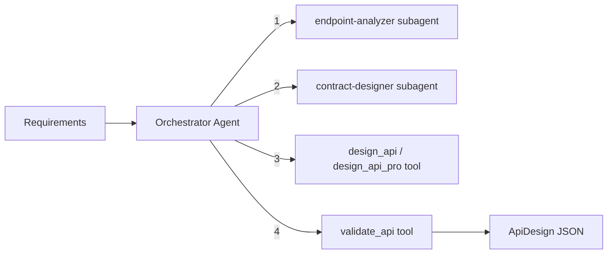

# API Designer Module

Designs enterprise-quality REST and GraphQL APIs with endpoint analysis, request/response contracts, validation rules, and error handling. Uses an orchestrator-worker pattern with specialized subagents.

## Architecture



### Orchestrator Workflow

1. **Analyze endpoints** -- `endpoint-analyzer` subagent derives endpoints from data model and requirements (CRUD per entity, custom operations, route design, auth annotations)
2. **Design contracts** -- `contract-designer` subagent designs request/response shapes, validation rules, error responses, pagination, and naming conventions
3. **Generate design** -- `design_api` (plain text) or `design_api_pro` (structured from data model) tool produces the API design
4. **Validate** -- `validate_api` tool checks the final JSON against the Zod schema

## Quick Start

```typescript
import { runApiDesignerAgent } from 'sweagent';

const result = await runApiDesignerAgent({
  input: 'Task manager with users, projects, and tasks\n\nAPI style: rest',
  model: { provider: 'openai', model: 'gpt-4o-mini' },
});

console.log(result.output); // ApiDesign as JSON string
```

## Importing into Your Project

```typescript
// Main agent function
import { runApiDesignerAgent } from 'sweagent';

// Tools (for custom agent setups)
import {
  validateApiTool,
  createDesignApiTool,
  createDesignApiProTool,
  createApiDesignerTools,
} from 'sweagent';

// Subagents (used by the planning module)
import { endpointAnalyzerSubagent, contractDesignerSubagent } from 'sweagent';

// Zod schemas for runtime validation
import { adApiDesignSchema, adRestEndpointSchema, adGraphqlOperationSchema } from 'sweagent';
import type { TApiDesign } from 'sweagent';

// System prompt (for customization)
import { API_DESIGNER_SYSTEM_PROMPT } from 'sweagent';

// Types
import type {
  ApiStyle,
  HttpMethod,
  AdRestEndpoint,
  AdGraphqlOperation,
  AdApiDesign,
  ApiDesignerAgentConfig,
} from 'sweagent';
```

## Configuration

### `ApiDesignerAgentConfig`

| Property        | Type                        | Default                                        | Description                                                                                                                        |
| --------------- | --------------------------- | ---------------------------------------------- | ---------------------------------------------------------------------------------------------------------------------------------- |
| `input`         | `string`                    | **required**                                   | Natural language requirements or data model + requirements. Append `API style: rest` or `API style: graphql` to specify the style. |
| `model`         | `ModelConfig`               | `{ provider: 'openai', model: 'gpt-4o-mini' }` | AI provider and model                                                                                                              |
| `maxIterations` | `number`                    | `15`                                           | Max orchestrator loop iterations                                                                                                   |
| `onStep`        | `(step: AgentStep) => void` | `undefined`                                    | Callback for each agent step                                                                                                       |
| `logger`        | `Logger`                    | `undefined`                                    | Pino-compatible logger                                                                                                             |

## Expected Output Format

The agent returns `AgentResult` where `output` is a JSON string conforming to `ApiDesign`:

```typescript
interface ApiDesign {
  style: 'rest' | 'graphql'; // API paradigm
  baseUrl: string; // Base URL (e.g., "/api/v1")
  endpoints: RestEndpoint[]; // REST endpoints (populated for REST style)
  graphqlOperations: GraphqlOperation[]; // GraphQL operations (populated for GraphQL style)
}

interface RestEndpoint {
  id: string; // Unique identifier (e.g., "create-user")
  resource: string; // Resource name (e.g., "users")
  method: 'GET' | 'POST' | 'PUT' | 'PATCH' | 'DELETE';
  path: string; // Route path (e.g., "/users/:id")
  description: string; // What this endpoint does
  auth: boolean; // Whether authentication is required
  roles: string[]; // Authorized roles (e.g., ["admin", "member"])
  requestBody: Record<string, string>; // Request body fields and types
  responseBody: Record<string, string>; // Response body fields and types
  queryParams: Record<string, string>; // Query parameters and descriptions
  validation: string[]; // Validation rules (e.g., "email must be valid")
  errorResponses: string[]; // Error scenarios (e.g., "409 if email exists")
}

interface GraphqlOperation {
  name: string; // Operation name (e.g., "createUser")
  type: 'query' | 'mutation' | 'subscription';
  description: string; // What this operation does
  auth: boolean; // Whether authentication is required
  roles: string[]; // Authorized roles
  args: {
    name: string; // Argument name
    type: string; // GraphQL type (e.g., "String!", "[ID!]!")
    required: boolean;
  }[];
  returnType: string; // GraphQL return type (e.g., "User!", "[Task!]!")
}
```

### Example Output (REST)

```json
{
  "style": "rest",
  "baseUrl": "/api/v1",
  "endpoints": [
    {
      "id": "create-task",
      "resource": "tasks",
      "method": "POST",
      "path": "/tasks",
      "description": "Create a new task",
      "auth": true,
      "roles": ["admin", "member"],
      "requestBody": {
        "title": "string (required)",
        "description": "string (optional)",
        "assigneeId": "string (optional)",
        "dueDate": "ISO 8601 date (optional)",
        "projectId": "string (required)"
      },
      "responseBody": {
        "id": "string",
        "title": "string",
        "status": "todo | in_progress | done",
        "createdAt": "ISO 8601 date"
      },
      "queryParams": {},
      "validation": [
        "title is required, 1-200 characters",
        "projectId must reference an existing project",
        "dueDate must be in the future"
      ],
      "errorResponses": [
        "400 - Invalid input (missing title or invalid projectId)",
        "401 - Not authenticated",
        "403 - Not a member of the project",
        "404 - Project not found"
      ]
    },
    {
      "id": "list-tasks",
      "resource": "tasks",
      "method": "GET",
      "path": "/tasks",
      "description": "List tasks with filtering and pagination",
      "auth": true,
      "roles": ["admin", "member"],
      "requestBody": {},
      "responseBody": {
        "data": "Task[]",
        "total": "number",
        "page": "number",
        "limit": "number"
      },
      "queryParams": {
        "status": "Filter by status (todo, in_progress, done)",
        "assigneeId": "Filter by assignee",
        "page": "Page number (default: 1)",
        "limit": "Items per page (default: 20)"
      },
      "validation": [],
      "errorResponses": ["401 - Not authenticated"]
    }
  ],
  "graphqlOperations": []
}
```

## Tools Reference

| Tool             | AI-Powered | Description                                                                                                                                   |
| ---------------- | ---------- | --------------------------------------------------------------------------------------------------------------------------------------------- |
| `validate_api`   | No         | Validates JSON against the Zod schema. Returns `{ valid, errors? }`                                                                           |
| `design_api`     | Yes        | Generates API design from plain text requirements (temperature: 0.3, max tokens: 8192)                                                        |
| `design_api_pro` | Yes        | Structured design from data model + context (temperature: 0.2, max tokens: 16384). Requires `projectName`, `apiStyle`, `dataModel`, `context` |

### Two-Tier Design Tools

- **`design_api`** -- For quick generation from a plain text requirement string.
- **`design_api_pro`** -- For structured, enterprise design. Accepts a pre-analyzed data model and project context. Best used when the data-modeler has already produced a schema.

## Subagents Reference

| Subagent            | Purpose                                                                                           | Max Iterations |
| ------------------- | ------------------------------------------------------------------------------------------------- | -------------- |
| `endpoint-analyzer` | Derives CRUD and custom endpoints from data model, designs RESTful routes, annotates auth/roles   | 2              |
| `contract-designer` | Designs request/response shapes, validation rules, error responses (400-500), pagination patterns | 2              |

## Environment Variables

| Variable         | Description                                    | Default       |
| ---------------- | ---------------------------------------------- | ------------- |
| `PROVIDER`       | AI provider (`openai`, `anthropic`, `google`)  | `openai`      |
| `MODEL`          | Model name                                     | `gpt-4o-mini` |
| `REQUIREMENT`    | Project requirement (skips interactive prompt) | --            |
| `OPENAI_API_KEY` | OpenAI API key                                 | --            |

### Run the Example

```bash
# Interactive (prompts for requirement and API style)
npm run example:api-designer

# One-shot
REQUIREMENT="Design REST API for a task manager" npm run example:api-designer
```

## Integration with Planning Module

The planning module uses the api-designer's subagents during the **Design** stage:

- `endpoint-analyzer` generates the `apiRoutes` section
- `contract-designer` produces request/response contract details

You do not need to call the api-designer separately if you are using the planning agent -- it delegates automatically.

```typescript
// Used internally by planning:
import { endpointAnalyzerSubagent, contractDesignerSubagent } from 'sweagent';
```
