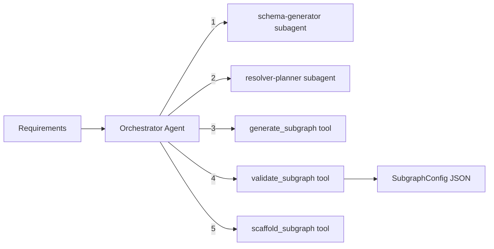

# Apollo Builder Module

Generates Apollo GraphQL subgraph configurations with type definitions, resolvers, and datasource mappings. Uses an orchestrator-worker pattern with schema generation and resolver planning subagents, and can scaffold a complete subgraph project from Handlebars templates.

## Architecture



### Orchestrator Workflow

1. **Generate schema** -- `schema-generator` subagent creates GraphQL type definitions (object types, input types, enums) from the data model
2. **Plan resolvers** -- `resolver-planner` subagent designs resolver implementations, datasource methods, and auth integration per module
3. **Generate config** -- `generate_subgraph` tool produces the complete subgraph configuration as JSON
4. **Validate** -- `validate_subgraph` tool checks the config JSON against the Zod schema
5. **Scaffold (optional)** -- `scaffold_subgraph` tool compiles Handlebars templates to generate the project

## Quick Start

```typescript
import { runApolloBuilderAgent } from 'sweagent';

const result = await runApolloBuilderAgent({
  input: 'Task manager with users, projects, and tasks. GraphQL API with JWT auth, MongoDB.',
  model: { provider: 'openai', model: 'gpt-4o-mini' },
});

console.log(result.output); // SubgraphConfig as JSON string
```

## Importing into Your Project

```typescript
// Main agent function
import { runApolloBuilderAgent } from 'sweagent';

// Tools (for custom agent setups)
import {
  validateSubgraphTool,
  createGenerateSubgraphTool,
  scaffoldSubgraphTool,
  createApolloBuilderTools,
} from 'sweagent';

// Subagents
import { schemaGeneratorSubagent, resolverPlannerSubagent } from 'sweagent';

// Zod schemas for runtime validation
import {
  subgraphConfigSchema,
  subgraphModuleSchema,
  graphqlTypeSchema,
  graphqlFieldSchema,
  resolverOperationSchema,
} from 'sweagent';
import type { TSubgraphConfig } from 'sweagent';

// System prompt (for customization)
import { APOLLO_BUILDER_SYSTEM_PROMPT } from 'sweagent';

// Types
import type { ApolloBuilderAgentConfig } from 'sweagent';
```

## Configuration

### `ApolloBuilderAgentConfig`

| Property        | Type                        | Default                                        | Description                                      |
| --------------- | --------------------------- | ---------------------------------------------- | ------------------------------------------------ |
| `input`         | `string`                    | **required**                                   | Data model, API design, and project requirements |
| `model`         | `ModelConfig`               | `{ provider: 'openai', model: 'gpt-4o-mini' }` | AI provider and model                            |
| `maxIterations` | `number`                    | `15`                                           | Max orchestrator loop iterations                 |
| `onStep`        | `(step: AgentStep) => void` | `undefined`                                    | Callback for each agent step                     |
| `logger`        | `Logger`                    | `undefined`                                    | Pino-compatible logger                           |

## Expected Output Format

The agent returns `AgentResult` where `output` is a JSON string conforming to `TSubgraphConfig`:

```typescript
interface SubgraphConfig {
  appName: string; // Application name
  port: number; // Server port (default: 4000)
  database: string; // Database type (default: "mongodb")
  modules: SubgraphModule[]; // One module per entity/domain
  sharedTypes: GraphqlType[]; // Shared types across modules
  authDirective: boolean; // Enable @auth directive (default: true)
  envVars: string[]; // Environment variable names
}

interface SubgraphModule {
  name: string; // Module name
  entity: string; // Primary entity
  types: GraphqlType[]; // GraphQL type definitions
  operations: ResolverOperation[]; // Query/mutation/subscription resolvers
  datasource: string; // Datasource class name
}

interface GraphqlType {
  name: string;
  kind: 'type' | 'input' | 'enum' | 'interface' | 'union';
  fields: GraphqlField[]; // Type fields
  values: string[]; // Enum values (if kind is "enum")
  description: string;
}

interface ResolverOperation {
  name: string;
  type: 'query' | 'mutation' | 'subscription';
  args: GraphqlField[];
  returnType: string;
  auth: boolean;
  roles: string[];
  description: string;
}
```

### Example Output

```json
{
  "appName": "task-manager-subgraph",
  "port": 4000,
  "database": "mongodb",
  "modules": [
    {
      "name": "user",
      "entity": "User",
      "types": [
        {
          "name": "User",
          "kind": "type",
          "fields": [
            { "name": "id", "type": "ID", "nullable": false, "isList": false, "description": "" },
            {
              "name": "name",
              "type": "String",
              "nullable": false,
              "isList": false,
              "description": ""
            },
            {
              "name": "email",
              "type": "String",
              "nullable": false,
              "isList": false,
              "description": ""
            }
          ],
          "values": [],
          "description": "User entity"
        }
      ],
      "operations": [
        {
          "name": "users",
          "type": "query",
          "args": [],
          "returnType": "[User!]!",
          "auth": true,
          "roles": ["admin"],
          "description": "List all users"
        }
      ],
      "datasource": "UserDataSource"
    }
  ],
  "sharedTypes": [],
  "authDirective": true,
  "envVars": ["MONGODB_URI", "JWT_SECRET", "PORT"]
}
```

## Tools Reference

| Tool                | AI-Powered | Description                                                                                                          |
| ------------------- | ---------- | -------------------------------------------------------------------------------------------------------------------- |
| `validate_subgraph` | No         | Validates JSON against the `SubgraphConfig` Zod schema. Returns `{ valid, errors? }`                                 |
| `generate_subgraph` | Yes        | Generates complete subgraph config from requirements (temperature: 0.3, max tokens: 16384)                           |
| `scaffold_subgraph` | No         | Scaffolds an Apollo subgraph project from validated config using Handlebars templates from `.ref/templates/subgraph` |

## Subagents Reference

| Subagent           | Purpose                                                                                                   | Max Iterations |
| ------------------ | --------------------------------------------------------------------------------------------------------- | -------------- |
| `schema-generator` | Creates GraphQL type definitions, input types, and enums from a data model with proper naming conventions | 2              |
| `resolver-planner` | Plans resolver implementations, datasource methods, and auth integration per module                       | 2              |

## Environment Variables

| Variable         | Description                                    | Default       |
| ---------------- | ---------------------------------------------- | ------------- |
| `PROVIDER`       | AI provider (`openai`, `anthropic`, `google`)  | `openai`      |
| `MODEL`          | Model name                                     | `gpt-4o-mini` |
| `REQUIREMENT`    | Project requirement (skips interactive prompt) | --            |
| `OPENAI_API_KEY` | OpenAI API key                                 | --            |

### Run the Example

```bash
# Interactive (prompts for requirement)
npm run example:apollo-builder

# One-shot
REQUIREMENT="Generate Apollo subgraph for a task manager" npm run example:apollo-builder
```

## Integration with Planning Module

The planning module uses the apollo-builder when the backend-architect selects "apollo" or "both" as the framework. The subagents are also available for direct use:

```typescript
import { schemaGeneratorSubagent, resolverPlannerSubagent } from 'sweagent';
```
