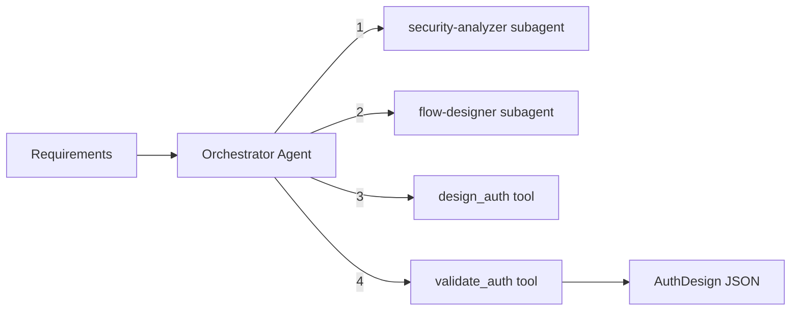

# Auth Designer Module

Designs enterprise-quality authentication and authorization systems: auth strategy selection, step-by-step flows, middleware definitions, RBAC roles, and security policies. Uses an orchestrator-worker pattern with specialized subagents for security analysis and flow design.

## Architecture



### Orchestrator Workflow

1. **Analyze security** -- `security-analyzer` subagent analyzes security requirements, determines the auth strategy (JWT/session/OAuth), and identifies threat vectors
2. **Design flows** -- `flow-designer` subagent designs step-by-step auth flows for signup, login, logout, password reset, and middleware -- with explicit frontend/backend separation
3. **Generate design** -- `design_auth` tool produces the complete auth design JSON
4. **Validate** -- `validate_auth` tool checks the final JSON against the Zod schema

## Quick Start

```typescript
import { runAuthDesignerAgent } from 'sweagent';

const result = await runAuthDesignerAgent({
  input: 'SaaS app with JWT auth. Roles: admin, member. HTTP-only cookies. Node.js + Express.',
  model: { provider: 'openai', model: 'gpt-4o-mini' },
});

console.log(result.output); // AuthDesign as JSON string
```

## Importing into Your Project

```typescript
// Main agent function
import { runAuthDesignerAgent } from 'sweagent';

// Tools (for custom agent setups)
import { validateAuthTool, createDesignAuthTool, createAuthDesignerTools } from 'sweagent';

// Subagents (used by the planning module)
import { securityAnalyzerSubagent, flowDesignerSubagent } from 'sweagent';

// Zod schemas for runtime validation
import { authDesignSchema } from 'sweagent';

// System prompt (for customization)
import { AUTH_DESIGNER_SYSTEM_PROMPT } from 'sweagent';

// Types
import type {
  AuthStrategy,
  AuthFlow,
  AuthFlowStep,
  AuthMiddleware,
  RoleDefinition,
  SecurityPolicy,
  AuthDesign,
  AuthDesignerAgentConfig,
} from 'sweagent';
```

## Configuration

### `AuthDesignerAgentConfig`

| Property        | Type                        | Default                                        | Description                                                                                                                                 |
| --------------- | --------------------------- | ---------------------------------------------- | ------------------------------------------------------------------------------------------------------------------------------------------- |
| `input`         | `string`                    | **required**                                   | Project context and auth requirements. Include details like auth strategy preference, roles, backend framework, and token storage approach. |
| `model`         | `ModelConfig`               | `{ provider: 'openai', model: 'gpt-4o-mini' }` | AI provider and model                                                                                                                       |
| `maxIterations` | `number`                    | `15`                                           | Max orchestrator loop iterations                                                                                                            |
| `onStep`        | `(step: AgentStep) => void` | `undefined`                                    | Callback for each agent step                                                                                                                |
| `logger`        | `Logger`                    | `undefined`                                    | Pino-compatible logger                                                                                                                      |

## Expected Output Format

The agent returns `AgentResult` where `output` is a JSON string conforming to `AuthDesign`:

```typescript
interface AuthDesign {
  strategy: 'jwt' | 'session' | 'oauth'; // Chosen auth strategy
  flows: AuthFlow[]; // Auth flows (signup, login, etc.)
  middleware: AuthMiddleware[]; // Middleware definitions
  roles: RoleDefinition[]; // RBAC role definitions
  policies: SecurityPolicy[]; // Security policies by area
}

interface AuthFlow {
  name: string; // Flow name (e.g., "Signup", "Login", "Password Reset")
  description: string; // What this flow does
  steps: AuthFlowStep[];
}

interface AuthFlowStep {
  order: number; // Step number (1-based)
  side: 'frontend' | 'backend'; // Which side handles this step
  action: string; // What happens (e.g., "Validate input")
  details: string; // Implementation details
}

interface AuthMiddleware {
  name: string; // Middleware name (e.g., "requireAuth", "requireRole")
  purpose: string; // What it does
  behavior: string[]; // Behavior rules (e.g., "Check Authorization header", "Return 401 if missing")
}

interface RoleDefinition {
  name: string; // Role name (e.g., "admin", "member")
  description: string; // What this role represents
  permissions: string[]; // Permissions (e.g., "users:read", "tasks:write", "admin:*")
}

interface SecurityPolicy {
  area: string; // Security area (e.g., "Password Storage", "Token Management")
  rules: string[]; // Rules for this area
}
```

### Example Output

```json
{
  "strategy": "jwt",
  "flows": [
    {
      "name": "Signup",
      "description": "New user registration with email and password",
      "steps": [
        {
          "order": 1,
          "side": "frontend",
          "action": "Collect credentials",
          "details": "User fills signup form with email, password, and name"
        },
        {
          "order": 2,
          "side": "frontend",
          "action": "Submit to API",
          "details": "POST /api/auth/signup with { email, password, name }"
        },
        {
          "order": 3,
          "side": "backend",
          "action": "Validate input",
          "details": "Check email format, password strength (min 8 chars, 1 uppercase, 1 number)"
        },
        {
          "order": 4,
          "side": "backend",
          "action": "Check uniqueness",
          "details": "Query User collection for existing email, return 409 if exists"
        },
        {
          "order": 5,
          "side": "backend",
          "action": "Hash password",
          "details": "Hash with bcrypt (12 salt rounds)"
        },
        {
          "order": 6,
          "side": "backend",
          "action": "Create user and token",
          "details": "Insert user, generate JWT (15m access + 7d refresh), set HTTP-only cookie"
        },
        {
          "order": 7,
          "side": "frontend",
          "action": "Handle response",
          "details": "Store user state, redirect to /dashboard"
        }
      ]
    },
    {
      "name": "Login",
      "description": "User login with email and password",
      "steps": []
    }
  ],
  "middleware": [
    {
      "name": "requireAuth",
      "purpose": "Verify JWT and attach user to request",
      "behavior": [
        "Extract token from Authorization header or HTTP-only cookie",
        "Verify JWT signature and expiration",
        "Attach decoded user payload to req.user",
        "Return 401 if token is missing or invalid"
      ]
    },
    {
      "name": "requireRole",
      "purpose": "Check user role against allowed roles",
      "behavior": [
        "Read req.user.role set by requireAuth",
        "Compare against allowed roles array",
        "Return 403 if role is not in allowed list"
      ]
    }
  ],
  "roles": [
    {
      "name": "admin",
      "description": "Full system access including user management",
      "permissions": ["users:*", "tasks:*", "projects:*", "admin:*"]
    },
    {
      "name": "member",
      "description": "Standard user with project and task access",
      "permissions": ["tasks:read", "tasks:write", "projects:read"]
    }
  ],
  "policies": [
    {
      "area": "Password Storage",
      "rules": [
        "Hash passwords with bcrypt (12 salt rounds)",
        "Never store plaintext passwords",
        "Never return password hashes in API responses"
      ]
    },
    {
      "area": "Token Management",
      "rules": [
        "Access tokens expire in 15 minutes",
        "Refresh tokens expire in 7 days",
        "Store refresh tokens in HTTP-only, Secure, SameSite=Strict cookies",
        "Rotate refresh tokens on use"
      ]
    }
  ]
}
```

## Tools Reference

| Tool            | AI-Powered | Description                                                         |
| --------------- | ---------- | ------------------------------------------------------------------- |
| `validate_auth` | No         | Validates JSON against the Zod schema. Returns `{ valid, errors? }` |
| `design_auth`   | Yes        | Generates complete auth design from requirements                    |

## Subagents Reference

| Subagent            | Purpose                                                                                                             | Max Iterations |
| ------------------- | ------------------------------------------------------------------------------------------------------------------- | -------------- |
| `security-analyzer` | Analyzes security requirements, determines auth strategy, identifies threat vectors, recommends token storage       | 2              |
| `flow-designer`     | Designs step-by-step auth flows with explicit frontend/backend separation for signup, login, logout, password reset | 2              |

## Environment Variables

| Variable         | Description                                    | Default       |
| ---------------- | ---------------------------------------------- | ------------- |
| `PROVIDER`       | AI provider (`openai`, `anthropic`, `google`)  | `openai`      |
| `MODEL`          | Model name                                     | `gpt-4o-mini` |
| `REQUIREMENT`    | Project requirement (skips interactive prompt) | --            |
| `OPENAI_API_KEY` | OpenAI API key                                 | --            |

### Run the Example

```bash
# Interactive (prompts for auth requirements)
npm run example:auth-designer

# One-shot
REQUIREMENT="JWT auth for a SaaS app with admin and user roles" npm run example:auth-designer
```

## Integration with Planning Module

The planning module uses the auth-designer's `flow-designer` subagent during the **Requirements** stage to generate the `authFlow` section of the plan. You do not need to call the auth-designer separately if you are using the planning agent -- it delegates automatically.

```typescript
// Used internally by planning:
import { flowDesignerSubagent } from 'sweagent';
```
