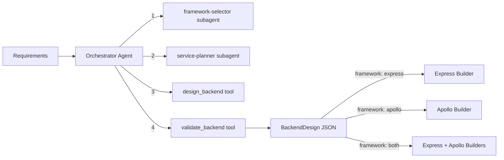

# Backend Architect Module

Designs backend architectures by selecting frameworks (Express, Apollo, or both), planning services and middleware, and generating structured backend designs. Acts as a routing orchestrator that delegates to downstream builders (express-builder, apollo-builder) for code generation.

## Architecture



### Orchestrator Workflow

1. **Select framework** -- `framework-selector` subagent analyzes requirements and recommends Express (REST), Apollo (GraphQL), or both
2. **Plan services** -- `service-planner` subagent designs the service layer, middleware stack, and folder structure
3. **Generate design** -- `design_backend` tool produces the complete backend architecture as JSON
4. **Validate** -- `validate_backend` tool checks the final JSON against the Zod schema

The resulting `framework` field determines which downstream builder to use for scaffolding.

## Quick Start

```typescript
import { runBackendArchitectAgent } from 'sweagent';

const result = await runBackendArchitectAgent({
  input: 'Task manager with users, projects, tasks. REST API with JWT auth, MongoDB.',
  model: { provider: 'openai', model: 'gpt-4o-mini' },
});

console.log(result.output); // BackendDesign as JSON string
```

## Importing into Your Project

```typescript
// Main agent function
import { runBackendArchitectAgent } from 'sweagent';

// Tools (for custom agent setups)
import {
  validateBackendTool,
  createDesignBackendTool,
  createBackendArchitectTools,
} from 'sweagent';

// Subagents (used by the planning module)
import { servicePlannerSubagent, frameworkSelectorSubagent } from 'sweagent';

// Zod schemas for runtime validation
import { backendDesignSchema, serviceSchema, middlewareSchema, routeGroupSchema } from 'sweagent';
import type { TBackendDesign } from 'sweagent';

// System prompt (for customization)
import { BACKEND_ARCHITECT_SYSTEM_PROMPT } from 'sweagent';

// Types
import type { BackendArchitectAgentConfig } from 'sweagent';
```

## Configuration

### `BackendArchitectAgentConfig`

| Property        | Type                        | Default                                        | Description                                      |
| --------------- | --------------------------- | ---------------------------------------------- | ------------------------------------------------ |
| `input`         | `string`                    | **required**                                   | Project requirements, data model, and API design |
| `model`         | `ModelConfig`               | `{ provider: 'openai', model: 'gpt-4o-mini' }` | AI provider and model                            |
| `maxIterations` | `number`                    | `15`                                           | Max orchestrator loop iterations                 |
| `onStep`        | `(step: AgentStep) => void` | `undefined`                                    | Callback for each agent step                     |
| `logger`        | `Logger`                    | `undefined`                                    | Pino-compatible logger                           |

## Expected Output Format

The agent returns `AgentResult` where `output` is a JSON string conforming to `TBackendDesign`:

```typescript
interface BackendDesign {
  framework: 'express' | 'apollo' | 'both';
  language: 'typescript' | 'javascript'; // Default: typescript
  database: string; // e.g., "mongodb"
  services: Service[]; // Service definitions per entity
  middleware: Middleware[]; // Middleware stack
  routes: RouteGroup[]; // Route definitions (REST)
  folderStructure: string[]; // Recommended folder layout
  envVars: string[]; // Environment variable inventory
  notes: string; // Additional architecture notes
}

interface Service {
  name: string; // e.g., "UserService"
  entity: string; // e.g., "user"
  operations: string[]; // e.g., ["create", "findById", "findAll", "update", "delete"]
  dependencies: string[]; // Other services this depends on
}

interface Middleware {
  name: string;
  purpose: string;
  appliesTo: 'global' | 'route' | 'resource';
  config: Record<string, unknown>;
}

interface RouteGroup {
  resource: string; // e.g., "users"
  basePath: string; // e.g., "/api/users"
  endpoints: {
    method: 'GET' | 'POST' | 'PUT' | 'PATCH' | 'DELETE';
    path: string;
    handler: string;
    auth: boolean;
    roles: string[];
  }[];
}
```

## Tools Reference

| Tool               | AI-Powered | Description                                                                                     |
| ------------------ | ---------- | ----------------------------------------------------------------------------------------------- |
| `validate_backend` | No         | Validates JSON against the `BackendDesign` Zod schema. Returns `{ valid, errors? }`             |
| `design_backend`   | Yes        | Generates complete backend architecture from requirements (temperature: 0.3, max tokens: 16384) |

## Subagents Reference

| Subagent             | Purpose                                                                                           | Max Iterations |
| -------------------- | ------------------------------------------------------------------------------------------------- | -------------- |
| `framework-selector` | Analyzes requirements and recommends Express (REST), Apollo (GraphQL), or both, with reasoning    | 2              |
| `service-planner`    | Plans service layer (CRUD + custom operations), middleware stack, and folder structure per entity | 2              |

## Environment Variables

| Variable         | Description                                    | Default       |
| ---------------- | ---------------------------------------------- | ------------- |
| `PROVIDER`       | AI provider (`openai`, `anthropic`, `google`)  | `openai`      |
| `MODEL`          | Model name                                     | `gpt-4o-mini` |
| `REQUIREMENT`    | Project requirement (skips interactive prompt) | --            |
| `OPENAI_API_KEY` | OpenAI API key                                 | --            |

### Run the Example

```bash
# Interactive (prompts for requirement)
npm run example:backend-architect

# One-shot
REQUIREMENT="Design backend for a task manager with REST API" npm run example:backend-architect
```

## Integration with Planning Module

The planning module uses the backend-architect's subagents during the **Design** stage:

- `framework-selector` recommends the backend framework
- `service-planner` designs the service layer and middleware

You do not need to call the backend-architect separately if you are using the planning agent -- it delegates automatically.

```typescript
// Used internally by planning:
import { servicePlannerSubagent, frameworkSelectorSubagent } from 'sweagent';
```
