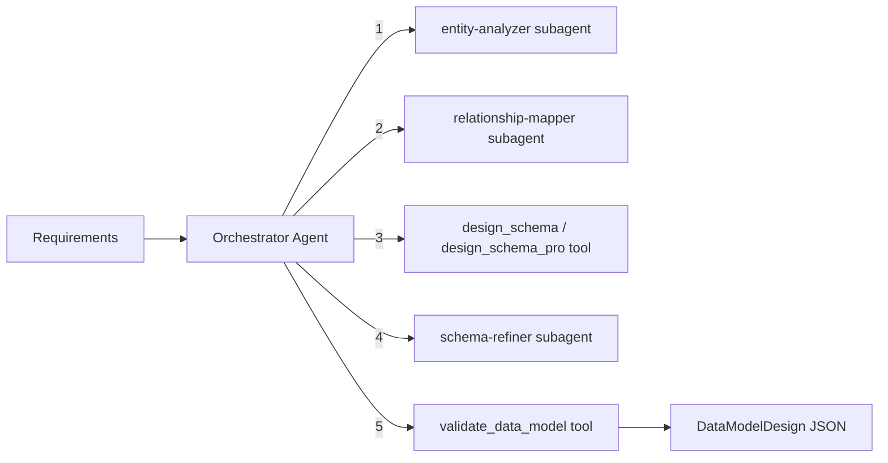

# Data Modeler Module

Designs enterprise-quality database schemas for MongoDB and PostgreSQL. Uses an orchestrator-worker pattern with specialized subagents for entity analysis, relationship mapping, and schema refinement.

## Architecture



### Orchestrator Workflow

1. **Analyze** -- `entity-analyzer` subagent extracts entities, fields, and relationships from requirements
2. **Map relationships** -- `relationship-mapper` subagent determines cardinality, foreign keys, and indexes
3. **Generate schema** -- `design_schema` (plain text) or `design_schema_pro` (structured 5-phase) tool produces the data model
4. **Refine** (optional) -- `schema-refiner` subagent validates and suggests improvements
5. **Validate** -- `validate_data_model` tool checks the final JSON against the Zod schema

## Quick Start

```typescript
import { runDataModelerAgent } from 'sweagent';

const result = await runDataModelerAgent({
  input: 'Fitness app with users, workouts, and nutrition logging\n\nTarget database: mongodb',
  model: { provider: 'openai', model: 'gpt-4o-mini' },
});

console.log(result.output); // DataModelDesign as JSON string
```

## Importing into Your Project

```typescript
// Main agent function
import { runDataModelerAgent } from 'sweagent';

// Tools (for custom agent setups)
import {
  dmValidateSchemaTool,
  createDesignSchemaTool,
  createDesignSchemaProTool,
  createRefineSchemaTools,
  createDataModelerTools,
} from 'sweagent';

// Subagents (used by the planning module)
import {
  dmEntityAnalyzerSubagent,
  relationshipMapperSubagent,
  dmCreateSchemaRefinerSubagent,
} from 'sweagent';

// Zod schemas for runtime validation
import { dmDataModelDesignSchema, dmDataEntitySchema } from 'sweagent';
import type { TDataModelDesign } from 'sweagent';

// System prompt (for customization)
import { DATA_MODELER_SYSTEM_PROMPT } from 'sweagent';

// Types
import type {
  DatabaseType,
  DataEntity,
  DataModelDesign,
  DataModelerAgentConfig,
  DmEntityField,
  DmEntityIndex,
  DmEntityRelation,
} from 'sweagent';
```

## Configuration

### `DataModelerAgentConfig`

| Property        | Type                        | Default                                        | Description                                                                                                            |
| --------------- | --------------------------- | ---------------------------------------------- | ---------------------------------------------------------------------------------------------------------------------- |
| `input`         | `string`                    | **required**                                   | Natural language project description. Include `Target database: mongodb` or `postgresql` to specify the database type. |
| `model`         | `ModelConfig`               | `{ provider: 'openai', model: 'gpt-4o-mini' }` | AI provider and model                                                                                                  |
| `maxIterations` | `number`                    | `15`                                           | Max orchestrator loop iterations                                                                                       |
| `onStep`        | `(step: AgentStep) => void` | `undefined`                                    | Callback for each agent step                                                                                           |
| `logger`        | `Logger`                    | `undefined`                                    | Pino-compatible logger                                                                                                 |

## Expected Output Format

The agent returns `AgentResult` where `output` is a JSON string conforming to `DataModelDesign`:

```typescript
interface DataModelDesign {
  type: 'mongodb' | 'postgresql'; // Target database
  reasoning: string; // Why this schema design was chosen
  entities: DataEntity[]; // All entities/collections/tables
}

interface DataEntity {
  name: string; // Entity name (e.g., "User", "Workout")
  description: string; // What this entity represents
  fields: EntityField[];
  indexes: EntityIndex[];
  relations: EntityRelation[];
}

interface EntityField {
  name: string; // Field name (e.g., "email", "createdAt")
  type: string; // Database-specific type (e.g., "String", "ObjectId", "VARCHAR(255)")
  required: boolean; // Whether the field is required
  unique: boolean; // Whether the field has a unique constraint
  description: string; // What this field stores
  default?: string; // Default value expression
}

interface EntityIndex {
  name: string; // Index name (e.g., "idx_user_email")
  fields: string[]; // Fields included in the index
  unique: boolean; // Whether this is a unique index
}

interface EntityRelation {
  field: string; // Local field name (e.g., "userId")
  references: string; // Referenced entity (e.g., "User")
  type: '1:1' | '1:N' | 'M:N'; // Cardinality
  description: string; // Relationship description
}
```

### Example Output

```json
{
  "type": "mongodb",
  "reasoning": "MongoDB chosen for flexible schema evolution and embedded document patterns suitable for fitness tracking data.",
  "entities": [
    {
      "name": "User",
      "description": "Application user with profile information",
      "fields": [
        {
          "name": "_id",
          "type": "ObjectId",
          "required": true,
          "unique": true,
          "description": "Primary identifier"
        },
        {
          "name": "email",
          "type": "String",
          "required": true,
          "unique": true,
          "description": "User email for authentication"
        },
        {
          "name": "passwordHash",
          "type": "String",
          "required": true,
          "unique": false,
          "description": "Bcrypt-hashed password"
        },
        {
          "name": "createdAt",
          "type": "Date",
          "required": true,
          "unique": false,
          "description": "Account creation timestamp",
          "default": "Date.now()"
        }
      ],
      "indexes": [{ "name": "idx_user_email", "fields": ["email"], "unique": true }],
      "relations": []
    },
    {
      "name": "Workout",
      "description": "A workout session with exercises",
      "fields": [
        {
          "name": "userId",
          "type": "ObjectId",
          "required": true,
          "unique": false,
          "description": "Reference to the user who created this workout"
        }
      ],
      "indexes": [{ "name": "idx_workout_user", "fields": ["userId"], "unique": false }],
      "relations": [
        {
          "field": "userId",
          "references": "User",
          "type": "1:N",
          "description": "Each user can have many workouts"
        }
      ]
    }
  ]
}
```

## Tools Reference

| Tool                  | AI-Powered | Description                                                                                                                           |
| --------------------- | ---------- | ------------------------------------------------------------------------------------------------------------------------------------- |
| `validate_data_model` | No         | Validates JSON against the Zod schema. Returns `{ valid, errors? }`                                                                   |
| `design_schema`       | Yes        | Generates a schema from plain text requirements (temperature: 0.3)                                                                    |
| `design_schema_pro`   | Yes        | 5-phase structured modeling from project context (temperature: 0.2). Requires `projectName`, `projectGoal`, `databaseType`, `context` |
| `refine_schema`       | Yes        | Refines an existing schema based on feedback (temperature: 0.3)                                                                       |

### Two-Tier Design Tools

- **`design_schema`** -- For quick, plain-text input. Pass a requirement string and get a schema back.
- **`design_schema_pro`** -- For structured, enterprise modeling. Uses a 5-phase process: Entity Discovery, Relationship Mapping, Permission Derivation, Schema Generation, Validation. Requires structured inputs like `projectName`, `databaseType`, and pre-analyzed `context`.

## Subagents Reference

| Subagent              | Purpose                                                                            | Max Iterations |
| --------------------- | ---------------------------------------------------------------------------------- | -------------- |
| `entity-analyzer`     | Extracts entities, fields, and relationship signals from requirements              | 2              |
| `relationship-mapper` | Maps cardinality, foreign key strategy, join tables, index recommendations         | 2              |
| `schema-refiner`      | Reviews schema for completeness, normalization, performance, security, conventions | 3              |

## Environment Variables

| Variable         | Description                                    | Default       |
| ---------------- | ---------------------------------------------- | ------------- |
| `PROVIDER`       | AI provider (`openai`, `anthropic`, `google`)  | `openai`      |
| `MODEL`          | Model name                                     | `gpt-4o-mini` |
| `REQUIREMENT`    | Project requirement (skips interactive prompt) | --            |
| `OPENAI_API_KEY` | OpenAI API key                                 | --            |

### Run the Example

```bash
# Interactive (prompts for requirement and database type)
npm run example:data-modeler

# One-shot
REQUIREMENT="E-commerce with products, orders, and reviews" npm run example:data-modeler
```

## Integration with Planning Module

The planning module uses the data-modeler's `entity-analyzer` subagent during the **Requirements** stage to generate the `dataModels` section of the plan. You do not need to call the data-modeler separately if you are using the planning agent -- it delegates automatically.

```typescript
// Used internally by planning:
import { dmEntityAnalyzerSubagent } from 'sweagent';
```

---

## Why Use This with Coding Agents

Instead of letting your coding agent guess your database schema, generate a professional-grade data model first. The structured JSON output gives your coding agent exact entity definitions, field types, relationships, indexes, and validation rules -- no ambiguity, no missing fields, no forgotten indexes.

## Integration with Coding Agents

Generate a data model and save it for your coding agent to implement:

```typescript
import { runDataModelerAgent } from 'sweagent';
import { writeFileSync } from 'fs';

const result = await runDataModelerAgent({
  input: 'SaaS platform with organizations, users, projects, and billing',
  model: { provider: 'openai', model: 'gpt-4o-mini' },
  maxIterations: 15,
});

writeFileSync('data-model.json', result.output);

// Cursor: "Implement the Prisma/Mongoose models from @data-model.json"
// Claude Code: "Read data-model.json and create the database models and migrations"
```
