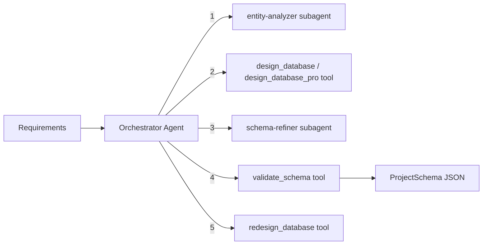

# DB Designer Module

Designs production-ready MongoDB database schemas with entity analysis, relationship mapping, and RBAC permissions. Uses an orchestrator-worker pattern with specialized subagents and a 5-phase analysis framework.

## Architecture



### Orchestrator Workflow

1. **Analyze entities** -- `entity-analyzer` subagent extracts entities, relationships, and roles from requirements using a 3-phase approach (entity discovery, relationship mapping, permission derivation)
2. **Generate schema** -- `design_database` (from plain text) or `design_database_pro` (from structured requirements with actors, flows, stories) produces the MongoDB schema
3. **Refine (optional)** -- `schema-refiner` subagent validates the draft schema against requirements and suggests improvements
4. **Validate** -- `validate_schema` tool checks the final JSON against the Zod schema
5. **Redesign (optional)** -- `redesign_database` tool updates an existing schema based on user feedback

## Quick Start

```typescript
import { runDbDesignerAgent } from 'sweagent';

const result = await runDbDesignerAgent({
  input: 'Task manager with users, projects, and tasks. Users have roles: admin, member.',
  model: { provider: 'openai', model: 'gpt-4o-mini' },
});

console.log(result.output); // ProjectSchema as JSON string
```

## Importing into Your Project

```typescript
// Main agent function
import { runDbDesignerAgent } from 'sweagent';

// Tools (for custom agent setups)
import {
  validateSchemaTool,
  createDesignDatabaseTool,
  createDesignDatabaseProTool,
  createRedesignDatabaseTool,
  createDbDesignerTools,
} from 'sweagent';

// Subagents (used by the planning module)
import { entityAnalyzerSubagent, createSchemaRefinerSubagent } from 'sweagent';

// Zod schemas for runtime validation
import { projectSchema, moduleSchema, fieldSchema } from 'sweagent';
import type { TBackendProjectSchema, TModuleSchema, TFieldSchema } from 'sweagent';

// System prompt (for customization)
import { DB_DESIGN_SYSTEM_PROMPT } from 'sweagent';

// Types
import type {
  DbDesignerAgentConfig,
  Actor,
  ExtractedFlow,
  ExtractedStory,
  TechnicalRequirements,
  StructuredRequirementsInput,
} from 'sweagent';
```

## Configuration

### `DbDesignerAgentConfig`

| Property        | Type                        | Default                                        | Description                                 |
| --------------- | --------------------------- | ---------------------------------------------- | ------------------------------------------- |
| `input`         | `string`                    | **required**                                   | Natural language requirement or instruction |
| `model`         | `ModelConfig`               | `{ provider: 'openai', model: 'gpt-4o-mini' }` | AI provider and model                       |
| `maxIterations` | `number`                    | `15`                                           | Max orchestrator loop iterations            |
| `onStep`        | `(step: AgentStep) => void` | `undefined`                                    | Callback for each agent step                |
| `logger`        | `Logger`                    | `undefined`                                    | Pino-compatible logger                      |

## Expected Output Format

The agent returns `AgentResult` where `output` is a JSON string conforming to `TBackendProjectSchema`:

```typescript
interface BackendProjectSchema {
  projectName: string; // kebab-case project name
  projectDescription: string;
  modules: ModuleSchema[]; // One per collection/entity
  author: string;
}

interface ModuleSchema {
  moduleName: string; // camelCase, never "auth"/"authentication"
  isUserModule: boolean;
  authMethod?: 'EMAIL_AND_PASSWORD' | 'PHONE_AND_OTP' | '';
  emailField?: string;
  passwordField?: string;
  phoneField?: string;
  roleField?: string;
  permissions?: Record<string, ('CREATE' | 'READ' | 'UPDATE' | 'DELETE')[]>;
  fields: FieldSchema[];
}

interface FieldSchema {
  fieldName: string; // camelCase
  fieldType:
    | 'string'
    | 'number'
    | 'boolean'
    | 'Types.ObjectId'
    | 'Date'
    | 'object'
    | 'email'
    | 'password'
    | 'enum';
  isArray: boolean;
  isRequired: boolean;
  isUnique: boolean;
  values: string[]; // Enum values if fieldType is "enum"
  defaultVal?: string | boolean | number | null;
  relationTo?: string; // Module name for relations
  relationType?: 'one-to-one' | 'many-to-one' | '';
  isPrivate: boolean; // True for password fields
}
```

### Example Output

```json
{
  "projectName": "task-manager",
  "projectDescription": "A task management application",
  "modules": [
    {
      "moduleName": "user",
      "isUserModule": true,
      "authMethod": "EMAIL_AND_PASSWORD",
      "emailField": "email",
      "passwordField": "password",
      "roleField": "role",
      "permissions": {
        "admin": ["CREATE", "READ", "UPDATE", "DELETE"],
        "member": ["READ", "UPDATE"]
      },
      "fields": [
        {
          "fieldName": "name",
          "fieldType": "string",
          "isArray": false,
          "isRequired": true,
          "isUnique": false,
          "values": [],
          "isPrivate": false
        },
        {
          "fieldName": "email",
          "fieldType": "email",
          "isArray": false,
          "isRequired": true,
          "isUnique": true,
          "values": [],
          "isPrivate": false
        },
        {
          "fieldName": "password",
          "fieldType": "password",
          "isArray": false,
          "isRequired": true,
          "isUnique": false,
          "values": [],
          "isPrivate": true
        },
        {
          "fieldName": "role",
          "fieldType": "enum",
          "isArray": false,
          "isRequired": true,
          "isUnique": false,
          "values": ["admin", "member"],
          "isPrivate": false
        },
        {
          "fieldName": "createdAt",
          "fieldType": "Date",
          "isArray": false,
          "isRequired": true,
          "isUnique": false,
          "values": [],
          "isPrivate": false
        },
        {
          "fieldName": "updatedAt",
          "fieldType": "Date",
          "isArray": false,
          "isRequired": true,
          "isUnique": false,
          "values": [],
          "isPrivate": false
        }
      ]
    }
  ],
  "author": "sijeeshmiziha"
}
```

## Tools Reference

| Tool                  | AI-Powered | Description                                                                                                                                       |
| --------------------- | ---------- | ------------------------------------------------------------------------------------------------------------------------------------------------- |
| `validate_schema`     | No         | Validates JSON against the Zod `projectSchema`. Returns `{ valid, errors? }`                                                                      |
| `design_database`     | Yes        | Generates MongoDB schema from plain text requirements (temperature: 0.3, max tokens: 8192)                                                        |
| `design_database_pro` | Yes        | Structured design from actors, flows, stories, and technical requirements (temperature: 0.2, max tokens: 16384). Returns `{ dbDesign, metadata }` |
| `redesign_database`   | Yes        | Updates an existing schema based on user feedback (temperature: 0.3, max tokens: 8192). Requires `existingSchema` (JSON string) and `feedback`    |

### Two-Tier Design Tools

- **`design_database`** -- For quick generation from a plain text requirement string.
- **`design_database_pro`** -- For structured, enterprise design. Accepts project name, goal, actors, flows, stories with `dataInvolved`, and technical requirements. Returns both the schema and metadata (entities detected, roles extracted).

## Subagents Reference

| Subagent          | Purpose                                                                                                      | Max Iterations |
| ----------------- | ------------------------------------------------------------------------------------------------------------ | -------------- |
| `entity-analyzer` | Extracts entities, relationships, and roles from raw requirements text using a 3-phase analysis framework    | 2              |
| `schema-refiner`  | Validates a draft schema against requirements and suggests refinements. Has access to `validate_schema` tool | 5              |

## Environment Variables

| Variable         | Description                                    | Default       |
| ---------------- | ---------------------------------------------- | ------------- |
| `PROVIDER`       | AI provider (`openai`, `anthropic`, `google`)  | `openai`      |
| `MODEL`          | Model name                                     | `gpt-4o-mini` |
| `REQUIREMENT`    | Project requirement (skips interactive prompt) | --            |
| `OPENAI_API_KEY` | OpenAI API key                                 | --            |

### Run the Example

```bash
# Interactive (prompts for requirement)
npm run example:db-designer

# One-shot
REQUIREMENT="Design MongoDB schema for a task manager" npm run example:db-designer
```

## Integration with Planning Module

The planning module uses the db-designer's subagents during the **Design** stage:

- `entity-analyzer` generates entity analysis for the data model section
- `schema-refiner` validates and refines the generated schema

You do not need to call the db-designer separately if you are using the planning agent -- it delegates automatically.

```typescript
// Used internally by planning:
import { entityAnalyzerSubagent, createSchemaRefinerSubagent } from 'sweagent';
```

---

## Why Use This with Coding Agents

Coding agents consistently produce incomplete MongoDB schemas -- missing indexes, wrong field types, no RBAC permissions, and broken relationships. The DB Designer uses a 5-phase analysis framework with entity-analyzer and schema-refiner sub-agents to produce production-ready schemas. Your coding agent receives exact Mongoose model definitions with field-level detail.

## Integration with Coding Agents

Generate a database schema and save it for your coding agent:

```typescript
import { runDbDesignerAgent } from 'sweagent';
import { writeFileSync } from 'fs';

const result = await runDbDesignerAgent({
  input: 'E-commerce: users, orders, products. Admins manage products and orders.',
  model: { provider: 'openai', model: 'gpt-4o-mini' },
  maxIterations: 15,
});

writeFileSync('db-schema.json', result.output);

// Cursor: "Create Mongoose models from the schema in @db-schema.json"
// Claude Code: "Read db-schema.json and implement the MongoDB models with validation"
```
