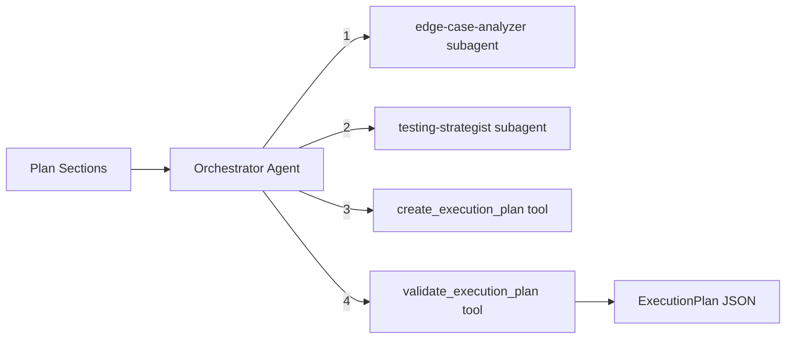

# Execution Planner Module

Creates enterprise-quality execution plans: phased implementation steps, current/desired state analysis, edge cases with severity levels, security and performance considerations, and manual testing checklists. Uses an orchestrator-worker pattern with specialized subagents for edge case analysis and testing strategy.

## Architecture



### Orchestrator Workflow

1. **Analyze edge cases** -- `edge-case-analyzer` subagent identifies edge cases per domain area with handling strategies and severity levels
2. **Design testing** -- `testing-strategist` subagent designs manual testing checklists grouped by feature flow
3. **Generate plan** -- `create_execution_plan` tool produces the complete execution plan with phases, edge cases, and testing checklist
4. **Validate** -- `validate_execution_plan` tool checks the final JSON against the Zod schema

## Quick Start

```typescript
import { runExecutionPlannerAgent } from 'sweagent';

const result = await runExecutionPlannerAgent({
  input:
    'Task manager app with Next.js, MongoDB, JWT auth. Features: user CRUD, task management, dashboard.',
  model: { provider: 'openai', model: 'gpt-4o-mini' },
});

console.log(result.output); // ExecutionPlan as JSON string
```

## Importing into Your Project

```typescript
// Main agent function
import { runExecutionPlannerAgent } from 'sweagent';

// Tools (for custom agent setups)
import {
  validateExecutionPlanTool,
  createExecutionPlanTool,
  createExecutionPlannerTools,
} from 'sweagent';

// Subagents (used by the planning module)
import { edgeCaseAnalyzerSubagent, testingStrategistSubagent } from 'sweagent';

// Zod schemas for runtime validation
import { executionPlanSchema } from 'sweagent';

// System prompt (for customization)
import { EXECUTION_PLANNER_SYSTEM_PROMPT } from 'sweagent';

// Types
import type {
  PhaseStep,
  ImplementationPhase,
  EdgeCase,
  TestChecklistItem,
  ExecutionPlan,
  ExecutionPlannerAgentConfig,
} from 'sweagent';
```

## Configuration

### `ExecutionPlannerAgentConfig`

| Property        | Type                        | Default                                        | Description                                                                                                                                                                 |
| --------------- | --------------------------- | ---------------------------------------------- | --------------------------------------------------------------------------------------------------------------------------------------------------------------------------- |
| `input`         | `string`                    | **required**                                   | All plan sections or project description to create the execution plan from. The more context provided (tech stack, features, data models, API routes), the better the plan. |
| `model`         | `ModelConfig`               | `{ provider: 'openai', model: 'gpt-4o-mini' }` | AI provider and model                                                                                                                                                       |
| `maxIterations` | `number`                    | `15`                                           | Max orchestrator loop iterations                                                                                                                                            |
| `onStep`        | `(step: AgentStep) => void` | `undefined`                                    | Callback for each agent step                                                                                                                                                |
| `logger`        | `Logger`                    | `undefined`                                    | Pino-compatible logger                                                                                                                                                      |

## Expected Output Format

The agent returns `AgentResult` where `output` is a JSON string conforming to `ExecutionPlan`:

```typescript
interface ExecutionPlan {
  phases: ImplementationPhase[]; // Ordered implementation phases
  currentState: string; // Starting point description
  desiredEndState: string; // Success criteria
  edgeCases: EdgeCase[]; // Edge cases by area with severity
  securityNotes: string[]; // Security considerations
  performanceNotes: string[]; // Performance considerations
  testingChecklist: TestChecklistItem[]; // Manual testing items
}

interface ImplementationPhase {
  name: string; // Phase name (e.g., "Phase 1: Foundation")
  description: string; // What this phase accomplishes
  steps: PhaseStep[]; // Ordered steps within the phase
}

interface PhaseStep {
  order: number; // Step number within the phase (1-based)
  action: string; // What to do (e.g., "Set up Next.js project")
  details: string; // Implementation details
}

interface EdgeCase {
  area: string; // Domain area (e.g., "Authentication", "Task Management")
  scenario: string; // Edge case scenario description
  handling: string; // How to handle this edge case
  severity: 'critical' | 'warning' | 'info'; // Impact level
}

interface TestChecklistItem {
  flow: string; // Feature flow (e.g., "User Signup", "Task Creation")
  item: string; // Test item description
  expectedResult: string; // What should happen
}
```

### Edge Case Severity Levels

| Severity   | Meaning                                                   | Example                                          |
| ---------- | --------------------------------------------------------- | ------------------------------------------------ |
| `critical` | Must be handled before launch; data loss or security risk | "Concurrent task updates overwriting each other" |
| `warning`  | Should be handled; degraded UX if not                     | "Network timeout during file upload"             |
| `info`     | Nice to handle; minor UX improvement                      | "User navigates away from unsaved form"          |

### Example Output

```json
{
  "phases": [
    {
      "name": "Phase 1: Foundation",
      "description": "Project setup, database, and authentication",
      "steps": [
        {
          "order": 1,
          "action": "Initialize Next.js project",
          "details": "npx create-next-app@14 with TypeScript, Tailwind CSS, App Router. Set up ESLint, Prettier, and project structure."
        },
        {
          "order": 2,
          "action": "Set up MongoDB connection",
          "details": "Install mongoose, create connection utility with retry logic, define User schema with indexes."
        },
        {
          "order": 3,
          "action": "Implement authentication",
          "details": "JWT with HTTP-only cookies. Routes: POST /api/auth/signup, POST /api/auth/login, POST /api/auth/logout. Middleware for protected routes."
        }
      ]
    },
    {
      "name": "Phase 2: Core Features",
      "description": "Task and project CRUD with assignments",
      "steps": [
        {
          "order": 1,
          "action": "Build task management API",
          "details": "CRUD endpoints for tasks with validation, assignment, status transitions, and pagination."
        },
        {
          "order": 2,
          "action": "Build task management UI",
          "details": "Task list with filters, task detail page, create/edit forms, status change interactions."
        }
      ]
    },
    {
      "name": "Phase 3: Polish and Deploy",
      "description": "Dashboard, error handling, testing, deployment",
      "steps": [
        {
          "order": 1,
          "action": "Build dashboard",
          "details": "Stats cards, recent activity, task distribution chart using chart library."
        },
        {
          "order": 2,
          "action": "Add error handling and loading states",
          "details": "Global error boundary, toast notifications, skeleton loaders, empty states."
        }
      ]
    }
  ],
  "currentState": "Empty project directory with no existing code or infrastructure",
  "desiredEndState": "Fully functional task manager with authentication, task CRUD, assignments, dashboard, and deployment-ready configuration",
  "edgeCases": [
    {
      "area": "Authentication",
      "scenario": "JWT refresh token expires while user is actively using the app",
      "handling": "Intercept 401 responses, attempt silent refresh, redirect to login only if refresh fails",
      "severity": "critical"
    },
    {
      "area": "Task Management",
      "scenario": "User deletes a project that has tasks assigned to other users",
      "handling": "Soft-delete the project, notify assignees, move orphaned tasks to an archive",
      "severity": "warning"
    },
    {
      "area": "Forms",
      "scenario": "User navigates away from an unsaved task form",
      "handling": "Show confirmation dialog using beforeunload event and router guards",
      "severity": "info"
    }
  ],
  "securityNotes": [
    "Sanitize all user input to prevent XSS (use DOMPurify for rich text)",
    "Rate-limit auth endpoints (5 attempts per 15 minutes per IP)",
    "Validate ObjectId format before database queries to prevent injection",
    "Set CORS to allow only the frontend domain in production"
  ],
  "performanceNotes": [
    "Add database indexes on frequently queried fields (userId, projectId, status)",
    "Use React Query with staleTime for caching API responses",
    "Paginate task lists (default 20, max 100 per page)",
    "Lazy-load dashboard charts and non-critical components"
  ],
  "testingChecklist": [
    {
      "flow": "User Signup",
      "item": "Sign up with valid email and password",
      "expectedResult": "Account created, redirected to dashboard, JWT cookie set"
    },
    {
      "flow": "User Signup",
      "item": "Sign up with an email that already exists",
      "expectedResult": "409 error displayed, form not cleared"
    },
    {
      "flow": "Task Creation",
      "item": "Create a task with all required fields",
      "expectedResult": "Task appears in list, success toast shown, redirected to task list"
    },
    {
      "flow": "Task Creation",
      "item": "Submit task form with empty title",
      "expectedResult": "Inline validation error shown, form not submitted"
    }
  ]
}
```

## Tools Reference

| Tool                      | AI-Powered | Description                                                         |
| ------------------------- | ---------- | ------------------------------------------------------------------- |
| `validate_execution_plan` | No         | Validates JSON against the Zod schema. Returns `{ valid, errors? }` |
| `create_execution_plan`   | Yes        | Generates complete execution plan from project context              |

## Subagents Reference

| Subagent             | Purpose                                                                                    | Max Iterations |
| -------------------- | ------------------------------------------------------------------------------------------ | -------------- |
| `edge-case-analyzer` | Identifies edge cases per domain area with handling strategies and severity classification | 2              |
| `testing-strategist` | Designs manual testing checklists grouped by feature flow with expected results            | 2              |

## Environment Variables

| Variable         | Description                                    | Default       |
| ---------------- | ---------------------------------------------- | ------------- |
| `PROVIDER`       | AI provider (`openai`, `anthropic`, `google`)  | `openai`      |
| `MODEL`          | Model name                                     | `gpt-4o-mini` |
| `REQUIREMENT`    | Project requirement (skips interactive prompt) | --            |
| `OPENAI_API_KEY` | OpenAI API key                                 | --            |

### Run the Example

```bash
# Interactive (prompts for project description)
npm run example:execution-planner

# One-shot
REQUIREMENT="Plan implementation for a task manager app" npm run example:execution-planner
```

## Integration with Planning Module

The planning module uses the execution-planner's subagents during the **Synthesis** stage:

- `edge-case-analyzer` generates the `edgeCases` section of the plan
- `testing-strategist` generates the `testingChecklist` section

You do not need to call the execution-planner separately if you are using the planning agent -- it delegates automatically.

```typescript
// Used internally by planning:
import { edgeCaseAnalyzerSubagent, testingStrategistSubagent } from 'sweagent';
```
