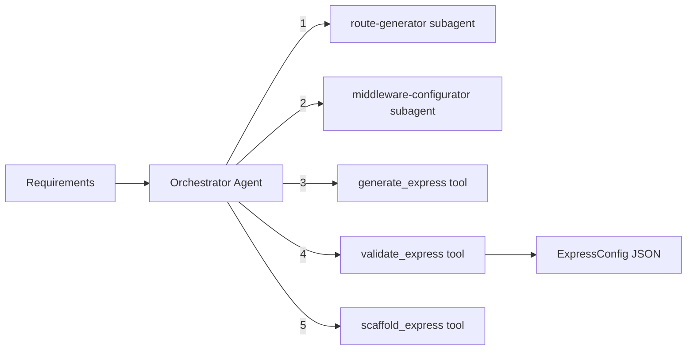

# Express Builder Module

Generates Express.js REST API project configurations with controllers, models, middleware, and route definitions. Uses an orchestrator-worker pattern with route generation and middleware configuration subagents, and can scaffold a complete Express project from Handlebars templates.

## Architecture



### Orchestrator Workflow

1. **Generate routes** -- `route-generator` subagent designs RESTful route definitions with controller mappings and validation
2. **Configure middleware** -- `middleware-configurator` subagent designs the middleware stack (auth, CORS, rate limiting, error handling)
3. **Generate config** -- `generate_express` tool produces the complete Express configuration as JSON
4. **Validate** -- `validate_express` tool checks the config JSON against the Zod schema
5. **Scaffold (optional)** -- `scaffold_express` tool compiles Handlebars templates to generate the project

## Quick Start

```typescript
import { runExpressBuilderAgent } from 'sweagent';

const result = await runExpressBuilderAgent({
  input: 'Task manager with users, projects, and tasks. REST API with JWT auth, MongoDB.',
  model: { provider: 'openai', model: 'gpt-4o-mini' },
});

console.log(result.output); // ExpressConfig as JSON string
```

## Importing into Your Project

```typescript
// Main agent function
import { runExpressBuilderAgent } from 'sweagent';

// Tools (for custom agent setups)
import {
  validateExpressTool,
  createGenerateExpressTool,
  scaffoldExpressTool,
  createExpressBuilderTools,
} from 'sweagent';

// Subagents
import { routeGeneratorSubagent, middlewareConfiguratorSubagent } from 'sweagent';

// Zod schemas for runtime validation
import {
  expressConfigSchema,
  controllerSchema,
  controllerMethodSchema,
  modelSchema,
  modelFieldSchema,
  middlewareConfigSchema,
} from 'sweagent';
import type { TExpressConfig } from 'sweagent';

// System prompt (for customization)
import { EXPRESS_BUILDER_SYSTEM_PROMPT } from 'sweagent';

// Types
import type { ExpressBuilderAgentConfig } from 'sweagent';
```

## Configuration

### `ExpressBuilderAgentConfig`

| Property        | Type                        | Default                                        | Description                                      |
| --------------- | --------------------------- | ---------------------------------------------- | ------------------------------------------------ |
| `input`         | `string`                    | **required**                                   | Data model, API design, and project requirements |
| `model`         | `ModelConfig`               | `{ provider: 'openai', model: 'gpt-4o-mini' }` | AI provider and model                            |
| `maxIterations` | `number`                    | `15`                                           | Max orchestrator loop iterations                 |
| `onStep`        | `(step: AgentStep) => void` | `undefined`                                    | Callback for each agent step                     |
| `logger`        | `Logger`                    | `undefined`                                    | Pino-compatible logger                           |

## Expected Output Format

The agent returns `AgentResult` where `output` is a JSON string conforming to `TExpressConfig`:

```typescript
interface ExpressConfig {
  appName: string; // Application name
  port: number; // Server port (default: 3000)
  database: string; // Database type (default: "mongodb")
  controllers: Controller[]; // Route controllers per resource
  models: Model[]; // Database models
  middleware: MiddlewareConfig[]; // Middleware stack
  envVars: string[]; // Environment variable names
  folderStructure: string[]; // Recommended folder layout
}

interface Controller {
  name: string; // e.g., "UserController"
  resource: string; // e.g., "users"
  basePath: string; // e.g., "/api/users"
  methods: ControllerMethod[];
}

interface ControllerMethod {
  name: string; // e.g., "getAll"
  httpMethod: 'GET' | 'POST' | 'PUT' | 'PATCH' | 'DELETE';
  path: string; // e.g., "/" or "/:id"
  auth: boolean;
  roles: string[];
  validation: string; // Zod schema reference
  description: string;
}

interface Model {
  name: string; // e.g., "User"
  collection: string; // e.g., "users"
  fields: ModelField[];
  timestamps: boolean;
  indexes: string[];
}

interface MiddlewareConfig {
  name: string;
  type: 'auth' | 'validation' | 'errorHandler' | 'cors' | 'rateLimit' | 'logging' | 'custom';
  config: Record<string, unknown>;
}
```

### Example Output

```json
{
  "appName": "task-manager-api",
  "port": 3000,
  "database": "mongodb",
  "controllers": [
    {
      "name": "UserController",
      "resource": "users",
      "basePath": "/api/users",
      "methods": [
        {
          "name": "getAll",
          "httpMethod": "GET",
          "path": "/",
          "auth": true,
          "roles": ["admin"],
          "validation": "",
          "description": "List all users"
        },
        {
          "name": "getById",
          "httpMethod": "GET",
          "path": "/:id",
          "auth": true,
          "roles": [],
          "validation": "",
          "description": "Get user by ID"
        },
        {
          "name": "create",
          "httpMethod": "POST",
          "path": "/",
          "auth": true,
          "roles": ["admin"],
          "validation": "CreateUserSchema",
          "description": "Create user"
        },
        {
          "name": "update",
          "httpMethod": "PUT",
          "path": "/:id",
          "auth": true,
          "roles": [],
          "validation": "UpdateUserSchema",
          "description": "Update user"
        },
        {
          "name": "delete",
          "httpMethod": "DELETE",
          "path": "/:id",
          "auth": true,
          "roles": ["admin"],
          "validation": "",
          "description": "Delete user"
        }
      ]
    }
  ],
  "models": [
    {
      "name": "User",
      "collection": "users",
      "fields": [
        { "name": "name", "type": "String", "required": true, "unique": false },
        { "name": "email", "type": "String", "required": true, "unique": true },
        { "name": "password", "type": "String", "required": true, "unique": false },
        { "name": "role", "type": "String", "required": true, "unique": false, "default": "member" }
      ],
      "timestamps": true,
      "indexes": ["email"]
    }
  ],
  "middleware": [
    { "name": "cors", "type": "cors", "config": {} },
    { "name": "helmet", "type": "custom", "config": {} },
    { "name": "jwtAuth", "type": "auth", "config": {} },
    { "name": "errorHandler", "type": "errorHandler", "config": {} }
  ],
  "envVars": ["MONGODB_URI", "JWT_SECRET", "PORT"],
  "folderStructure": [
    "src/controllers/",
    "src/models/",
    "src/middleware/",
    "src/routes/",
    "src/config/"
  ]
}
```

## Tools Reference

| Tool               | AI-Powered | Description                                                                                                 |
| ------------------ | ---------- | ----------------------------------------------------------------------------------------------------------- |
| `validate_express` | No         | Validates JSON against the `ExpressConfig` Zod schema. Returns `{ valid, errors? }`                         |
| `generate_express` | Yes        | Generates complete Express config from requirements (temperature: 0.3, max tokens: 16384)                   |
| `scaffold_express` | No         | Scaffolds an Express project from validated config using Handlebars templates from `.ref/templates/express` |

## Subagents Reference

| Subagent                  | Purpose                                                                                                    | Max Iterations |
| ------------------------- | ---------------------------------------------------------------------------------------------------------- | -------------- |
| `route-generator`         | Designs RESTful route definitions with controller mappings, validation, and pagination                     | 2              |
| `middleware-configurator` | Designs the Express middleware stack: auth (JWT), CORS, rate limiting, validation, error handling, logging | 2              |

## Environment Variables

| Variable         | Description                                    | Default       |
| ---------------- | ---------------------------------------------- | ------------- |
| `PROVIDER`       | AI provider (`openai`, `anthropic`, `google`)  | `openai`      |
| `MODEL`          | Model name                                     | `gpt-4o-mini` |
| `REQUIREMENT`    | Project requirement (skips interactive prompt) | --            |
| `OPENAI_API_KEY` | OpenAI API key                                 | --            |

### Run the Example

```bash
# Interactive (prompts for requirement)
npm run example:express-builder

# One-shot
REQUIREMENT="Generate Express API for a task manager" npm run example:express-builder
```

## Integration with Planning Module

The planning module uses the express-builder when the backend-architect selects "express" or "both" as the framework. The subagents are also available for direct use:

```typescript
import { routeGeneratorSubagent, middlewareConfiguratorSubagent } from 'sweagent';
```
