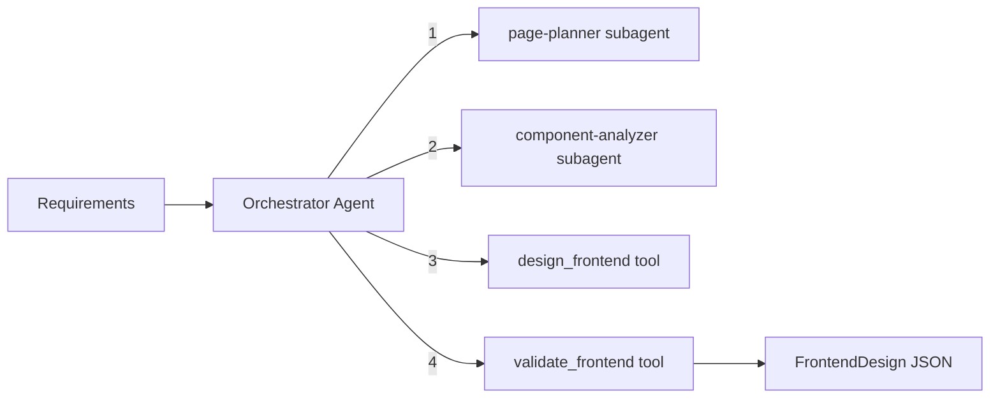

# Frontend Architect Module

Designs enterprise-quality frontend architectures: page specifications with routes, reusable component taxonomy, state management strategy, and routing design. Uses an orchestrator-worker pattern with specialized subagents for page planning and component analysis.

## Architecture



### Orchestrator Workflow

1. **Plan pages** -- `page-planner` subagent designs detailed page specifications with routes, forms, actions, states, and key UI elements
2. **Analyze components** -- `component-analyzer` subagent identifies reusable components, layouts, and state management patterns
3. **Generate design** -- `design_frontend` tool produces the complete frontend architecture JSON
4. **Validate** -- `validate_frontend` tool checks the final JSON against the Zod schema

## Quick Start

```typescript
import { runFrontendArchitectAgent } from 'sweagent';

const result = await runFrontendArchitectAgent({
  input: 'Fitness app with Next.js. Pages: dashboard, workout log, nutrition tracker, profile.',
  model: { provider: 'openai', model: 'gpt-4o-mini' },
});

console.log(result.output); // FrontendDesign as JSON string
```

## Importing into Your Project

```typescript
// Main agent function
import { runFrontendArchitectAgent } from 'sweagent';

// Tools (for custom agent setups)
import {
  validateFrontendTool,
  createDesignFrontendTool,
  createFrontendArchitectTools,
} from 'sweagent';

// Subagents (used by the planning module)
import { pagePlannerSubagent, componentAnalyzerSubagent } from 'sweagent';

// Zod schemas for runtime validation
import { frontendDesignSchema } from 'sweagent';

// System prompt (for customization)
import { FRONTEND_ARCHITECT_SYSTEM_PROMPT } from 'sweagent';

// Types
import type {
  PageAccess,
  FormField,
  PageDesign,
  ComponentDesign,
  FrontendDesign,
  FrontendArchitectAgentConfig,
} from 'sweagent';
```

## Configuration

### `FrontendArchitectAgentConfig`

| Property        | Type                        | Default                                        | Description                                                                                                                          |
| --------------- | --------------------------- | ---------------------------------------------- | ------------------------------------------------------------------------------------------------------------------------------------ |
| `input`         | `string`                    | **required**                                   | Project context, API surface, and frontend requirements. Include framework preference, page list, and key features for best results. |
| `model`         | `ModelConfig`               | `{ provider: 'openai', model: 'gpt-4o-mini' }` | AI provider and model                                                                                                                |
| `maxIterations` | `number`                    | `15`                                           | Max orchestrator loop iterations                                                                                                     |
| `onStep`        | `(step: AgentStep) => void` | `undefined`                                    | Callback for each agent step                                                                                                         |
| `logger`        | `Logger`                    | `undefined`                                    | Pino-compatible logger                                                                                                               |

## Expected Output Format

The agent returns `AgentResult` where `output` is a JSON string conforming to `FrontendDesign`:

```typescript
interface FrontendDesign {
  pages: PageDesign[]; // All page specifications
  components: ComponentDesign[]; // Reusable component taxonomy
  stateManagement: string; // State management strategy description
  routingNotes: string; // Routing behavior and guard notes
}

interface PageDesign {
  path: string; // Route path (e.g., "/dashboard", "/tasks/:id")
  name: string; // Page name (e.g., "Dashboard", "Task Detail")
  access: 'public' | 'protected'; // Access level
  purpose: string; // What this page does
  formFields: FormField[]; // Form fields on this page (if any)
  actions: string[]; // User actions available (e.g., "Create task", "Filter by status")
  emptyState: string; // What to show when there is no data
  errorState: string; // What to show on error
  redirectOnSuccess: string; // Where to redirect after a successful action
  keyUiElements: string[]; // Key UI elements (e.g., "Data table", "Stats cards")
}

interface FormField {
  name: string; // Field name (e.g., "email", "title")
  type: string; // Input type (e.g., "email", "text", "select", "date")
  required: boolean; // Whether the field is required
  validation: string; // Validation rule (e.g., "Valid email format", "1-200 characters")
}

interface ComponentDesign {
  name: string; // Component name (e.g., "AppLayout", "TaskCard", "DataTable")
  type: 'layout' | 'shared' | 'form' | 'display' | 'navigation';
  purpose: string; // What this component does
  props: string[]; // Props it accepts (e.g., "title: string", "items: Task[]")
  usedIn: string[]; // Pages that use this component (e.g., ["/dashboard", "/tasks"])
}
```

### Component Types

| Type         | Description                    | Examples                                        |
| ------------ | ------------------------------ | ----------------------------------------------- |
| `layout`     | Page layouts, wrappers, shells | `AppLayout`, `AuthLayout`, `DashboardShell`     |
| `shared`     | Reused across multiple pages   | `DataTable`, `StatsCard`, `Modal`, `EmptyState` |
| `form`       | Form components and inputs     | `LoginForm`, `TaskForm`, `SearchInput`          |
| `display`    | Data presentation components   | `TaskCard`, `UserAvatar`, `ProgressChart`       |
| `navigation` | Navigation and routing         | `Sidebar`, `Breadcrumbs`, `TabNavigation`       |

### Example Output

```json
{
  "pages": [
    {
      "path": "/dashboard",
      "name": "Dashboard",
      "access": "protected",
      "purpose": "Overview of user activity, workout stats, and recent entries",
      "formFields": [],
      "actions": ["View workout stats", "Navigate to recent workouts", "Quick-log a workout"],
      "emptyState": "Welcome message with prompts to log first workout and set goals",
      "errorState": "Retry button with fallback to cached data",
      "redirectOnSuccess": "",
      "keyUiElements": [
        "Stats cards (workouts this week, calories today, streak)",
        "Recent workouts list",
        "Progress chart",
        "Quick action buttons"
      ]
    },
    {
      "path": "/workouts/new",
      "name": "Log Workout",
      "access": "protected",
      "purpose": "Create a new workout entry with exercises",
      "formFields": [
        {
          "name": "exerciseName",
          "type": "text",
          "required": true,
          "validation": "1-100 characters"
        },
        {
          "name": "sets",
          "type": "number",
          "required": true,
          "validation": "1-50"
        },
        {
          "name": "reps",
          "type": "number",
          "required": true,
          "validation": "1-500"
        },
        {
          "name": "date",
          "type": "date",
          "required": true,
          "validation": "Cannot be in the future"
        }
      ],
      "actions": ["Add exercise", "Remove exercise", "Save workout"],
      "emptyState": "Form ready with date defaulting to today",
      "errorState": "Inline field validation errors, toast on server error",
      "redirectOnSuccess": "/workouts",
      "keyUiElements": ["Dynamic exercise list", "Add exercise button", "Save/cancel buttons"]
    }
  ],
  "components": [
    {
      "name": "AppLayout",
      "type": "layout",
      "purpose": "Main authenticated layout with sidebar and header",
      "props": ["children: ReactNode"],
      "usedIn": ["/dashboard", "/workouts", "/nutrition", "/profile"]
    },
    {
      "name": "StatsCard",
      "type": "display",
      "purpose": "Display a single metric with label, value, and trend",
      "props": ["label: string", "value: number | string", "trend?: 'up' | 'down' | 'flat'"],
      "usedIn": ["/dashboard"]
    },
    {
      "name": "ExerciseForm",
      "type": "form",
      "purpose": "Form for adding/editing a single exercise entry",
      "props": ["exercise?: Exercise", "onSubmit: (data) => void", "onCancel: () => void"],
      "usedIn": ["/workouts/new", "/workouts/:id/edit"]
    }
  ],
  "stateManagement": "React Query for server state (workout data, nutrition logs). React Context for auth state and theme. Local useState for form state and UI toggles.",
  "routingNotes": "Next.js App Router with middleware-based auth guards. Protected routes redirect to /login if no valid session. Public routes: /, /login, /signup. All other routes are protected."
}
```

## Tools Reference

| Tool                | AI-Powered | Description                                                         |
| ------------------- | ---------- | ------------------------------------------------------------------- |
| `validate_frontend` | No         | Validates JSON against the Zod schema. Returns `{ valid, errors? }` |
| `design_frontend`   | Yes        | Generates complete frontend architecture from requirements          |

## Subagents Reference

| Subagent             | Purpose                                                                                                | Max Iterations |
| -------------------- | ------------------------------------------------------------------------------------------------------ | -------------- |
| `page-planner`       | Designs detailed page specs with routes, form fields, actions, empty/error states, key UI elements     | 2              |
| `component-analyzer` | Identifies reusable components, categorizes by type, maps props and usage, recommends state management | 2              |

## Environment Variables

| Variable         | Description                                    | Default       |
| ---------------- | ---------------------------------------------- | ------------- |
| `PROVIDER`       | AI provider (`openai`, `anthropic`, `google`)  | `openai`      |
| `MODEL`          | Model name                                     | `gpt-4o-mini` |
| `REQUIREMENT`    | Project requirement (skips interactive prompt) | --            |
| `OPENAI_API_KEY` | OpenAI API key                                 | --            |

### Run the Example

```bash
# Interactive (prompts for frontend requirements)
npm run example:frontend-architect

# One-shot
REQUIREMENT="Dashboard app with users, analytics, settings" npm run example:frontend-architect
```

## Integration with Planning Module

The planning module uses the frontend-architect's `page-planner` subagent during the **Requirements** stage to generate the `pagesAndRoutes` section of the plan. You do not need to call the frontend-architect separately if you are using the planning agent -- it delegates automatically.

```typescript
// Used internally by planning:
import { pagePlannerSubagent } from 'sweagent';
```

---

## Why Use This with Coding Agents

Coding agents create frontend pages ad hoc -- inconsistent layouts, missing state management, no component reuse plan. The Frontend Architect designs a complete frontend blueprint with page specs, reusable components, routing strategy, and state management -- so your coding agent builds a cohesive frontend from the start instead of refactoring later.

## Integration with Coding Agents

Generate a frontend architecture and save it for your coding agent:

```typescript
import { runFrontendArchitectAgent } from 'sweagent';
import { writeFileSync } from 'fs';

const result = await runFrontendArchitectAgent({
  input: 'Dashboard app with analytics, settings, and user management',
  model: { provider: 'openai', model: 'gpt-4o-mini' },
  maxIterations: 15,
});

writeFileSync('frontend-design.json', result.output);

// Cursor: "Scaffold the frontend project from @frontend-design.json"
// Claude Code: "Read frontend-design.json and create the page components and routing"
```
