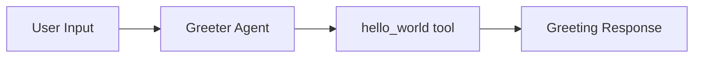

# Hello World Module

A minimal example agent that greets users by name. Useful as a starting point for understanding the sweagent tool and agent patterns.

## Architecture



### Workflow

1. **Receive input** -- Agent receives a natural language request (e.g. "Say hello to Alice")
2. **Greet** -- `hello_world` tool returns a greeting message for the given name

## Quick Start

```typescript
import { runHelloWorldAgent } from 'sweagent';

const result = await runHelloWorldAgent({
  input: 'Say hello to Alice',
  model: { provider: 'openai', model: 'gpt-4o-mini' },
});

console.log(result.output); // "Hello, Alice! Welcome to sweagent."
```

## Importing into Your Project

```typescript
// Main agent function
import { runHelloWorldAgent } from 'sweagent';

// Tool (for custom agent setups)
import { helloWorldTool } from 'sweagent';

// Types
import type { HelloWorldAgentConfig } from 'sweagent';
```

## Configuration

### `HelloWorldAgentConfig`

| Property        | Type                        | Default                                        | Description                           |
| --------------- | --------------------------- | ---------------------------------------------- | ------------------------------------- |
| `input`         | `string`                    | **required**                                   | Natural language request to the agent |
| `model`         | `ModelConfig`               | `{ provider: 'openai', model: 'gpt-4o-mini' }` | AI provider and model                 |
| `systemPrompt`  | `string`                    | `"You are a friendly greeter..."`              | System prompt override                |
| `maxIterations` | `number`                    | `3`                                            | Max agent loop iterations             |
| `onStep`        | `(step: AgentStep) => void` | `undefined`                                    | Callback for each agent step          |
| `logger`        | `Logger`                    | `undefined`                                    | Pino-compatible logger                |

## Tool Reference

| Tool          | AI-Powered | Description                                   |
| ------------- | ---------- | --------------------------------------------- |
| `hello_world` | No         | Returns a greeting message for the given name |

### Tool Input

| Parameter | Type     | Description   |
| --------- | -------- | ------------- |
| `name`    | `string` | Name to greet |

### Tool Output

```json
{ "greeting": "Hello, Alice! Welcome to sweagent." }
```

## Environment Variables

| Variable         | Description    | Default |
| ---------------- | -------------- | ------- |
| `OPENAI_API_KEY` | OpenAI API key | --      |

### Run the Example

```bash
npm run example:hello-world
```

---

## Using as a Module Template

Use this module as a starting point when building your own domain agent. Each sweagent module follows the same structure:

```
src/modules/your-module/
  index.ts          -- Module exports
  agent.ts          -- Orchestrator agent
  types.ts          -- Module-specific types
  prompts/          -- System and stage prompts
  tools/            -- Module-specific tools
  subagents/        -- Specialized sub-agents
  schemas/          -- Zod validation schemas
  README.md         -- Module documentation
```

Copy the hello-world module, rename it, and replace the greeting tool with your domain-specific tools. See the [main README](../../README.md#domain-agent-modules) for how production modules are structured.
