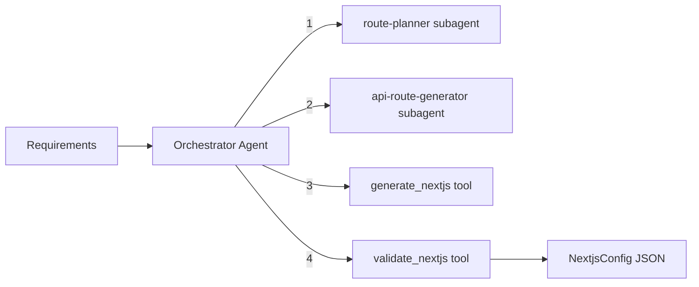

# Next.js Builder Module

Generates Next.js App Router application configurations with pages, layouts, API routes, server actions, and middleware. Uses an orchestrator-worker pattern with route planning and API route generation subagents.

## Architecture



### Orchestrator Workflow

1. **Plan routes** -- `route-planner` subagent designs the App Router file structure with route groups (auth, dashboard, marketing), layouts, and page files
2. **Generate API routes** -- `api-route-generator` subagent designs API route handlers and server actions, determining when to use each
3. **Generate config** -- `generate_nextjs` tool produces the complete Next.js configuration as JSON
4. **Validate** -- `validate_nextjs` tool checks the config JSON against the Zod schema

## Quick Start

```typescript
import { runNextjsBuilderAgent } from 'sweagent';

const result = await runNextjsBuilderAgent({
  input: 'Task manager with users, projects, tasks. Next.js with next-auth, Prisma, MongoDB.',
  model: { provider: 'openai', model: 'gpt-4o-mini' },
});

console.log(result.output); // NextjsConfig as JSON string
```

## Importing into Your Project

```typescript
// Main agent function
import { runNextjsBuilderAgent } from 'sweagent';

// Tools (for custom agent setups)
import { validateNextjsTool, createGenerateNextjsTool, createNextjsBuilderTools } from 'sweagent';

// Subagents
import { routePlannerSubagent, apiRouteGeneratorSubagent } from 'sweagent';

// Zod schemas for runtime validation
import {
  nextjsConfigSchema,
  nextjsPageSchema,
  nextjsLayoutSchema,
  nextjsApiRouteSchema,
  serverActionSchema,
} from 'sweagent';
import type { TNextjsConfig } from 'sweagent';

// System prompt (for customization)
import { NEXTJS_BUILDER_SYSTEM_PROMPT } from 'sweagent';

// Types
import type { NextjsBuilderAgentConfig } from 'sweagent';
```

## Configuration

### `NextjsBuilderAgentConfig`

| Property        | Type                        | Default                                        | Description                                           |
| --------------- | --------------------------- | ---------------------------------------------- | ----------------------------------------------------- |
| `input`         | `string`                    | **required**                                   | Frontend design, API design, and project requirements |
| `model`         | `ModelConfig`               | `{ provider: 'openai', model: 'gpt-4o-mini' }` | AI provider and model                                 |
| `maxIterations` | `number`                    | `15`                                           | Max orchestrator loop iterations                      |
| `onStep`        | `(step: AgentStep) => void` | `undefined`                                    | Callback for each agent step                          |
| `logger`        | `Logger`                    | `undefined`                                    | Pino-compatible logger                                |

## Expected Output Format

The agent returns `AgentResult` where `output` is a JSON string conforming to `TNextjsConfig`:

```typescript
interface NextjsConfig {
  appName: string; // Application name
  pages: NextjsPage[]; // Page definitions
  layouts: NextjsLayout[]; // Layout definitions
  apiRoutes: NextjsApiRoute[]; // API route handlers
  serverActions: ServerAction[]; // Server action definitions
  middleware: string[]; // Middleware matcher patterns
  envVars: string[]; // Environment variable names
  packages: string[]; // Recommended npm packages
}

interface NextjsPage {
  path: string; // App Router path (e.g., "/dashboard/tasks")
  name: string; // Page name
  access: 'public' | 'protected';
  routeGroup: string; // Route group (e.g., "(dashboard)")
  purpose: string; // Page description
  hasForm: boolean; // Has form inputs
  formFields: string[]; // Form field names
  dataFetching: 'server' | 'client' | 'hybrid';
  actions: string[]; // Available actions
}

interface NextjsLayout {
  name: string;
  path: string;
  routeGroup: string;
  components: string[]; // Shared components (e.g., "Sidebar", "Header")
  purpose: string;
}

interface NextjsApiRoute {
  path: string; // e.g., "/api/users"
  methods: ('GET' | 'POST' | 'PUT' | 'PATCH' | 'DELETE')[];
  auth: boolean;
  description: string;
}

interface ServerAction {
  name: string; // e.g., "createTask"
  module: string; // e.g., "tasks"
  description: string;
  revalidates: string[]; // Paths/tags to revalidate after mutation
}
```

### Example Output

```json
{
  "appName": "task-manager",
  "pages": [
    {
      "path": "/login",
      "name": "Login",
      "access": "public",
      "routeGroup": "(auth)",
      "purpose": "User authentication",
      "hasForm": true,
      "formFields": ["email", "password"],
      "dataFetching": "server",
      "actions": ["login"]
    },
    {
      "path": "/dashboard",
      "name": "Dashboard",
      "access": "protected",
      "routeGroup": "(dashboard)",
      "purpose": "Main dashboard with task overview",
      "hasForm": false,
      "formFields": [],
      "dataFetching": "server",
      "actions": []
    },
    {
      "path": "/dashboard/tasks",
      "name": "Tasks",
      "access": "protected",
      "routeGroup": "(dashboard)",
      "purpose": "Task listing with CRUD operations",
      "hasForm": true,
      "formFields": ["title", "description", "assignee", "dueDate", "status"],
      "dataFetching": "hybrid",
      "actions": ["create", "edit", "delete"]
    }
  ],
  "layouts": [
    {
      "name": "AuthLayout",
      "path": "(auth)/layout.tsx",
      "routeGroup": "(auth)",
      "components": [],
      "purpose": "Centered card layout for auth pages"
    },
    {
      "name": "DashboardLayout",
      "path": "(dashboard)/layout.tsx",
      "routeGroup": "(dashboard)",
      "components": ["Sidebar", "Header"],
      "purpose": "Dashboard with sidebar navigation"
    }
  ],
  "apiRoutes": [
    {
      "path": "/api/auth/[...nextauth]",
      "methods": ["GET", "POST"],
      "auth": false,
      "description": "NextAuth.js authentication handler"
    }
  ],
  "serverActions": [
    {
      "name": "createTask",
      "module": "tasks",
      "description": "Create a new task",
      "revalidates": ["/dashboard/tasks"]
    },
    {
      "name": "updateTask",
      "module": "tasks",
      "description": "Update an existing task",
      "revalidates": ["/dashboard/tasks"]
    }
  ],
  "middleware": ["/(dashboard)(.*)"],
  "envVars": ["MONGODB_URI", "NEXTAUTH_SECRET", "NEXTAUTH_URL"],
  "packages": ["next-auth", "prisma", "@prisma/client", "tailwindcss", "shadcn/ui"]
}
```

## Tools Reference

| Tool              | AI-Powered | Description                                                                                          |
| ----------------- | ---------- | ---------------------------------------------------------------------------------------------------- |
| `validate_nextjs` | No         | Validates JSON against the `NextjsConfig` Zod schema. Returns `{ valid, errors? }`                   |
| `generate_nextjs` | Yes        | Generates complete Next.js App Router config from requirements (temperature: 0.3, max tokens: 16384) |

## Subagents Reference

| Subagent              | Purpose                                                                                                        | Max Iterations |
| --------------------- | -------------------------------------------------------------------------------------------------------------- | -------------- |
| `route-planner`       | Plans App Router file structure with route groups, layouts, pages, loading/error boundaries, and data fetching | 2              |
| `api-route-generator` | Designs API route handlers and server actions, determining when to use each based on use case                  | 2              |

## Environment Variables

| Variable         | Description                                    | Default       |
| ---------------- | ---------------------------------------------- | ------------- |
| `PROVIDER`       | AI provider (`openai`, `anthropic`, `google`)  | `openai`      |
| `MODEL`          | Model name                                     | `gpt-4o-mini` |
| `REQUIREMENT`    | Project requirement (skips interactive prompt) | --            |
| `OPENAI_API_KEY` | OpenAI API key                                 | --            |

### Run the Example

```bash
# Interactive (prompts for requirement)
npm run example:nextjs-builder

# One-shot
REQUIREMENT="Generate Next.js app for a task manager" npm run example:nextjs-builder
```

## Integration with Planning Module

The planning module can use the nextjs-builder as an alternative frontend builder. The subagents are available for direct use:

```typescript
import { routePlannerSubagent, apiRouteGeneratorSubagent } from 'sweagent';
```

---

## Why Use This with Coding Agents

Next.js App Router has complex conventions -- route groups, layouts, server components, server actions, API routes, and middleware matchers. Coding agents frequently mix up server and client components, use wrong data fetching patterns, and create flat route structures. The Next.js Builder produces a complete App Router configuration with proper route groups, layouts, server actions, and data fetching strategies.

## Integration with Coding Agents

Generate a Next.js configuration and save it for your coding agent:

```typescript
import { runNextjsBuilderAgent } from 'sweagent';
import { writeFileSync } from 'fs';

const result = await runNextjsBuilderAgent({
  input: 'Next.js app for project management with teams, tasks, and dashboards',
  model: { provider: 'openai', model: 'gpt-4o-mini' },
  maxIterations: 15,
});

writeFileSync('nextjs-config.json', result.output);

// Cursor: "Scaffold the Next.js app from @nextjs-config.json with App Router"
// Claude Code: "Read nextjs-config.json and create the pages, layouts, and API routes"
```
