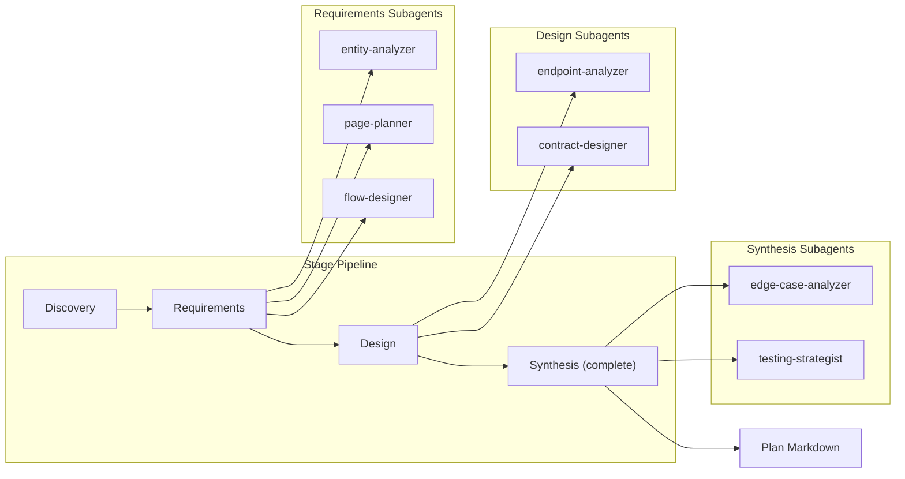

# Planning Module

Multi-stage chat agent that converts project requirements into an implementation-ready markdown plan. Uses the State pattern with 4 stages and delegates to specialist subagents from every other module.

## Architecture



### Stage Flow

| Stage                    | Purpose                                              | Outputs                                                                     |
| ------------------------ | ---------------------------------------------------- | --------------------------------------------------------------------------- |
| **Discovery**            | Understand the project, ask clarifying questions     | `overview` section, `projectDescription`                                    |
| **Requirements**         | Generate requirements via specialist subagents       | `techStack`, `featureDecisions`, `dataModels`, `pagesAndRoutes`, `authFlow` |
| **Design**               | Generate API and implementation details              | `apiRoutes`, `implementation`                                               |
| **Synthesis (complete)** | Assemble final plan, identify edge cases and testing | `executionPlan`, `edgeCases`, `testingChecklist` + full plan markdown       |

## Quick Start

```typescript
import { runPlanningAgent } from 'sweagent';

const result = await runPlanningAgent({
  input: 'Fitness app with workout tracking and nutrition logging',
  model: { provider: 'openai', model: 'gpt-4o-mini' },
});

console.log(result.output); // Full plan as markdown
```

## Three Usage Modes

### 1. Interactive Chat (`processPlanningChat`)

Multi-turn conversation with full context preservation. Best for interactive applications where the user answers discovery questions.

```typescript
import { processPlanningChat } from 'sweagent';
import type { PlanningContext } from 'sweagent';

let context: PlanningContext | null = null;

// Turn 1: describe the project
const turn1 = await processPlanningChat('Build a task manager with teams', context, {
  model: { provider: 'openai', model: 'gpt-4o-mini' },
});
context = turn1.context;
console.log(turn1.message); // Assistant response
console.log(turn1.context.stage); // 'discovery' | 'requirements' | ...
console.log(turn1.pendingQuestions); // Questions the agent wants answered

// Turn 2: answer questions or say "continue" to advance
const turn2 = await processPlanningChat('continue', context, {
  model: { provider: 'openai', model: 'gpt-4o-mini' },
});
context = turn2.context;

// When complete, turn.planMarkdown contains the full plan
if (turn2.planMarkdown) {
  console.log(turn2.planMarkdown);
}
```

### 2. One-Shot (`runPlanningAgent`)

Auto-advances through all stages with "continue" messages. Returns the plan as `AgentResult.output`.

```typescript
import { runPlanningAgent } from 'sweagent';

const result = await runPlanningAgent({
  input: 'E-commerce platform with payments and inventory',
  model: { provider: 'openai', model: 'gpt-4o-mini' },
});

console.log(result.output); // Plan markdown
console.log(result.messages); // Full conversation history
```

### 3. With Validation (`runPlanningWithResult`)

Runs the one-shot agent then validates the output with an LLM judge. Returns a canonical `{ planning: boolean, plan: string }`.

```typescript
import { runPlanningWithResult } from 'sweagent';

const result = await runPlanningWithResult({
  input: 'SaaS dashboard with analytics and user management',
  model: { provider: 'openai', model: 'gpt-4o-mini' },
});

if (result.planning) {
  console.log('Plan is implementation-ready');
  console.log(result.plan);
} else {
  console.log('Plan needs more work');
  console.log(result.plan); // Raw output
}
```

## Importing into Your Project

```typescript
// Main agent functions
import { runPlanningAgent, runPlanningWithResult, processPlanningChat } from 'sweagent';

// Validation and utilities
import {
  validatePlanForCodingAgent,
  assemblePlan,
  writePlanToFile,
  createPlanningContextBuilder,
  PlanningContextBuilder,
} from 'sweagent';

// System prompt (for customization)
import { PLANNING_SYSTEM_PROMPT } from 'sweagent';

// Types
import type {
  PlanSections,
  PlanningContext,
  PlanChatTurnResult,
  PlanningChatConfig,
  PlanStageResult,
  StageInput,
  PlanningAgentConfig,
  PlanningResult,
  PlanValidationResult,
  PlanningStage,
  PlanningChatEntry,
} from 'sweagent';
```

## Configuration

### `PlanningAgentConfig` (for `runPlanningAgent` and `runPlanningWithResult`)

| Property        | Type                        | Default                                        | Description                          |
| --------------- | --------------------------- | ---------------------------------------------- | ------------------------------------ |
| `input`         | `string`                    | **required**                                   | Natural language project description |
| `model`         | `ModelConfig`               | `{ provider: 'openai', model: 'gpt-4o-mini' }` | AI provider and model                |
| `maxIterations` | `number`                    | `undefined`                                    | Max iterations per stage             |
| `onStep`        | `(step: AgentStep) => void` | `undefined`                                    | Callback for each agent step         |
| `logger`        | `Logger`                    | `undefined`                                    | Pino-compatible logger               |

### `PlanningChatConfig` (for `processPlanningChat`)

| Property        | Type                        | Default                                        | Description                  |
| --------------- | --------------------------- | ---------------------------------------------- | ---------------------------- |
| `model`         | `ModelConfig`               | `{ provider: 'openai', model: 'gpt-4o-mini' }` | AI provider and model        |
| `maxIterations` | `number`                    | `undefined`                                    | Max iterations per stage     |
| `onStep`        | `(step: AgentStep) => void` | `undefined`                                    | Callback for each agent step |
| `logger`        | `Logger`                    | `undefined`                                    | Pino-compatible logger       |

### `ModelConfig`

```typescript
{ provider: 'openai' | 'anthropic' | 'google', model: string }
```

## Expected Output Format

The planning module outputs **markdown** (not JSON). The final plan is assembled from 11 `PlanSections`:

```typescript
interface PlanSections {
  overview: string | null; // Project summary and goals
  techStack: string | null; // Technologies, versions, rationale
  featureDecisions: string | null; // Product decisions per feature
  dataModels: string | null; // Entity schemas with fields
  pagesAndRoutes: string | null; // Frontend pages with routes
  authFlow: string | null; // Step-by-step auth flows
  apiRoutes: string | null; // REST/GraphQL endpoints
  implementation: string | null; // File structure, env vars, dependencies
  executionPlan: string | null; // Phased implementation steps
  edgeCases: string | null; // Edge cases per area
  testingChecklist: string | null; // Manual testing items per flow
}
```

These sections are assembled into a single markdown document with `## Section Title` headers:

```markdown
## Overview

Project summary...

## Tech Stack

- **Frontend**: Next.js 14, TypeScript, Tailwind CSS
- **Backend**: Node.js, Express
  ...

## Feature Decisions

### User Authentication

- Strategy: JWT with HTTP-only cookies
  ...

## Data Models

### User

| Field | Type | Required | Description |
...

## Pages and Routes

### /dashboard (protected)

...

## Authentication Flow

### Signup Flow

1. [Frontend] User fills signup form...
2. [Backend] Validate input...
   ...

## API Routes

### POST /api/auth/signup

...

## Implementation Details

### File Structure

...

## Implementation Order

### Phase 1: Foundation

...

## Edge Cases and Considerations

...

## Testing Checklist

- [ ] Signup with valid credentials...
```

### Return Types

**`runPlanningAgent`** returns `AgentResult`:

```typescript
interface AgentResult {
  output: string; // Plan markdown
  steps: AgentStep[];
  totalUsage: unknown;
  messages: Message[]; // Full conversation history
}
```

**`runPlanningWithResult`** returns `PlanningResult`:

```typescript
interface PlanningResult {
  planning: boolean; // true if plan passed LLM validation
  plan: string; // Plan markdown
}
```

**`processPlanningChat`** returns `PlanChatTurnResult`:

```typescript
interface PlanChatTurnResult {
  message: string; // Assistant response for this turn
  context: PlanningContext; // Updated context (pass to next turn)
  pendingQuestions: string[]; // Questions the agent wants answered
  planMarkdown: string | null; // Set when plan is complete
}
```

## Context Builder

Use `PlanningContextBuilder` for programmatic context setup:

```typescript
import { createPlanningContextBuilder } from 'sweagent';

const context = createPlanningContextBuilder()
  .withStage('requirements')
  .withProjectDescription('Task manager with teams and real-time updates')
  .withSections({ overview: '## Overview\nA task manager...' })
  .withHistory([
    { role: 'user', content: 'Build a task manager' },
    { role: 'assistant', content: 'Great! Let me understand...' },
  ])
  .build();
```

## Subagents Used

The planning module delegates to specialist subagents from other modules:

| Stage        | Subagent             | Source Module      | Purpose                                 |
| ------------ | -------------------- | ------------------ | --------------------------------------- |
| Requirements | `entity-analyzer`    | data-modeler       | Extract entities, fields, relationships |
| Requirements | `page-planner`       | frontend-architect | Design pages and routes                 |
| Requirements | `flow-designer`      | auth-designer      | Design authentication flows             |
| Design       | `endpoint-analyzer`  | api-designer       | Derive API endpoints from data model    |
| Design       | `contract-designer`  | api-designer       | Design request/response contracts       |
| Synthesis    | `edge-case-analyzer` | execution-planner  | Identify edge cases per area            |
| Synthesis    | `testing-strategist` | execution-planner  | Create manual testing checklists        |

## Environment Variables

| Variable            | Description                                   | Default       |
| ------------------- | --------------------------------------------- | ------------- |
| `PROVIDER`          | AI provider (`openai`, `anthropic`, `google`) | `openai`      |
| `MODEL`             | Model name                                    | `gpt-4o-mini` |
| `REQUIREMENT`       | Project requirement (skips interactive chat)  | --            |
| `OPENAI_API_KEY`    | OpenAI API key                                | --            |
| `ANTHROPIC_API_KEY` | Anthropic API key                             | --            |
| `GEMINI_API_KEY`    | Google Gemini API key                         | --            |

### Run the Example

```bash
# Interactive chat
npm run example:planning

# One-shot via environment variable
REQUIREMENT="Fitness app with workouts and nutrition" npm run example:planning
```

## Utilities

### `assemblePlan(projectName, sections)`

Assembles `PlanSections` into a single markdown string:

```typescript
import { assemblePlan } from 'sweagent';

const markdown = assemblePlan('My Project', sections);
```

### `writePlanToFile(markdown, outputPath)`

Writes the assembled plan to a file:

```typescript
import { writePlanToFile } from 'sweagent';

await writePlanToFile(markdown, './plan.md');
```

### `validatePlanForCodingAgent(planMarkdown, model, logger)`

LLM-based validator that checks if the plan is implementation-ready:

```typescript
import { validatePlanForCodingAgent } from 'sweagent';
import { createModel } from 'sweagent';

const model = createModel({ provider: 'openai', model: 'gpt-4o-mini' });
const result = await validatePlanForCodingAgent(planMarkdown, model);
// { valid: boolean, feedback?: string }
```
