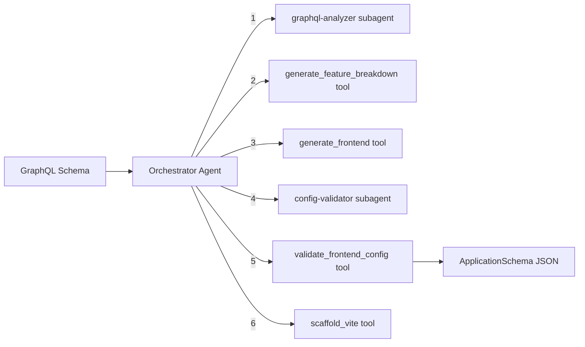

# React Builder Module

Generates frontend application configurations from GraphQL schemas, producing module/page/field definitions for rapid React app development. Uses an orchestrator-worker pattern with GraphQL analysis and config validation subagents.

## Architecture



### Orchestrator Workflow

1. **Analyze schema (optional)** -- `graphql-analyzer` subagent extracts types, queries, mutations, and relationships from the GraphQL schema
2. **Feature breakdown (optional)** -- `generate_feature_breakdown` tool produces a module/operation breakdown and suggested pages
3. **Generate config** -- `generate_frontend` tool converts the GraphQL schema into a full `ApplicationSchema` JSON (app config, modules, pages, fields, API hooks)
4. **Validate (optional)** -- `config-validator` subagent checks structure and completeness against the GraphQL schema
5. **Validate directly** -- `validate_frontend_config` tool checks config JSON against the Zod schema
6. **Scaffold (optional)** -- `scaffold_vite` tool generates a Vite + React project from the validated config

## Quick Start

```typescript
import { runReactBuilderAgent } from 'sweagent';

const result = await runReactBuilderAgent({
  input: `type User { id: ID!, name: String!, email: String! }
type Query { users: [User!]!, user(id: ID!): User }
type Mutation { createUser(name: String!, email: String!): User! }`,
  model: { provider: 'openai', model: 'gpt-4o-mini' },
});

console.log(result.output); // ApplicationSchema as JSON string
```

## Importing into Your Project

```typescript
// Main agent function
import { runReactBuilderAgent } from 'sweagent';

// Tools (for custom agent setups)
import {
  validateFrontendConfigTool,
  createGenerateFrontendTool,
  createGenerateFeatureBreakdownTool,
  createReactBuilderTools,
  scaffoldViteTool,
} from 'sweagent';
import type { FeatureBreakdownResult } from 'sweagent';

// Subagents (used by the planning module)
import { graphqlAnalyzerSubagent, createConfigValidatorSubagent } from 'sweagent';

// Zod schemas for runtime validation
import {
  ApplicationSchema,
  ModuleSchema,
  PageSchema,
  AppConfigSchema,
  BrandingSchema,
} from 'sweagent';
import type { TApplicationSchema, TReactModuleSchema, TPageSchema } from 'sweagent';

// System prompt (for customization)
import { REACT_BUILDER_SYSTEM_PROMPT } from 'sweagent';

// Types
import type { ReactBuilderAgentConfig, AppInfo } from 'sweagent';
```

## Configuration

### `ReactBuilderAgentConfig`

| Property        | Type                        | Default                                        | Description                                           |
| --------------- | --------------------------- | ---------------------------------------------- | ----------------------------------------------------- |
| `input`         | `string`                    | **required**                                   | GraphQL schema string or instruction                  |
| `appInfo`       | `AppInfo`                   | `undefined`                                    | Optional project context (name, description, modules) |
| `model`         | `ModelConfig`               | `{ provider: 'openai', model: 'gpt-4o-mini' }` | AI provider and model                                 |
| `maxIterations` | `number`                    | `15`                                           | Max orchestrator loop iterations                      |
| `onStep`        | `(step: AgentStep) => void` | `undefined`                                    | Callback for each agent step                          |
| `logger`        | `Logger`                    | `undefined`                                    | Pino-compatible logger                                |

### `AppInfo`

| Property             | Type     | Description                  |
| -------------------- | -------- | ---------------------------- |
| `projectName`        | `string` | Project name                 |
| `projectDescription` | `string` | Project description          |
| `modules`            | `string` | Comma-separated module names |
| `apiEndpoint`        | `string` | GraphQL API endpoint URL     |

## Expected Output Format

The agent returns `AgentResult` where `output` is a JSON string conforming to `TApplicationSchema`:

```typescript
interface ApplicationSchema {
  app: AppConfig; // App-level config (name, description, branding, apiEndpoint)
  modules: Module[]; // Feature modules with pages
}

interface Module {
  name: string; // Module name (e.g., "users", "tasks")
  pages: Page[]; // Pages within this module (listing, auth, etc.)
}

interface Page {
  type: 'listing' | 'auth';
  name: string; // Page name
  route: string; // URL route
  isPrivate: boolean; // Requires authentication
  api: object; // GraphQL query/mutation bindings
  columns?: Column[]; // Table columns (for listing pages)
  actions?: string[]; // Available actions (create, edit, delete)
  drawerCreate?: object; // Create form definition
  drawerUpdate?: object; // Update form definition
}
```

## Tools Reference

| Tool                         | AI-Powered | Description                                                                                                       |
| ---------------------------- | ---------- | ----------------------------------------------------------------------------------------------------------------- |
| `validate_frontend_config`   | No         | Validates JSON against `ApplicationSchema`. Returns `{ valid, errors? }`                                          |
| `generate_frontend`          | Yes        | Converts GraphQL schema to frontend config JSON (temperature: 0.2, max tokens: 16384). Accepts optional `appInfo` |
| `generate_feature_breakdown` | Yes        | Analyzes GraphQL schema and returns module/operation breakdown with suggested pages (temperature: 0.3)            |
| `scaffold_vite`              | No         | Scaffolds a Vite + React project from a validated `ApplicationSchema` config using Handlebars templates           |

## Subagents Reference

| Subagent           | Purpose                                                                                                                | Max Iterations |
| ------------------ | ---------------------------------------------------------------------------------------------------------------------- | -------------- |
| `graphql-analyzer` | Extracts types, queries, mutations, relationships, and auth directives from a GraphQL schema                           | 2              |
| `config-validator` | Validates frontend config JSON and checks completeness against the GraphQL schema. Has `validate_frontend_config` tool | 5              |

## Environment Variables

| Variable         | Description                                    | Default       |
| ---------------- | ---------------------------------------------- | ------------- |
| `PROVIDER`       | AI provider (`openai`, `anthropic`, `google`)  | `openai`      |
| `MODEL`          | Model name                                     | `gpt-4o-mini` |
| `REQUIREMENT`    | Project requirement (skips interactive prompt) | --            |
| `OPENAI_API_KEY` | OpenAI API key                                 | --            |

### Run the Example

```bash
# Interactive (prompts for GraphQL schema)
npm run example:react-builder

# One-shot
REQUIREMENT="Generate frontend for a task manager" npm run example:react-builder
```

## Integration with Planning Module

The planning module uses the react-builder's subagents during the **Design** stage:

- `graphql-analyzer` generates the frontend schema analysis
- `config-validator` validates the generated frontend configuration

You do not need to call the react-builder separately if you are using the planning agent -- it delegates automatically.

```typescript
// Used internally by planning:
import { graphqlAnalyzerSubagent, createConfigValidatorSubagent } from 'sweagent';
```

---

## Why Use This with Coding Agents

Converting a GraphQL schema into a working React frontend requires understanding every type, query, mutation, and relationship -- and mapping them to pages, forms, tables, and API hooks. Coding agents miss fields, create wrong form inputs, and skip validation. The React Builder produces a complete app config with module/page/field definitions and API bindings that your coding agent can scaffold precisely.

## Integration with Coding Agents

Generate a React app configuration and save it for your coding agent:

```typescript
import { runReactBuilderAgent } from 'sweagent';
import { writeFileSync } from 'fs';

const result = await runReactBuilderAgent({
  input: `type User { id: ID!, name: String!, email: String! }
type Query { users: [User!]!, user(id: ID!): User }
type Mutation { createUser(name: String!, email: String!): User! }`,
  model: { provider: 'openai', model: 'gpt-4o-mini' },
  maxIterations: 15,
});

writeFileSync('react-config.json', result.output);

// Cursor: "Scaffold the React app from @react-config.json with Vite, React Router, and Apollo Client"
// Claude Code: "Read react-config.json and create the pages, forms, and API hooks"
```
