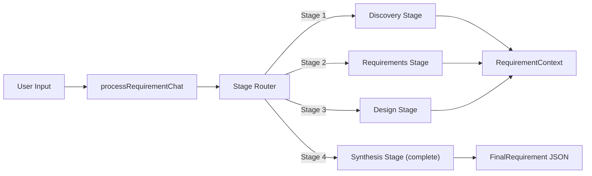

# Requirement Gatherer Module

A multi-stage chat-based agent that gathers project requirements through a structured conversation flow. Progresses through discovery, requirements, design, and synthesis stages to produce a complete requirement document with actors, flows, user stories, data model, and API design.

## Architecture



### Stage Flow

1. **Discovery** -- Understands the project: name, goal, features, domain, tech preferences (database, API style, backend runtime)
2. **Requirements** -- Extracts actors (user types), flows (user journeys), user stories (with data involved), and modules (with CRUD APIs)
3. **Design** -- Generates database design (entities, fields, indexes, relations) and API design (REST endpoints or GraphQL operations)
4. **Complete (Synthesis)** -- Produces the final requirement document combining all stages

The agent uses the **State pattern** for stage management. Each stage processes user messages, accumulates context, and decides when to advance to the next stage. When the user says "continue", "yes", or "looks good", the agent treats it as confirmation and advances.

## Quick Start

### Interactive Chat Mode

```typescript
import { processRequirementChat } from 'sweagent';

// First turn
let result = await processRequirementChat('I want to build a task management app', null, {
  model: { provider: 'openai', model: 'gpt-4o-mini' },
});

console.log(result.message); // Agent's response
console.log(result.questions); // Clarifying questions

// Subsequent turns
result = await processRequirementChat('I want REST API with MongoDB', result.context, {
  model: { provider: 'openai', model: 'gpt-4o-mini' },
});
```

### One-Shot Mode

```typescript
import { runRequirementGathererAgent } from 'sweagent';

const result = await runRequirementGathererAgent({
  input: 'Build a task manager with users, projects, and tasks. REST API, MongoDB.',
  model: { provider: 'openai', model: 'gpt-4o-mini' },
});

console.log(result.output); // FinalRequirement as JSON string
```

## Importing into Your Project

```typescript
// Main agent function (one-shot)
import { runRequirementGathererAgent } from 'sweagent';

// Chat processor (interactive)
import { processRequirementChat } from 'sweagent';

// Context utilities
import {
  RequirementContextBuilder,
  createRequirementContextBuilder,
  createInitialContext,
  mergeStageResult,
  addChatEntry,
  advanceStage,
} from 'sweagent';

// Zod schemas for runtime validation
import * from 'sweagent'; // requirement-gatherer schemas

// System prompt (for customization)
import { REQUIREMENT_GATHERER_SYSTEM_PROMPT } from 'sweagent';

// Types
import type {
  RequirementGathererAgentConfig,
  RequirementChatConfig,
  ChatTurnResult,
  FinalRequirement,
  RequirementContext,
  ProjectBrief,
  Stage,
  BasicProjectInfo,
  ExtractedModule,
  CrudApi,
  Module,
} from 'sweagent';
```

## Configuration

### `RequirementGathererAgentConfig` (One-Shot)

| Property        | Type                        | Default                                        | Description                         |
| --------------- | --------------------------- | ---------------------------------------------- | ----------------------------------- |
| `input`         | `string`                    | **required**                                   | Project description or requirements |
| `model`         | `ModelConfig`               | `{ provider: 'openai', model: 'gpt-4o-mini' }` | AI provider and model               |
| `maxIterations` | `number`                    | `undefined`                                    | Max iterations (unused in one-shot) |
| `onStep`        | `(step: AgentStep) => void` | `undefined`                                    | Callback for each agent step        |
| `logger`        | `Logger`                    | `undefined`                                    | Pino-compatible logger              |

### `RequirementChatConfig` (Interactive Chat)

| Property        | Type                        | Default                                        | Description                  |
| --------------- | --------------------------- | ---------------------------------------------- | ---------------------------- |
| `model`         | `ModelConfig`               | `{ provider: 'openai', model: 'gpt-4o-mini' }` | AI provider and model        |
| `maxIterations` | `number`                    | `undefined`                                    | Max stage iterations         |
| `onStep`        | `(step: AgentStep) => void` | `undefined`                                    | Callback for each agent step |
| `logger`        | `Logger`                    | `undefined`                                    | Pino-compatible logger       |

## Expected Output Format

The agent returns `AgentResult` where `output` is a JSON string conforming to `FinalRequirement`:

```typescript
interface FinalRequirement {
  project: ProjectBrief; // Name, goal, features, domain, tech choices
  actors: Actor[]; // User types (admin, customer, etc.)
  flows: Flow[]; // User journeys (signup, checkout, etc.)
  stories: Story[]; // User stories with data involved
  modules: Module[]; // Feature modules with CRUD APIs
  database: DatabaseDesign; // Entity definitions with fields, indexes, relations
  apiDesign: ApiDesign; // REST endpoints or GraphQL operations
  summary: RequirementSummary; // Totals and overview
}

interface ProjectBrief {
  name: string;
  goal: string;
  features: string[];
  domain: string;
  database: 'mongodb' | 'postgresql';
  backendRuntime: 'nodejs';
  apiStyle: 'rest' | 'graphql';
}

interface Actor {
  id: string;
  name: string;
  description: string;
  goals: string[];
}

interface Module {
  id: string;
  name: string;
  description: string;
  entity: string;
  apis: CrudApi[]; // CRUD operations for this module
}
```

## Stages Reference

| Stage          | Purpose                                                                        | Advances When              |
| -------------- | ------------------------------------------------------------------------------ | -------------------------- |
| `discovery`    | Extracts project brief: name, goal, features, tech preferences (DB, API style) | User confirms tech choices |
| `requirements` | Derives actors, flows, user stories, and modules with CRUD APIs                | All entities identified    |
| `design`       | Generates database design (entities, fields) and API design (REST/GraphQL)     | Design is complete         |
| `complete`     | Synthesizes all stages into a `FinalRequirement` document with summary         | Final document produced    |

## Context Builder

The `RequirementContextBuilder` provides a fluent API for constructing context objects:

```typescript
import { createRequirementContextBuilder } from 'sweagent';

const context = createRequirementContextBuilder()
  .withStage('requirements')
  .withProjectBrief({
    name: 'task-mgr',
    goal: '...',
    features: [],
    domain: 'productivity',
    database: 'mongodb',
    backendRuntime: 'nodejs',
    apiStyle: 'rest',
  })
  .withActors([{ id: '1', name: 'Admin', description: '...', goals: [] }])
  .build();
```

## Environment Variables

| Variable         | Description                                    | Default       |
| ---------------- | ---------------------------------------------- | ------------- |
| `PROVIDER`       | AI provider (`openai`, `anthropic`, `google`)  | `openai`      |
| `MODEL`          | Model name                                     | `gpt-4o-mini` |
| `REQUIREMENT`    | Project requirement (skips interactive prompt) | --            |
| `OPENAI_API_KEY` | OpenAI API key                                 | --            |

### Run the Example

```bash
# Interactive (prompts for requirement)
npm run example:requirement-gatherer

# One-shot
REQUIREMENT="Build a task manager with users and projects" npm run example:requirement-gatherer
```
